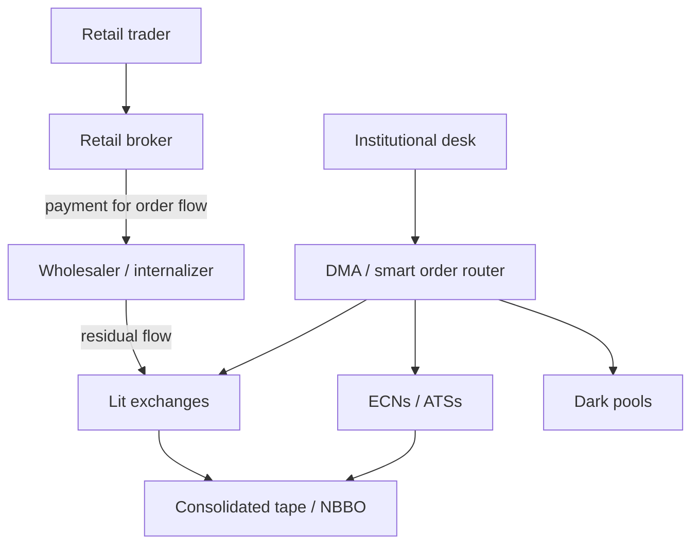
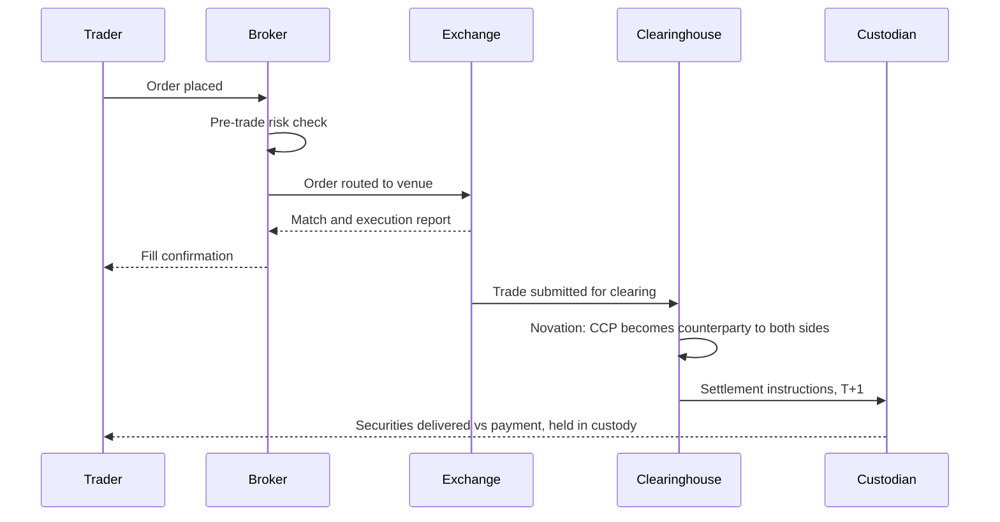

# Exchanges, Brokers, and ECNs

Type a ticker into a brokerage app, click buy, and a fill comes back in under a second. The interface implies a single "market" that took your order. There is no such place. Your order entered a fragmented web of exchanges, alternative venues, dark pools, and wholesalers, was routed by economics you did not choose, matched somewhere you probably cannot name, and then handed to a clearinghouse you have never thought about. For a systematic trader this plumbing is not trivia — it determines your fill quality, your costs, your capital efficiency, and your counterparty risk. This lesson maps the web and distills it into two key diagrams: the market-structure diagram and the trade-lifecycle diagram.

## The venue landscape

**Exchanges** are regulated venues running public limit order books — in US equities, sixteen of them across the NYSE, Nasdaq, and Cboe families plus independents like IEX. No single exchange dominates: liquidity for one stock is scattered across all of them simultaneously.

**ECNs and ATSs** blur the old boundary. Electronic communication networks — Instinet, Island, Archipelago — were the 1990s upstarts that electronified equity trading; the successful ones became exchanges outright. Today's alternative trading systems (ATSs) are broker-operated venues under lighter regulation, numbering over thirty in US equities.

**Dark pools** are ATSs with no pre-trade transparency: no public quotes, no visible book. Orders rest hidden and typically match at the midpoint of the public best bid and offer. The design purpose is real — institutions can seek size without advertising intent — but you learn a dark fill happened only after the print.

**Wholesalers (internalizers)** — Citadel Securities and Virtu foremost — are market-making firms that buy retail order flow from brokers and execute it internally, off-exchange, usually at or slightly inside the public quote. A large share of US equity volume now executes off-exchange, much of it retail flow that never touches a lit book.

Fragmentation demands a common reference. In US equities that is the **NBBO** — the National Best Bid and Offer, the best bid and best ask aggregated across all exchanges. Regulation NMS obliges brokers to execute at prices no worse than the NBBO. But note the fine print: the consolidated (SIP) feed that computes the NBBO is measurably slower than the direct feeds professionals buy from each exchange. The "official" market view lags the true one — a structural fact with obvious consequences for anyone fast.

## Brokers: retail, prime, and DMA

A broker is your interface to venues, and broker tiers differ in kind, not just price.

**Retail brokers** offer simplicity and zero commissions, funded substantially by **payment for order flow (PFOF)**: wholesalers pay the broker for the privilege of executing its customers' orders. Why is retail flow worth paying for? Because it is *uninformed* — recall lesson 3: a market maker's spread must cover losses to informed traders, so flow that is reliably uninformed can be profitably filled at better-than-exchange prices. The retail customer typically receives modest price improvement over the NBBO; the wholesaler keeps the rest of the spread it no longer risks losing to sharper counterparties.

What does this mean for you as a systematic trader? At small size and low frequency, PFOF execution is genuinely fine — often better than lit-exchange fills. The costs are subtler: you surrender all control of routing, your effective latency is high and variable, you cannot manage queue position, and you see none of the venue-level information professionals use. PFOF is acceptable for slow strategies and disqualifying for fast ones.

**Prime brokers** serve funds: custody, margin financing, securities lending for shorts, and consolidated clearing across the many executing brokers a fund may use. If you scale up, a prime relationship is what makes multi-broker, levered, short-selling operation administratively possible.

**DMA (direct market access)** lets a trader send orders to a venue under a broker's membership without the broker's intervention — your order types, your venue choice, your smart order router, optionally your servers colocated in the exchange data center. This is how professional systematic desks trade, and it is what the institutional path in the diagram below depicts.

## Clearing and settlement

Execution is a promise; clearing and settlement make it real.

After the match, the trade goes to a **clearinghouse** (central counterparty, CCP). Through **novation**, the CCP steps into the middle: it becomes the buyer to every seller and the seller to every buyer. Neither side faces the other's credit risk anymore — only the CCP's, which is defended by margin requirements and a mutualized default fund. Clearing members post **initial margin** against open exposure and pay or receive **variation margin** as positions are marked to market. The CCP also **nets** offsetting obligations: a firm that bought and sold the same stock all day settles only the residual, collapsing gross flows by orders of magnitude.

**Settlement** — the actual exchange of securities for cash — happens on a fixed lag. US equities moved to **T+1** in May 2024: trade Monday, settle Tuesday. Shorter settlement means less time for a counterparty to fail and less margin trapped at the CCP, at the cost of tighter operational deadlines. Futures work differently and, for a trader, better: positions are marked and margined daily at the CCP, which is why futures margin is a performance bond of roughly 3–12% of notional rather than a 50% down payment.

Why should a strategy researcher care? Because margin rules set your leverage, settlement cycles set your cash timing, and CCP protections define your worst-case counterparty risk. Crypto's recurring disasters — exchanges that were simultaneously venue, broker, and custodian, with no CCP — are a standing demonstration of what this layer is *for*.

## The market-structure diagram

The first diagram captures the two canonical routes an order can take. Retail flow travels the left path — broker to wholesaler, touching an exchange only residually. Institutional flow travels the right — DMA and a smart order router spraying lit venues, ECNs, and dark pools, all referenced to the consolidated NBBO.

## The trade-lifecycle diagram

The second diagram follows one trade end to end — from click to custody. Execution is the fast, visible part; everything after the exchange match is the slower machinery that makes ownership real.

Internalize both diagrams. They are the skeleton on which the rest of the course hangs: backtest cost models must respect the routing layer, and live infrastructure must respect the clearing layer.

!!! abstract "Key takeaways"
    - There is no single "market": liquidity fragments across exchanges, ECNs/ATSs, dark pools, and wholesalers, unified only by the NBBO reference price.
    - The consolidated feed lags direct exchange feeds; the official market view is slower than the one professionals trade on.
    - PFOF exists because uninformed retail flow is profitable to fill; it delivers decent prices at small size but surrenders routing, latency, and queue control.
    - Broker tiers are capability tiers: retail for simplicity, prime for financing and shorts at fund scale, DMA for professional control.
    - Clearinghouses novate trades, net obligations, and collect margin; settlement in US equities is T+1, and margin rules — not ambition — set your leverage.
    - Crypto's exchange failures illustrate what a missing clearing layer costs; counterparty structure is part of strategy risk.

## Where this goes next

You now have the machinery and the map. The remaining foundation question is *what to trade*: equities, futures, options, FX, and crypto differ enormously in mechanics, leverage, hours, costs, and data access — and those differences, more than taste, should decide where you start. That comparison is [Lesson 5](05-asset-classes.md).
