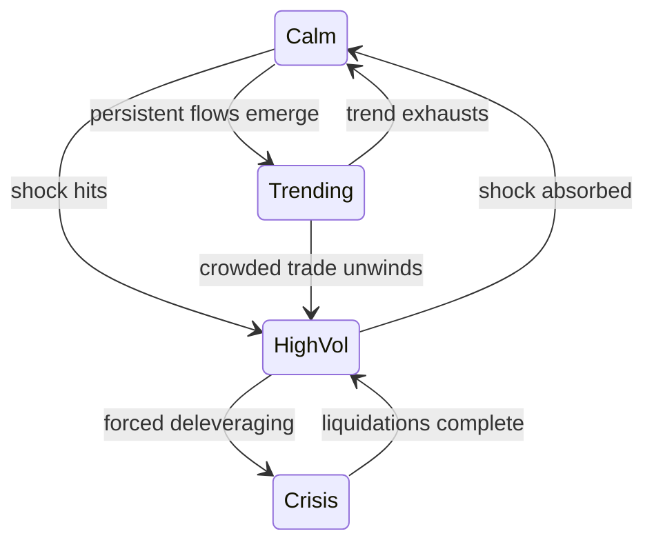

# Market Regimes

In 2017, selling equity volatility was close to free money: the VIX spent most of the year below 12, and short-vol exchange-traded products compounded steadily upward. In February 2018, one violent afternoon erased years of those gains and terminated an entire product category. Nothing about the strategy's logic changed between December and February. The *market* changed — and the strategy was never designed to notice.

This is the single most important structural fact about markets that retail material ignores: returns are not drawn from one stationary distribution. Markets move between persistent states — regimes — in which volatility, correlation, and the autocorrelation of returns are all different. A strategy that prints money in one regime can bleed or blow up in another, not because it "stopped working" in some vague sense, but because the statistical conditions it was implicitly betting on stopped holding.

## The four regimes that matter

You can slice regimes many ways, but four capture most of what a practitioner needs:

| Regime | Return behavior | Volatility | What thrives | What suffers |
|---|---|---|---|---|
| Trending | Persistent directional drift; positive autocorrelation at the trading horizon | Low to moderate | Momentum, trend following | Mean reversion, short gamma |
| Mean-reverting / range-bound | Prices oscillate around a level; negative autocorrelation | Low to moderate | Mean reversion, carry, market making | Trend following (whipsawed) |
| High-volatility | Large moves in both directions, unstable direction | High | Long volatility, wide-stop trend | Tight-stop systems, leveraged carry |
| Crisis | Forced deleveraging, liquidity withdrawal, gap moves | Extreme | Cash, long vol, some trend followers | Almost everything else |

Two things about this table deserve emphasis. First, the columns are statistical properties you can measure — drift, variance, autocorrelation, tail thickness — not vibes. Second, the "what suffers" column is not about bad execution. A well-built mean-reversion system *should* lose money in a strong trend; it is faded moves that keep going. The losses are the strategy behaving exactly as designed, in conditions it was not designed for.

## Volatility clusters: calm and storm are both persistent

If daily returns were independent draws, a 3% down day would tell you nothing about tomorrow. Empirically it tells you a lot — not about tomorrow's *direction*, but about its *magnitude*. Large moves follow large moves; quiet days follow quiet days. Formally: returns themselves show little autocorrelation, but squared returns (a proxy for variance) are strongly autocorrelated for weeks. This is volatility clustering, and it is one of the most robust stylized facts in all of finance, visible in equities, FX, rates, and crypto alike.

The GARCH family of models — which you will meet properly later — is essentially bookkeeping for this observation: today's variance is a weighted blend of a long-run baseline, yesterday's variance, and the size of yesterday's shock. You do not need the machinery yet. You need the intuition:

!!! note "The practical consequence"
    Volatility is *forecastable* in a way direction is not. A position sized off last year's average volatility is badly sized for this week's. Every serious system scales exposure to a current volatility estimate — this is one of the few nearly-free lunches in trading, and it falls directly out of volatility clustering.

Clustering is also why regimes are a useful concept at all. If calm and turbulent periods each persist, then "which state am I in?" is a question with a stable, learnable answer over days and weeks — rather than a coin that reflips every tick.

## When correlations go to one

The second regime effect is nastier because it attacks diversification itself. In calm markets, a portfolio spread across equities, credit, commodities, and emerging markets looks diversified: pairwise correlations might sit around 0.2–0.4, and portfolio math rewards you accordingly. In a crisis, those correlations lurch toward 1. In late 2008, asset classes with entirely different economic drivers sold off together, week after week.

The mechanism is not mysterious. In stress, the marginal seller is not trading views — they are meeting margin calls, cutting risk, or facing redemptions. Forced sellers sell *what they can*, not what they want to, so liquidation pressure hits everything simultaneously. The common factor driving all assets becomes "leveraged holders need cash," and against that factor, your carefully estimated correlation matrix is fiction.

!!! warning "Diversification is regime-dependent"
    A correlation matrix estimated over calm years systematically overstates the protection you will have when you actually need it. Risk models that ignore this are precise in normal times and wrong at the exact moment being right matters most. We will return to this when we cover risk models in Part VIII: stress correlations, not average correlations, should size your tail risk.

## Every strategy is an implicit regime bet

Here is the reframing that separates professional thinking from indicator shopping: **no strategy is unconditionally good; every strategy is a bet that a particular regime persists.**

- A short-volatility carry trade is a bet that calm persists.
- A trend follower is a bet that moves, once started, continue.
- A mean-reversion book is a bet that the current equilibrium holds.
- Even "diversified buy-and-hold" is a bet against a correlated deleveraging regime.

Once you see strategies this way, two professional questions become automatic. First: *what regime am I implicitly long, and what happens to me when it ends?* Second: *can I detect the transition fast enough to matter?* The first question is answerable today with the tools in this part. The second is a genuine modeling problem — regimes are not announced, they must be inferred from noisy data.

The standard formal tool for this inference is the Hidden Markov Model: assume the market occupies one of a few unobserved states, each generating returns with its own mean and variance, with probabilistic transitions between states — then infer the current state from the data. We study HMM-based regime detection in Part III. The underlying machinery — Markov chains, transition matrices, stationary distributions — is covered in the appendix: [Markov Processes I](../appendix/probability/42-markov-processes-1.md) and [Markov Processes II](../appendix/probability/43-markov-processes-2.md). If those are unfamiliar, read them before Part III; the HMM material assumes them.

!!! abstract "Key takeaways"
    - Market returns are not one stationary distribution; they move between persistent regimes with different volatility, correlation, and autocorrelation structure.
    - The four working categories: trending, mean-reverting, high-volatility, and crisis. Each rewards and punishes different strategy families.
    - Volatility clusters: squared returns are strongly autocorrelated, which makes volatility forecastable and volatility-based position sizing nearly mandatory.
    - Correlations are regime-dependent and converge toward one in a crisis, because forced deleveraging becomes the common driver of everything.
    - Every strategy is an implicit bet that a particular regime persists — know which bet you are making before the market tells you.
    - Regime detection is an inference problem; Hidden Markov Models (Part III) are the standard formal tool, built on the Markov machinery in the appendix.

## Where this goes next

The regime lens makes the next question concrete: the two great strategy families — trend following and mean reversion — are precisely opposite bets on the autocorrelation of returns. Understanding their payoff shapes, and why the same market can support both at different horizons, is the subject of [Trend Following vs Mean Reversion](07-trend-following-vs-mean-reversion.md).
