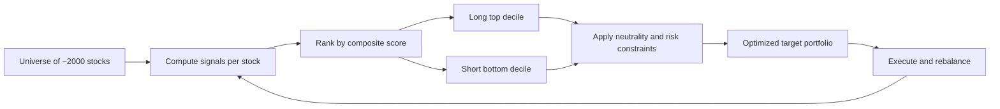

# Statistical Arbitrage

The word "arbitrage" is doing misleading work in the name. True arbitrage — buying an asset in one place and simultaneously selling it elsewhere for a risk-free profit — is essentially extinct at human timescales. Statistical arbitrage keeps the *relative-value* logic of arbitrage but drops the certainty: you trade instruments whose prices are statistically tethered to each other, betting that deviations in the relationship correct — usually, not always, and on average often enough to build a business on.

That last clause is the whole discipline. A stat-arb desk is not trying to be right about any single trade; it manufactures many small, roughly independent, slightly-better-than-even bets and lets the law of large numbers convert a thin per-trade edge into a smooth aggregate return. This lesson covers how the machine works, what once broke it, and what the job looks like from inside.

## Trade the spread, not the level

The founding move of statistical arbitrage is a change of variable. Predicting whether the equity market goes up next week is close to hopeless — the signal-to-noise ratio of index returns is dismal, and everyone is trying. But predicting the *difference* between two closely related instruments is a different problem entirely. Take two large-cap oil producers with similar reserves, costs, and customers. Oil prices, the dollar, the economy, and equity risk appetite hit both roughly equally. Form the spread — long one, short the other in appropriate ratio — and all of that common noise cancels. What remains is the idiosyncratic gap between two similar businesses: a series far more stationary and forecastable than either stock alone.

This is why stat-arb books are **hedged books**. A desk running hundreds of positions targets net exposures near zero along every dimension it can measure: dollar-neutral (long value ≈ short value), beta-neutral (no net market exposure), and typically sector- and factor-neutral as well. The goal is a P&L stream that does not care whether the index rises or falls — the book isolates *relative* mispricings and hedges away everything else.

!!! note "The economics of hedging"
    Hedging is not free — the short leg pays borrow fees, and neutrality constraints exclude many attractive positions. What it buys is *independence*: a return stream uncorrelated with the market, which is precisely what allocators pay for, and a book no single macro event can sink.

## Pairs: the founding intuition

The classic pedagogical case is pairs trading. Find two stocks that share economic drivers — two Australian banks, two US railroads, a parent company and its listed subsidiary. Their price *ratio* or log-price difference wanders, but historically within a band: when the spread stretches wide, buy the laggard, short the leader, and wait for convergence; when it closes, exit.

The spread itself is the tradable object. You chart it, compute its mean and standard deviation, define entry at (say) two standard deviations and exit near zero — a synthetic instrument no exchange lists, but one that behaves better than anything an exchange does list.

The dangerous part is the phrase "historically within a band." Two prices that have moved together for five years can decouple permanently: one company gets acquired, loses a lawsuit, or simply pulls ahead. The formal question — *when is a linear combination of non-stationary prices genuinely stationary, and how do you test it rather than eyeball it?* — has a rigorous answer called **cointegration**, with its own testing machinery (Engle–Granger, Johansen). We develop it properly in Parts III and IV; for now, register the professional discipline it represents: a stable-looking spread on a chart is a hypothesis, not a fact, and hypotheses get tested.

!!! warning "Correlation is not the tool"
    Retail material almost always reaches for correlation to justify a pair. Correlation measures whether *returns* move together day to day; it says nothing about whether *prices* stay tethered over months. Two stocks can be 90% correlated while their spread trends away forever. Cointegration — not correlation — is the property a pairs trade actually needs.

## Cross-sectional stat-arb: pairs at industrial scale

Modern equity stat-arb rarely trades hand-picked pairs. It generalizes the idea across an entire universe. Take 2,000 liquid stocks. Compute signals for each — short-term reversal, earnings momentum, analyst revisions, relative valuation, dozens more. Combine them into a composite score, rank the universe, go long the top slice and short the bottom slice, weighted to hit the neutrality constraints above. Rebalance daily or intraday as scores update.

Each position is a weak bet; the desk might be right on 52% of them. But with 2,000 nearly independent bets refreshed continuously, breadth does the heavy lifting — the same law-of-large-numbers logic as the casino's house edge. Risk-adjusted performance scales with skill *times the square root of breadth*, which is why desks obsess over universe size and turnover rather than heroic single calls.

## Capacity, crowding, and August 2007

Stat-arb edges are small and mechanical, which creates two structural problems. **Capacity**: a signal that earns 5 basis points per trade cannot absorb unlimited money — push size and your own trading moves the spread you are trying to capture. **Crowding**: the signals are discoverable — reversal, momentum, and valuation factors are in the literature, and many desks converge on similar books. In calm times this merely competes returns away (*alpha decay*: known signals weaken after discovery). In stress, it does something worse.

The canonical lesson is the **quant quake of August 2007**. Over roughly August 6–9, quantitative equity market-neutral funds suffered abrupt, severe, and — crucially — *simultaneous* losses, while the broader market did little. The accepted reconstruction: one or more large multi-strategy players, facing credit-related losses as the subprime crisis broke, rapidly unwound big quant equity books. That meant selling the longs and buying back the shorts *everyone else also held* — mechanically inflicting losses on every similar book and triggering further risk-cutting in a self-reinforcing spiral. Textbook factor portfolios lost double-digit percentages in days. Then, within about a week, much of the move snapped back; desks that held on recovered substantially, while those that cut at the bottom locked in the losses.

The enduring lessons: your true risk factor may be *the positioning of people running the same models*, a factor no historical covariance matrix contained before it fired; deleveraging spirals make crowded-trade losses fast and correlated; and surviving them is a function of leverage and liquidity headroom decided long before the event.

## What the work actually looks like

From outside, stat-arb sounds like a search for clever signals. From inside, signal research is a minority of the work.

- **Data hygiene dominates.** Corporate actions (splits, dividends, spinoffs) must be adjusted exactly; tickers change; a survivorship-free universe with point-in-time membership must be maintained. A single bad split adjustment fabricates a monster "reversal" signal that a naive backtest happily monetizes. Much of Part II's tooling exists for this.
- **The short side has real frictions.** Every short pays a borrow fee — a few basis points annually for easy names, double-digit *percent* for hard-to-borrow ones. A signal that looks great on paper often earns most of its paper alpha in exactly the names that are expensive or impossible to short. Borrow modeling decides whether the strategy exists.
- **Risk limits are the job, not the constraint on the job.** Position caps, factor exposure bands, liquidity limits (size relative to daily volume), drawdown protocols. August 2007 is why these are hard limits rather than guidelines.

The craft is mostly engineering discipline wrapped around a modest statistical edge — a preview of this course's central claim.

!!! abstract "Key takeaways"
    - Stat-arb changes the variable: spreads between related instruments are far more stationary and forecastable than outright price levels.
    - Books are hedged — dollar-, beta-, and factor-neutral — to isolate relative mispricings and deliver returns uncorrelated with the market.
    - Pairs trading is the intuition; cointegration (formalized in Parts III–IV) is the test that separates genuinely tethered prices from coincidentally correlated ones.
    - Cross-sectional stat-arb scales the idea: rank a large universe, go long the top and short the bottom, and let breadth convert a 52% hit rate into a business.
    - Edges are capacity-constrained and crowd-prone; August 2007 showed that the dominant tail risk can be the synchronized unwinding of everyone running similar books.
    - Day to day, the work is data hygiene, borrow-cost realism, and risk limits — engineering discipline around a small edge, not oracle-hunting.

## Where this goes next

Stat-arb desks hold positions for days to weeks. Compress the holding period to seconds — then milliseconds, then microseconds — and the game changes character entirely: the edge stops being statistical mispricing and becomes speed itself. That world runs on different physics and different economics, and it sets the execution costs every slower trader pays: [High-Frequency Trading](09-high-frequency-trading.md).
