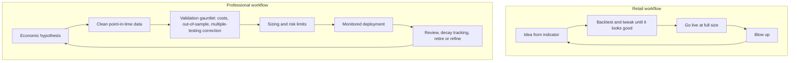

# Why Most Retail Strategies Fail

Most retail systematic strategies lose money, and the uncomfortable part is that this outcome is largely decided before the first live trade. It is not primarily bad luck, and it is not that markets are perfectly efficient — professional desks extract real edges every day. It is that the standard retail *process* manufactures strategies that were never real: statistical mirages, built on biased data, evaluated without costs, sized without risk mathematics, and deployed without monitoring. This lesson is the summation of Part I: everything that follows in the course is, one way or another, the antidote.

Read it as a checklist of the failure modes the rest of this course engineers out.

## The multiple testing trap: torture the data and it confesses

Here is an experiment you can run yourself in Part II: backtest 1,000 strategies that are *pure coin flips* — random long/short signals with zero true edge — on five years of daily data. The average backtest Sharpe will be near zero, as it should be. But you won't look at the average — you'll look at the best one, and the best of 1,000 random strategies routinely shows a backtest Sharpe above 2, a beautiful equity curve, and plausible statistics. It is still a coin flip; its expected live performance is zero, minus costs.

This is the multiple testing problem, and the retail workflow is a machine for committing it: try an indicator, tweak the lookback, add a filter, change the stop, rerun — and a thousand variations later, keep the one that "works." Each iteration is another lottery ticket drawn from the noise distribution. The final backtest is not evidence about the strategy; it is the maximum of many draws, and maxima of noise look like skill.

$$\mathbb{E}[\max(S_1,\dots,S_N)] \gg 0 \quad \text{even when every } \mathbb{E}[S_i] = 0$$

The professional response is not "don't iterate" — everyone iterates. It is to *account for the search*. The tools have names you should know now: **White's Reality Check** (test the winner against the full universe of strategies tried), the **Probability of Backtest Overfitting** (how likely the in-sample winner is to disappoint out of sample), and the **Deflated Sharpe Ratio** (discount a Sharpe for trials, sample length, and non-normal returns). These arrive with full machinery in [Part IV's validation lesson](../part-04-strategy-development/08-validation-and-overfitting.md). Until then, one habit: every time you rerun a backtest with a tweak, mentally increment a counter — that counter is part of your result.

## Costs: a worked execution of a plausible edge

Overfitting produces fake edges; costs kill real-but-thin ones. Walk through the arithmetic once and you will never trust a cost-free backtest again.

Suppose research finds a daily mean-reversion signal on liquid US large caps with a genuine gross edge of **8 basis points per round trip** — a believable number that, over 250 trading days, backtests to roughly 20% annual gross. Now execute it with market orders:

| Item | Cost per round trip | Note |
|---|---|---|
| Bid-ask spread | 4.0 bps | 2 bps half-spread, paid on entry and exit |
| Commissions and fees | 1.0 bps | Even at "zero commission," exchange and regulatory fees are embedded |
| Slippage and market impact | 3.5 bps | Price movement between signal and fill; worse in volatile names and larger size |
| **Total cost** | **8.5 bps** | |
| **Net edge** | **−0.5 bps** | 8.0 gross − 8.5 costs |

The strategy is *genuinely predictive* and still loses money — roughly −1.3% a year, versus the +20% the frictionless backtest promised. That is the routine fate of high-turnover retail strategies: the edge is real, small, and smaller than the toll. And costs scale with *turnover*: the same 8 bps edge held a month instead of a day faces the toll 20 times less often. Turnover discipline is a return source — and this is why the previous lesson insisted on pessimistic execution assumptions.

## Biased data: the backtest that couldn't lose

Two data biases are so common in retail backtests that you should assume their presence until proven otherwise.

**Survivorship bias.** Backtest a strategy on the *current* S&P 500 constituents over the past 20 years and you have quietly conditioned on survival: every bankruptcy and delisting has been removed from your universe *because you selected companies that made it to today*. Strategies that buy dips look brilliant on this data — every crash in the sample was, by construction, followed by recovery. Point-in-time universe membership, dead companies included, is non-negotiable — a large part of why professional data is expensive.

**Look-ahead bias.** Any use of information before it was knowable: computing a signal from today's close and assuming execution *at* today's close; using fundamental data as of its fiscal period rather than its publication date (earnings arrive weeks later, and get restated); normalizing with full-sample statistics that include the future. It is insidious because it is usually an off-by-one error in code, invisible except through impossibly good performance.

!!! warning "The smell test"
    A backtest Sharpe above ~2 on a daily-frequency strategy is not a discovery; it is an alarm. The probability that you found something the industry missed is far lower than the probability of a bug, a bias, or a multiple-testing artifact. Spectacular backtests are guilty until proven innocent.

## Leverage and the arithmetic of ruin

Even a real, cost-surviving edge is destroyed by wrong sizing. Two pieces of arithmetic:

**Losses are asymmetric.** A 50% drawdown requires a 100% gain to recover; 90% requires 900%. Compounding punishes volatility itself: of two accounts with the same average return, the more volatile one ends up poorer.

**There is an optimal amount of leverage, and exceeding it guarantees ruin.** For any positive-edge strategy there is a growth-optimal bet size (the Kelly framework, treated properly later). Bet beyond roughly twice that size and long-run growth turns *negative* — with a genuine edge. Retail traders in leveraged FX and futures routinely size at multiples of any defensible level; the martingale instinct — double up after losses — merely schedules the ruin for the worst possible day. Sizing is not an afterthought to strategy design; it *is* strategy design, and it gets its own treatment in Part IV.

## Indicators are not strategies

Finally, the content problem. The retail canon — RSI thresholds, moving-average crossovers, MACD signals — consists of transforms of past prices. They add no information not already in the price series; at best they are crude, lagged estimates of the autocorrelation structure you met earlier in this part. An indicator crossing a threshold is not an edge; it is a coordinate system.

The deeper distinction is **process versus prediction**. The retail question is "what will the price do?" The professional questions are: *Why does this edge exist? Who is on the other side, and why are they willing to lose to me — are they hedging, forced, constrained, or slower? Under which regimes does it pay, and how will I know when it stops?* A strategy without an answer to "why does the counterparty lose" is a strategy waiting to discover that *it* is the counterparty.

Both loops iterate. The difference is *what survives each pass*: the retail loop keeps whatever looks best, which selects for overfitting; the professional loop keeps whatever survives hostile scrutiny, which selects — imperfectly but systematically — for real edges sized to be survivable.

!!! abstract "Key takeaways"
    - The best of 1,000 random strategies looks brilliant in backtest; unaccounted-for search is the root retail failure. The corrections — White's Reality Check, PBO, the Deflated Sharpe Ratio — arrive in Part IV.
    - Costs kill thin edges mechanically: a real 8 bps daily edge dies against 8.5 bps of spread, fees, and slippage. Cost per round trip times turnover is the first number to compute, not the last.
    - Survivorship and look-ahead bias make backtests structurally optimistic; point-in-time data and publication-date discipline are prerequisites, not refinements.
    - Volatility drag and the Kelly bound mean over-leverage turns positive-edge strategies into guaranteed ruin; sizing is part of the strategy, not a setting.
    - Indicators are transforms of price, not information; an edge requires a hypothesis about why it exists and who is paying for it.
    - The professional loop differs from the retail loop in one respect: what is allowed to survive iteration — hostile validation instead of visual appeal.

## Where this goes next

Every failure mode above has an engineering answer: point-in-time data pipelines, cost-aware backtests, validation statistics, sizing mathematics, monitoring. Building them requires tools, and the tooling starts now. Part II builds the Python stack for quantitative research — the data handling, numerics, and code discipline everything else stands on: [Part II — Python for Quantitative Finance](../part-02-python/index.md).
