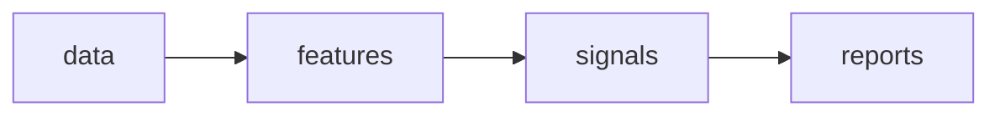

# Typing, Dataclasses, and Code Structure

Research code rarely dies of slow algorithms. It dies of untyped dictionaries: a "bar" that is a dict in one function, a tuple in another, and a DataFrame row somewhere else; a "side" that is `"buy"` here, `"BUY"` there, and `"B"` in the vendor file. Six months later nobody — including the author — can say what fields exist or what units they are in, and the cost lands on the worst possible day: the one when a second person, or your future self, has to change the code quickly and correctly.

This lesson is about making Python state its assumptions. Type hints put the contracts in the signatures, dataclasses and enums give market objects a single authoritative shape, package structure gives the code a geography, and mypy checks the whole story mechanically. None of it is bureaucracy; it is how research survives contact with time.

## Type hints as executable documentation

A type hint is a comment that cannot rot silently — a checker will call the bluff. Python does not enforce annotations at runtime; their value is that they make signatures say what a function actually consumes and returns, precisely enough for tools and colleagues alike.

```python
import numpy as np
from numpy.typing import NDArray

def position_size(signal: float, vol: float,
                  target_risk: float = 0.02) -> float:
    """Exposure per unit of signal, scaled to a target risk budget."""
    if vol <= 0:
        raise ValueError(f"vol must be positive, got {vol}")
    return signal * target_risk / vol

def zscore(x: NDArray[np.float64]) -> NDArray[np.float64]:
    return (x - x.mean()) / x.std()

print(position_size(0.5, 0.16))  # => 0.0625
```

The vocabulary you will use daily is small: built-in generics like `list[float]` and `dict[str, float]`, `X | None` for values that may be absent, and `NDArray[np.float64]` for the arrays of [NumPy and Vectorization](01-numpy-and-vectorization.md). Treat `| None` as a design signal, not a reflex — a function taking five optional arguments that "sometimes" apply is usually two functions wearing one name.

The most underused tool in the typing module is **`Protocol`**, which types behavior instead of inheritance. A research codebase talks to many data vendors; what it needs from each is a capability, not a family tree:

```python
from typing import Protocol

class PriceFeed(Protocol):
    def latest(self, symbol: str) -> float: ...

class VendorA:
    def latest(self, symbol: str) -> float:
        return 100.01                      # imagine a REST call here

class VendorB:
    def latest(self, symbol: str) -> float:
        return 100.02                      # imagine a websocket cache here

def mid_estimate(feed: PriceFeed, symbol: str) -> float:
    return feed.latest(symbol)

print(mid_estimate(VendorA(), "AAA"))  # => 100.01
print(mid_estimate(VendorB(), "AAA"))  # => 100.02
```

Neither vendor class imports, inherits, or even knows about `PriceFeed`; they satisfy it structurally. That means you can wrap a third vendor — or a replay of recorded data in a backtest — without touching existing code, which is exactly the seam the live-trading parts of this course will exploit.

## Dataclasses for market objects

The facts of a trade are not negotiable after the fact, and the objects representing them should say so. A **frozen dataclass** gives a market object a declared shape, value equality, a readable repr, and immutability — with validation at the only moment it can help: construction.

```python
import dataclasses
from dataclasses import dataclass
from datetime import datetime, timezone

@dataclass(frozen=True, slots=True)
class Bar:
    ts: datetime
    open: float
    high: float
    low: float
    close: float
    volume: int

    def __post_init__(self) -> None:
        if not (self.low <= self.open <= self.high
                and self.low <= self.close <= self.high):
            raise ValueError(f"inconsistent bar at {self.ts}")

bar = Bar(datetime(2024, 1, 2, 14, 30, tzinfo=timezone.utc),
          100.0, 100.04, 99.98, 100.01, 8951)
print(bar.close)  # => 100.01

try:
    bar.volume = 0
except dataclasses.FrozenInstanceError:
    print("bars are history; history does not change")

try:
    Bar(bar.ts, 100.0, 99.90, 99.98, 100.01, 1)
except ValueError as e:
    print(e)  # => inconsistent bar at 2024-01-02 14:30:00+00:00
```

`frozen=True` means a `Bar` can flow through resampling, feature, and signal code with a guarantee that nobody downstream edited history — the same aliasing discipline you learned with NumPy views, enforced by the object itself. `slots=True` drops the per-instance dict, which matters when millions of these exist. The `__post_init__` check turns a corrupt vendor row into a loud error at the data boundary instead of a quiet lie in a backtest. One classic trap: default values are evaluated once, so a mutable default like `symbols: list[str] = []` is shared by every instance — write `field(default_factory=list)` when a per-instance container is genuinely needed.

## Enums for the categorical facts of trading

Order sides, instrument types, venue codes, order lifecycles — trading is full of small closed vocabularies, and representing them as bare strings invites the failure that never raises: `"BUY "` with a trailing space is not `"BUY"`, and an `if` chain comparing strings simply falls through to the wrong branch. An enum makes the vocabulary a type.

```python
from enum import StrEnum, auto

class Side(StrEnum):
    BUY = auto()
    SELL = auto()

def signed_qty(side: Side, qty: int) -> int:
    match side:
        case Side.BUY:
            return qty
        case Side.SELL:
            return -qty

print(signed_qty(Side.SELL, 200))       # => -200
print(Side("BUY ".strip().lower()))     # => buy — parse once, at the boundary
print("BUY " == Side.BUY)               # => False — the stray space cannot hide
```

The pattern that makes enums pay for themselves: parse vendor strings into the enum exactly once, at the edge of the system — `Side(raw.strip().lower())` raises immediately on anything unrecognized — and pass the enum everywhere else. Combined with `match`, a checker can then verify *exhaustiveness*: add `Side.SHORT_EXEMPT` next year and mypy will list every `match` that fails to handle it. Which sides and order types actually exist, and why, is covered in [Market Microstructure](../part-01-foundations/03-market-microstructure.md).

## Structuring research code

Notebooks are where research happens, and notebooks are where code goes to die. The resolution is a division of labor: **notebooks are for looking, modules are for logic.** Anything computed twice moves into a package; the notebook imports it, runs it, and displays the result. The layout that serves this course — and scales to the systems of Parts V and VI — is deliberately boring:

```text
src/quantlab/
    data/          # vendors, loading, storage — talks to the outside world
    features/      # transformations of clean data (rolling stats, returns)
    signals/       # decisions computed from features
    reports/       # tables and plots for humans
notebooks/         # thin: import from quantlab, look at results
tests/
pyproject.toml
```

The arrows only point one way:



Import discipline is the whole game. `features` may import from `data`, never the reverse; nothing imports from `notebooks`, ever; and `from module import *` is banned because it makes the dependency graph unreadable to humans and tools alike. When you feel the urge to import a signal into the data layer, that is the design telling you a concept is in the wrong place. Testing, packaging, and CI for this layout get full treatment in [Part IX — Software Engineering](../part-09-software-engineering/index.md); for now the structure alone buys you the ability to find things.

## mypy in practice

mypy reads the annotations and checks the whole codebase's story for contradictions, before anything runs and long before anything trades. Adopt strict mode from day one on new code — loosening a rule deliberately beats discovering it was never on:

```toml
[tool.mypy]
python_version = "3.12"
strict = true
warn_unreachable = true
pretty = true

[[tool.mypy.overrides]]
module = "tests.*"
disallow_untyped_defs = false
```

Three error patterns account for most of what you will see:

| Error (abbreviated) | What it usually means | Fix |
|---|---|---|
| `Incompatible types in assignment (expression has type "float \| None", variable has type "float")` | A lookup can miss and you assumed it cannot | Handle the `None` branch, or make the function raise instead of returning `None` |
| `Item "None" of "DataFrame \| None" has no attribute "resample"` | Using a maybe-absent value without narrowing | Guard with `if df is None: raise ...` — the error moves to where the data went missing |
| `Argument 1 has incompatible type "str"; expected "Side"` | A raw vendor string leaked past the boundary | Parse into the enum at the edge, as above |

!!! warning "Fix errors, don't silence them"
    Every `# type: ignore` is a place where the code's story contradicts itself and you chose not to find out why. Silencing an error to meet a deadline is technical debt with an unusually vicious interest rate, because the contradiction usually surfaces again inside a backtest number rather than a stack trace. The acceptable uses are narrow — an untyped third-party library boundary — and each one deserves a comment saying what is being ignored and why it is safe.

The payoff compounds in refactoring. Here is the shape of the 400-line script every quant has written, reduced to its crime scene:

```python
def process(rows, mult):
    out = []
    for row in rows:
        if row["side"] == "buy":        # or was it "BUY"? or "B"?
            out.append(row["px"] * row["qty"] * mult)
        else:
            out.append(-row["px"] * row["qty"] * mult)
    return out
```

What is `rows`? What keys exist? What happens on `"BUY"`? Nothing in the code answers, so every change requires re-reading everything. The typed version answers all of it in the signatures:

```python
from dataclasses import dataclass
from enum import StrEnum, auto

class Side(StrEnum):
    BUY = auto()
    SELL = auto()

@dataclass(frozen=True, slots=True)
class Fill:
    px: float
    qty: int
    side: Side

def signed_notional(fills: list[Fill], mult: float = 1.0) -> list[float]:
    return [f.px * f.qty * mult * (1 if f.side is Side.BUY else -1)
            for f in fills]

print(signed_notional([Fill(100.01, 300, Side.BUY),
                       Fill(99.98, 200, Side.SELL)]))
# => [30003.0, -19996.0]
```

The refactor from script to package follows the same three moves every time: name the objects (dicts become dataclasses, strings become enums), name the stages (the script's paragraphs become functions in `data`/`features`/`signals` modules), and let mypy find every call site the changes broke. Run it after each move, not at the end — a hundred errors is a to-do list, a thousand is a reason to give up.

!!! abstract "Key takeaways"
    - Type hints are contracts that tools can verify: built-in generics, `X | None`, and `NDArray` cover daily use, and `| None` sprawl is a design smell before it is a typing problem.
    - `Protocol` types behavior without inheritance — the right seam for swapping vendors, or live data for a backtest replay.
    - Frozen, slotted dataclasses with `__post_init__` validation turn market objects into immutable facts that fail loudly at the data boundary.
    - Enums make trading's closed vocabularies typed: parse strings once at the edge, pass the enum everywhere, and let `match` exhaustiveness catch missing cases.
    - Notebooks are for looking, modules are for logic; the `data → features → signals → reports` arrow only points one way.
    - Run mypy strict from day one and fix rather than silence — every `# type: ignore` is a contradiction you chose not to investigate.

## Where this goes next

Your code now states what it expects — which is exactly what you need before letting the outside world start talking to it. [Async and Market Data APIs](04-async-and-apis.md) is about that outside world: event loops, rate limits, retries, and the vendor endpoints that will test every boundary you just drew.
