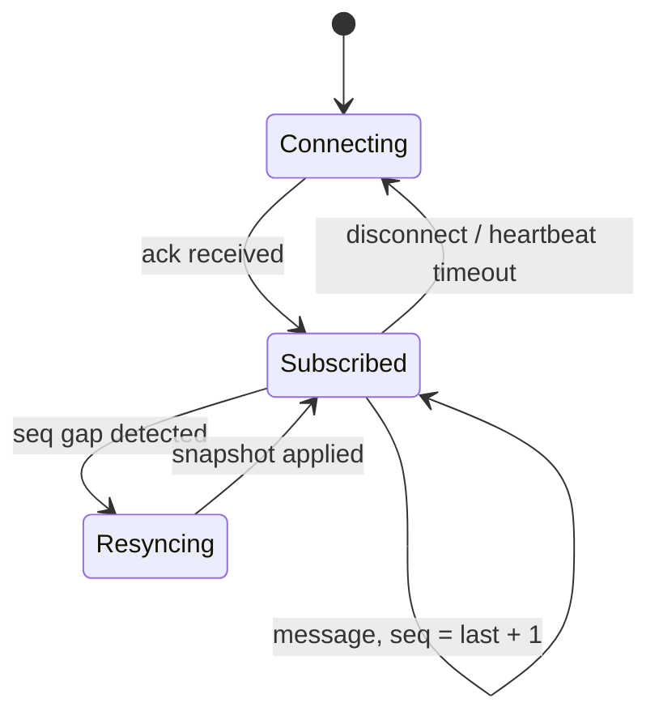

# Async and Market Data APIs

Market data arrives on the market's schedule, not yours. Fetch daily history for 500 symbols sequentially at 200 milliseconds per request and you have spent 100 seconds doing nothing — your program was idle the whole time, waiting on the network. Async is Python's way of doing that waiting concurrently, and it is the substrate of every data pipeline and live system later in this course. It is also where your relationship with data vendors is won or lost: the code in this lesson — rate limits, retries, reconnects — is the difference between a downloader that works in the demo and one that still works in week three.

Everything here runs offline: the "vendor" in most snippets is an in-process coroutine that sleeps for a realistic latency and returns synthetic data. The two snippets that genuinely need a network are marked as illustrative.

## The event loop, and why trading code cares

An `async def` function is a **coroutine**: calling it creates a suspended computation, and `await` runs it while marking the places where it may pause. When a coroutine awaits something slow — a network response, a timer — the **event loop** parks it and runs whatever else is ready. One thread, cooperative scheduling, no locks in your code. The payoff shows up the moment two waits overlap:

```python
import asyncio
import time

async def fetch_bars(symbol: str) -> str:
    await asyncio.sleep(0.05)            # stands in for network latency
    return f"{symbol}: 390 bars"

async def main() -> None:
    t0 = time.perf_counter()
    await fetch_bars("AAA")              # sequential: each await suspends us,
    await fetch_bars("BBB")              # and nothing else is queued
    print(f"sequential: {time.perf_counter() - t0:.2f}s")  # => ~0.10s

    t0 = time.perf_counter()
    await asyncio.gather(fetch_bars("AAA"), fetch_bars("BBB"))
    print(f"concurrent: {time.perf_counter() - t0:.2f}s")  # => ~0.05s

asyncio.run(main())
```

The discipline that keeps this model honest: **nothing in an async program may block the thread.** `time.sleep`, a synchronous `requests.get`, a heavy pandas aggregation — any of them freezes every task on the loop, because cooperation is voluntary. Sleep with `await asyncio.sleep`, do I/O with async libraries, and push CPU-bound work out of the loop entirely (a thread or process pool, or simply a separate batch step). Async buys concurrency for *waiting*, not for *computing* — a distinction the vectorized code of the earlier lessons already handles from the other side.

## Concurrency patterns that survive production

`asyncio.gather` is fine for a handful of awaits, but its failure mode is unhelpful at scale: by default one exception cancels nothing and the rest keep running detached. `asyncio.TaskGroup` is the structured alternative — all tasks finish or the block raises, nothing leaks. The second production necessity is bounding fan-out: a vendor that sees 500 simultaneous connections from your IP address does not interpret it as enthusiasm.

```python
import asyncio
import time

SYMBOLS = ["AAA", "BBB", "CCC", "DDD", "EEE", "FFF", "GGG", "HHH"]

async def fetch_bars(symbol: str, sem: asyncio.Semaphore) -> str:
    async with sem:                      # at most 3 requests in flight
        await asyncio.sleep(0.05)
        return f"{symbol} ok"

async def main() -> None:
    sem = asyncio.Semaphore(3)
    t0 = time.perf_counter()
    async with asyncio.TaskGroup() as tg:
        tasks = [tg.create_task(fetch_bars(s, sem)) for s in SYMBOLS]
    print(len([t.result() for t in tasks]))    # => 8
    print(f"{time.perf_counter() - t0:.2f}s")  # => ~0.15s — 3, then 3, then 2

asyncio.run(main())
```

Two more tools complete the survival kit. `asyncio.timeout` puts a deadline on any await — a vendor that usually answers in 80 milliseconds and occasionally hangs forever should cost you a timeout, not an evening. And cancellation is how timeouts and task groups work under the hood: a cancelled coroutine receives `CancelledError` at its next await, so `finally` blocks (and `async with` for sessions and connections) are what guarantee cleanup happens anyway.

## REST market data

REST endpoints are how you will fetch history: request, JSON response, done. Three habits separate a robust client from a script. Reuse one session for the whole program — connection setup is expensive, and every serious vendor supports keep-alive. Read credentials from the environment, never from literals in code; [Logging, Configuration, and Reproducibility](07-logging-and-config.md) formalizes where they live. And treat pagination as the norm: history endpoints return a page and a cursor, and your job is to loop until the cursor runs out.

```python
import asyncio

PAGES = {None: (["bar"] * 100, "p2"), "p2": (["bar"] * 100, "p3"),
         "p3": (["bar"] * 47, None)}

async def get_page(cursor: str | None) -> tuple[list[str], str | None]:
    await asyncio.sleep(0.02)            # simulated vendor endpoint
    return PAGES[cursor]

async def fetch_history() -> list[str]:
    rows: list[str] = []
    cursor: str | None = None
    while True:
        page, cursor = await get_page(cursor)
        rows.extend(page)
        if cursor is None:
            return rows

print(len(asyncio.run(fetch_history())))  # => 247
```

The real-network version of the same shape, with `aiohttp`:

```python
# illustrative — requires a live endpoint
import os

import aiohttp

async def fetch_bars(symbol: str) -> dict:
    headers = {"Authorization": f"Bearer {os.environ['VENDOR_TOKEN']}"}
    async with aiohttp.ClientSession(headers=headers) as session:
        url = f"https://api.vendor.example/v1/bars/{symbol}"
        async with session.get(url, params={"freq": "1min"}) as resp:
            resp.raise_for_status()
            return await resp.json()
```

In a real program the session is created once in `main` and passed in, not opened per call — and the JSON should be parsed into the frozen dataclasses of [Typing, Dataclasses, and Code Structure](03-typing-dataclasses-structure.md) right here at the boundary, so nothing downstream ever sees a raw dict.

## Rate limits

Every vendor publishes limits — requests per second, requests per day, concurrent connections — and enforces them with HTTP 429 responses, throttling, or account suspension. Respecting them is not politeness; it is protecting your access to the data your research depends on. The standard mechanism is a **token bucket**: tokens refill at the allowed rate, each request spends one, and an empty bucket means you wait. It permits short bursts while capping the sustained rate.

```python
import asyncio
import time

class TokenBucket:
    """Allow `rate` requests per second, with bursts up to `burst`."""

    def __init__(self, rate: float, burst: int) -> None:
        self.rate, self.burst = rate, burst
        self.tokens = float(burst)
        self.stamp = time.monotonic()

    async def acquire(self) -> None:
        while True:
            now = time.monotonic()
            self.tokens = min(self.burst,
                              self.tokens + (now - self.stamp) * self.rate)
            self.stamp = now
            if self.tokens >= 1:
                self.tokens -= 1
                return
            await asyncio.sleep((1 - self.tokens) / self.rate)

async def main() -> None:
    bucket = TokenBucket(rate=5, burst=2)    # 5 req/s, burst of 2
    t0 = time.perf_counter()
    for i in range(6):
        await bucket.acquire()
        print(f"req {i} at {time.perf_counter() - t0:.2f}s")
    # req 0 at 0.00s      <- the burst goes immediately
    # req 1 at 0.00s
    # req 2 at ~0.20s     <- then one token every 1/5 s
    # req 3 at ~0.40s
    # req 4 at ~0.60s
    # req 5 at ~0.80s

asyncio.run(main())
```

Note that the bucket and the semaphore from earlier limit different things — requests per second versus requests in flight — and a well-behaved client usually needs both. When a 429 arrives anyway, read the `Retry-After` header and honor it: the vendor is telling you exactly when to come back.

## Retries done right

Networks flake, vendors deploy on Fridays, and a request that failed once will usually succeed in a second. The standard remedy is **exponential backoff with full jitter**:

$$
\text{delay}_k = \min(\text{cap},\; b \cdot 2^k) \cdot U(0, 1),
$$

doubling a base delay $b$ per attempt $k$ up to a cap, then multiplying by a uniform random draw. The jitter matters more than it looks: when a vendor stumbles, every client sees the failure at the same moment, and without randomization they all retry in synchronized waves that re-flatten the vendor on schedule.

```python
import asyncio
import random

async def flaky_fetch(log: list[int], fail_first: int = 2) -> str:
    log.append(len(log))                 # simulated vendor: fails twice
    if len(log) <= fail_first:
        raise ConnectionError("vendor hiccup")
    return "247 bars"

async def with_retries(rng: random.Random, retries: int = 5) -> str:
    log: list[int] = []
    for attempt in range(retries):
        try:
            return await flaky_fetch(log)
        except ConnectionError:
            delay = min(2.0, 0.1 * 2**attempt) * rng.random()
            print(f"attempt {attempt} failed; sleeping {delay:.3f}s")
            await asyncio.sleep(delay)
    raise RuntimeError("retry budget exhausted")

print(asyncio.run(with_retries(random.Random(42))))
# attempt 0 failed; sleeping 0.064s
# attempt 1 failed; sleeping 0.005s
# => 247 bars
```

Before wrapping anything in a retry loop, ask whether the request is **idempotent** — safe to perform twice. Fetching bars is; the worst case is wasted bandwidth. Placing an order is not: a timeout tells you the *response* was lost, not that the request was, and blind resubmission is how doubled positions happen. (The live-trading parts of this course handle that case with idempotency keys and order-state reconciliation — never with a bare retry.) Equally important is giving up cleanly: a bounded retry budget and a loud final error, because a pipeline that silently retried all night has converted a vendor outage into a data gap you will discover much later.

## Streaming, and choosing REST vs websockets

For live quotes, order books, and fills, polling REST is the wrong shape — you want the vendor to push. A websocket subscription inverts the flow, and with it the engineering burden: the connection is now long-lived state that must be defended. Heartbeats detect silent death; on disconnect you reconnect and resubscribe; and because messages can be lost in the gap, vendors number them — a jump in sequence numbers means missing data, and the honest response is to resynchronize from a snapshot, not to pretend continuity. [Market Microstructure](../part-01-foundations/03-market-microstructure.md) explains what those sequenced book updates actually contain.



```python
# illustrative — requires a live endpoint
import asyncio
import json

import websockets

async def stream_quotes(symbol: str) -> None:
    last_seq = 0
    while True:                          # reconnect loop: never exits quietly
        try:
            async with websockets.connect("wss://stream.vendor.example") as ws:
                await ws.send(json.dumps({"op": "subscribe", "sym": symbol}))
                async for raw in ws:
                    msg = json.loads(raw)
                    if last_seq and msg["seq"] != last_seq + 1:
                        raise RuntimeError(f"gap {last_seq} -> {msg['seq']}")
                    last_seq = msg["seq"]
        except (OSError, RuntimeError):
            last_seq = 0                 # resync from snapshot, resubscribe
            await asyncio.sleep(1.0)
```

Whether you need any of this is a per-dataset decision:

| | REST polling | Websocket streaming |
|---|---|---|
| Latency | Poll interval at best | Milliseconds |
| Completeness | Whatever the endpoint returns — easy to reason about | Yours to guarantee via sequence numbers and snapshots |
| Cost & complexity | Low — stateless requests | High — connection state, gap recovery, monitoring |
| Fits | History, daily bars, reference data | Live quotes, order books, executions |

The rule of thumb that falls out: **bars and history over REST, books and fills over streams.** A strategy that trades once a day gains nothing from a websocket except failure modes; a live execution system cannot function without one. The machinery that schedules these downloads and keeps them running unattended is built in [Scheduling and Data Plumbing](../part-06-live-infrastructure/02-scheduling-and-data-plumbing.md).

!!! abstract "Key takeaways"
    - The event loop interleaves *waiting*, not computing: never block the thread — no `time.sleep`, no synchronous I/O, no heavy CPU work inside async code.
    - Prefer `TaskGroup` over bare `gather` for structured error handling, bound fan-out with a semaphore, and put a timeout on every network await.
    - REST clients live and die by three habits: one reused session, credentials from the environment, and pagination loops that run until the cursor is exhausted.
    - Rate limits are an economic constraint — enforce them client-side with a token bucket plus a concurrency cap, and honor `Retry-After` on 429s.
    - Retry with exponential backoff and full jitter, only for idempotent requests, with a bounded budget and a loud failure at the end — order placement is never blindly retried.
    - Streams trade REST's simplicity for latency: heartbeats, reconnect-and-resubscribe, and sequence-gap resync are the price, so pay it only for data that truly must push.

## Where this goes next

You can now get data out of a vendor reliably; the next problem is keeping it somewhere trustworthy, so that you never download the same history twice and yesterday's query gives yesterday's answer. That is [SQL and Data Storage](05-sql-and-data-storage.md).
