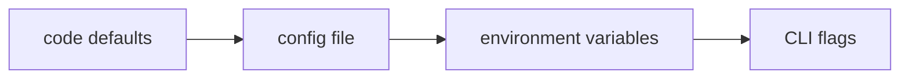

# Logging, Configuration, and Reproducibility

The most expensive sentence in quantitative research is "I can't reproduce the backtest that made us allocate to this." A result with no recorded configuration, seed, or code version is an anecdote — maybe a true one, but nobody can check, and results nobody can check have a way of being flattering. This closing lesson of Part II is about the difference between a result and a claim: pipelines that say what they did (logging), are told what to do in one auditable place (configuration), and can be rerun to the same numbers indefinitely (reproducibility).

None of it requires infrastructure. Everything here is the standard library plus one small package, applied with intent.

## Logs are data

`print` statements answer the question you had while writing them. Logs should answer questions you have not asked yet — which run produced this file? what was the NaN rate before that suspicious result? — and that means logs need structure. The convention is JSON lines: one JSON object per event, with context fields, written to stdout or a file.

```python
import json
import logging
import sys

class JsonFormatter(logging.Formatter):
    def format(self, record: logging.LogRecord) -> str:
        entry = {"level": record.levelname, "msg": record.getMessage()}
        entry.update(getattr(record, "ctx", {}))
        return json.dumps(entry)

handler = logging.StreamHandler(sys.stdout)
handler.setFormatter(JsonFormatter())
log = logging.getLogger("research")
log.addHandler(handler)
log.setLevel(logging.INFO)

log.info("stage complete", extra={"ctx": {
    "run_id": "a3f9", "stage": "load_bars", "rows": 98280, "nan_rate": 0.002}})
# {"level": "INFO", "msg": "stage complete", "run_id": "a3f9",
#  "stage": "load_bars", "rows": 98280, "nan_rate": 0.002}
```

(A production formatter also stamps the time on every entry; it is omitted here so the output stays deterministic on the page.) Two fields do the heavy lifting. `run_id` — one identifier minted at startup and attached to every event — is what lets you pull the complete story of a single run out of a month of interleaved logs. And the counts: rows loaded, rows dropped, NaN rates — the numbers lesson 01 taught you to track — belong in log fields, not in your memory of what the console said. The payoff of the format is that logs load straight back into the tools of this part: `pd.read_json("run.log", lines=True)` turns a log file into a DataFrame, and "which stage dropped the rows?" becomes a groupby.

## Levels with intent

Levels are a promise about who needs to read the event, and a research pipeline uses them best with concrete meanings:

| Level | In a research pipeline | Example |
|---|---|---|
| `DEBUG` | Per-row/per-symbol detail; off by default, on when hunting | "AAA 2024-01-15: forward-filled 2 bars" |
| `INFO` | Stage boundaries with counts and timings | "resample done, 98280 → 19656 rows, 1.4s" |
| `WARNING` | The run continued, but a human should look eventually | "NaN rate 4.1% exceeds 1% threshold" |
| `ERROR` | The run's output cannot be trusted | "vendor returned 0 rows for 3 symbols" |

The discipline that keeps levels meaningful: **a WARNING that fires on every run is a configuration bug** — either the threshold is wrong or the data problem is real, and both deserve fixing rather than scrolling past. Alert fatigue is how genuinely new warnings go unread, and in live trading — where [Monitoring, Logging, and Alerting](../part-06-live-infrastructure/04-monitoring-logging-alerting.md) picks up this thread — unread warnings become unexplained positions.

## Configuration out of the code

Parameters hardcoded in scripts rot in predictable ways: the lookback edited in place for an experiment and never restored, the database path that exists on exactly one laptop, the "temporary" universe filter that becomes load-bearing. Configuration belongs in files; for research configs this course uses **TOML** — it is unambiguous, it supports comments, and Python reads it with zero dependencies via `tomllib`. (YAML is widespread in ops tooling and fine there; its type-guessing quirks make it a worse default for numbers you care about.)

The pattern that scales is layering — a base file plus a small per-context override:

```python
import tempfile
import tomllib
from pathlib import Path

root = Path(tempfile.mkdtemp())
(root / "base.toml").write_text(
    '[run]\nseed = 42\nlookback = 20\n\n[data]\ndb_path = "research.db"\n')
(root / "research.toml").write_text("[run]\nlookback = 60\n")

def load(env: str) -> dict:
    cfg = tomllib.loads((root / "base.toml").read_text())
    for section, values in tomllib.loads(
            (root / f"{env}.toml").read_text()).items():
        cfg.setdefault(section, {}).update(values)
    return cfg

print(load("research")["run"])  # => {'seed': 42, 'lookback': 60}
```

The override file contains *only* what differs, which makes reading it a diff against the base. When more sources enter the picture, precedence runs in one direction, rightmost wins:



Defaults are the documentation, the file is the record, environment variables adapt a deployment, and command-line flags serve the one-off experiment. Any tool that resolves these in a different order is a tool you will eventually debug at midnight.

## Typed settings with pydantic

A dict of config values reintroduces exactly the disease [Typing, Dataclasses, and Code Structure](03-typing-dataclasses-structure.md) cured: stringly-typed data with no declared shape. `pydantic-settings` closes the loop — a settings class is a validated dataclass that knows how to populate itself from the environment:

```python
import os
from pydantic import SecretStr, ValidationError
from pydantic_settings import BaseSettings, SettingsConfigDict

class Settings(BaseSettings):
    model_config = SettingsConfigDict(env_prefix="QL_")
    seed: int = 42
    lookback: int = 20
    vendor_token: SecretStr = SecretStr("")

os.environ["QL_LOOKBACK"] = "60"
os.environ["QL_VENDOR_TOKEN"] = "super-secret"

s = Settings()
print(s.lookback)      # => 60 — parsed and type-checked from the env
print(s.vendor_token)  # => ********** — masked in logs and reprs

os.environ["QL_LOOKBACK"] = "sixty"
try:
    Settings()
except ValidationError as e:
    print(e.error_count(), "validation error")  # => 1 validation error
```

Two properties matter. Validation happens at startup: `QL_LOOKBACK=sixty` kills the run in the first millisecond with a named field and reason, instead of six stages later as a `TypeError` in the middle of a resample — failing at the door is always cheaper than failing mid-run. And `SecretStr` is where the API keys from [Async and Market Data APIs](04-async-and-apis.md) live: the value arrives from the environment, never from code, and every accidental `print` or log line shows asterisks; only an explicit `.get_secret_value()` reveals it, which makes leaking a secret a greppable act rather than an accident.

## Reproducible runs, end to end

Reproducibility is the absence of hidden state, and hidden state hides in the same places every time. The audit list for any research script:

- **Global RNGs** — module-level `np.random.*` calls, or libraries seeding themselves; any randomness not traceable to your seed.
- **Hardcoded paths** — absolute paths into one person's home directory.
- **Mutable default arguments** — the shared-list trap from lesson 03, now corrupting results across calls.
- **Wall-clock dependence** — `datetime.now()` inside feature logic, so the "same" run differs by execution date.
- **Unpinned environments** — the pandas 2 to 3 upgrade will change *some* output somewhere; a lockfile makes that a diff, not a mystery.
- **Notebook execution order** — cells run out of order are unrecorded state; the notebooks-are-for-looking rule exists for exactly this reason.

Seed discipline follows one rule from lesson 01, applied without exception: create **one** `np.random.default_rng(cfg.seed)` at the top of the run and pass it explicitly to everything that needs randomness. Explicit passing makes the dependency visible in every signature — and makes the appendix's point about [Random Number Generation](../appendix/part-09-monte-carlo-methods/01-random-number-generation.md) practical: a seeded generator is a deterministic function, so the same seed *is* the same data.

The final piece is the **run manifest**: a small JSON file written next to every output, recording what produced it.

```python
import hashlib
import json
import tempfile
from pathlib import Path

import numpy as np

def run(cfg: dict, out_dir: Path) -> None:
    rng = np.random.default_rng(cfg["seed"])   # THE generator, created once
    rets = rng.normal(0.0005, 0.01, 252)
    sharpe = float(rets.mean() / rets.std() * np.sqrt(252))

    manifest = {
        "config": cfg,
        "config_hash": hashlib.sha256(
            json.dumps(cfg, sort_keys=True).encode()).hexdigest()[:12],
        "code_version": "<git rev-parse HEAD>",
        "outputs": {"sharpe": round(sharpe, 4)},
    }
    (out_dir / "manifest.json").write_text(json.dumps(manifest, indent=2))
    print(json.dumps(manifest["outputs"]))
    print(manifest["config_hash"])

run({"seed": 42, "lookback": 60}, Path(tempfile.mkdtemp()))
# {"sharpe": 0.0276}
# 873bb4049e72
```

A real manifest adds the start time and a dump of package versions; the shape is what matters. The config hash answers "were these two runs configured identically?" without diffing files; the recorded git commit answers "which code?"; together with the seed they make the claim checkable: anyone can rerun `config_hash 873bb...` at that commit and demand the same 0.0276. (That Sharpe is the same flat seed-42 year whose equity curve you plotted in the previous lesson — the generator has been keeping this promise across the whole part.) When a number in a meeting looks too good, the manifest is what turns "trust me" into "run it yourself" — and structuring whole projects around this contract is where [Package Structure, Configuration, and Dependency Injection](../part-09-software-engineering/03-package-structure-config-di.md) goes deeper.

!!! warning "If it isn't recorded, it didn't happen that way"
    The uncomfortable corollary of this lesson: a result produced before you added config recording, seeding, and manifests is not reproducible *retroactively*. Instrument the pipeline before the interesting result shows up, because the interesting result is precisely the one whose provenance will be questioned.

!!! abstract "Key takeaways"
    - Logs are data: JSON lines with a `run_id` and count fields, loadable back into a DataFrame — instrument for the questions you have not asked yet.
    - Levels are promises: INFO narrates stages with counts, WARNING demands an eventual human, ERROR means the output is untrustworthy — and a WARNING that always fires is a bug.
    - Configuration lives in layered TOML files with one precedence order: defaults, file, environment, CLI — rightmost wins.
    - `pydantic-settings` makes config a validated, typed object that fails at startup and masks secrets by construction.
    - Audit for hidden state — global RNGs, hardcoded paths, mutable defaults, wall-clock reads, unpinned environments — and pass one seeded generator explicitly.
    - Every output ships with a manifest: config, config hash, code version, seed, results. That file is what makes a number a claim instead of an anecdote.

## Where this goes next

Part II is complete: you can compute with arrays, align time series, structure and type the code, fetch data politely, store it honestly, chart it defensibly, and rerun all of it to the same numbers. That stack exists to answer one question — is a strategy's edge real, or luck? — and answering it is statistics. [Part III — Statistics for Trading](../part-03-statistics/index.md) begins there.
