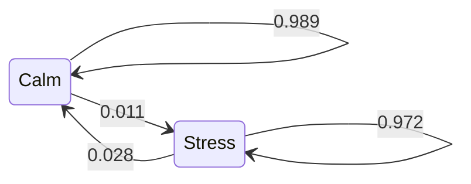

# Bayesian Methods and Hidden Markov Models

Part III has treated a strategy's edge as a fixed unknown number — something to estimate, test, and wrap in an interval. But that is not how a desk actually reasons. A desk holds a *belief* about the edge, updates it as evidence arrives, discounts it against the base rate of strategies that looked this good and failed, and asks a question no frequentist interval answers: *given everything seen so far, what is the probability this thing makes money?* Bayesian statistics is that reasoning made formal, and it earns its place here because its machinery — priors, posteriors, shrinkage — is the mathematically honest version of the skepticism lessons four and five kept arriving at empirically.

The second half of the lesson gives the market itself a hidden variable: a latent regime that switches between calm and stress, inferred by a Hidden Markov Model. The two halves share a moral. Both produce quantities that quietly consult information you would not have had in real time, and the lesson's job is to enjoy their power while keeping that confession on the record. Foundations live in the appendix's [Bayesian Framework](../appendix/part-16-bayesian-statistics/01-bayesian-framework.md) and [Hidden Markov Models](../appendix/part-08-stochastic-processes/07-hidden-markov-models.md) pages; the running example is still the twelve-month momentum strategy.

## Parameters as beliefs

Bayes' rule turns a prior belief and observed data into a posterior belief:

$$
p(\theta \mid \text{data}) \;\propto\; p(\text{data} \mid \theta)\, p(\theta),
$$

and for a hit rate — a Bernoulli parameter — the algebra is fully closed-form: a $\text{Beta}(a, b)$ prior observing $k$ wins in $n$ trials becomes a $\text{Beta}(a + k,\; b + n - k)$ posterior ([Conjugate Priors](../appendix/part-16-bayesian-statistics/04-conjugate-priors.md) explains why the family is closed under updating):

```python
import numpy as np
import pandas as pd
from scipy import stats

px = pd.read_parquet("data/prices.parquet")
r = np.log(px["SPY"]).diff().dropna()
strat = (np.sign(r.rolling(252).sum()).shift(1) * r).dropna()

wins, n = (strat > 0).sum(), len(strat)
post = stats.beta(1 + wins, 1 + n - wins)          # flat Beta(1,1) prior
print(f"hit rate {wins / n:.4f}  ({wins} of {n})")
# => hit rate 0.5406  (3329 of 6158)
print(f"95% credible [{post.ppf(0.025):.4f}, {post.ppf(0.975):.4f}], "
      f"P(hit rate > 0.5) = {1 - post.cdf(0.5):.3f}")
# => 95% credible [0.5281, 0.5530], P(hit rate > 0.5) = 1.000
p_hat, se = wins / n, np.sqrt(wins / n * (1 - wins / n) / n)
print(f"Wald 95% CI  [{p_hat - 1.96 * se:.4f}, {p_hat + 1.96 * se:.4f}]")
# => Wald 95% CI  [0.5282, 0.5530]
```

Two readings, one honest and one seductive. The honest one: with a flat prior and six thousand observations, the credible interval and the frequentist interval agree to the third decimal — the data has drowned the prior, as it should, and the Bayesian machinery here buys interpretability ("the probability the hit rate exceeds one-half is essentially one"), not different numbers. The seductive one is the number itself: a hit rate *decisively* above 50%, from the very strategy lesson four declared statistically dead. Both are true. The strategy is right 54% of days and still barely profitable, because momentum's losing days — concentrated in the stress regimes this lesson will soon label — are larger than its winning ones. Hit rate is trivia; the mean is the money. Any pitch deck leading with win percentage is answering the easy question because the hard one came out badly.

## Sequential updating: yesterday's posterior, today's prior

For the mean return with (approximately) known variance, the normal-normal conjugate update composes across time — feed it a year, and the posterior becomes the prior for the next year:

$$
\tau_{\text{post}}^{-2} = \tau_0^{-2} + \tfrac{n}{\sigma^2},
\qquad
\mu_{\text{post}} = \tau_{\text{post}}^{2}\Big(\tfrac{\mu_0}{\tau_0^{2}} + \tfrac{\sum x_i}{\sigma^2}\Big).
$$

Watching the belief evolve over a quarter century is the fastest way to internalize what data can and cannot do for a trading mean:

```python
import numpy as np
import pandas as pd

px = pd.read_parquet("data/prices.parquet")
r = np.log(px["SPY"]).diff().dropna()
strat = (np.sign(r.rolling(252).sum()).shift(1) * r).dropna()

sigma2, tau2, mu0 = strat.var(), (1e-2) ** 2, 0.0     # wide prior
for year in [2005, 2010, 2015, 2020, 2025]:
    x = strat.loc[:str(year)]
    t2 = 1 / (1 / tau2 + len(x) / sigma2)
    mu = t2 * (mu0 / tau2 + x.sum() / sigma2)
    print(f"through {year}: ann mean {252 * mu:+.1%} +/- {252 * 1.96 * np.sqrt(t2):.1%}")
# => through 2005: ann mean +9.2% +/- 17.0%
#    through 2010: ann mean +10.1% +/- 12.0%
#    through 2015: ann mean +7.9% +/- 9.8%
#    through 2020: ann mean +6.1% +/- 8.5%
#    through 2025: ann mean +5.8% +/- 7.7%
```

The interval narrows like $1/\sqrt{n}$, exactly as theory promises — and after twenty-four years it is still ±7.7% around a +5.8% mean. This is lesson one's "the mean is barely estimable" and lesson four's ±0.20 Sharpe error bar, arriving a third time in Bayesian dress, and the repetition is the point: no philosophy of statistics rescues you from the information content of the data. What updating *does* buy is a live belief at every point in time — the input a sizing rule can consume daily ([Bayesian Updating](../appendix/part-16-bayesian-statistics/05-bayesian-updating.md) covers the mechanics, and [Bayesian Signal Updating](../appendix/part-18-quant-finance-applications/08-bayesian-signal-updating.md) the trading application).

## Priors are chosen, not discovered

With data this weakly informative, the prior is not a formality — it is a live input, and pretending otherwise is how Bayesian analysis becomes rhetoric. The professional move is to publish the sensitivity:

```python
import numpy as np
import pandas as pd
from scipy import stats

px = pd.read_parquet("data/prices.parquet")
r = np.log(px["SPY"]).diff().dropna()
strat = (np.sign(r.rolling(252).sum()).shift(1) * r).dropna()
sigma2, n = strat.var(), len(strat)

for label, mu0, tau in [("skeptical  N(0, 1bp)", 0.0, 1e-4),
                        ("agnostic   N(0, 100bp)", 0.0, 1e-2),
                        ("optimistic N(4bp, 2bp)", 4e-4, 2e-4)]:
    t2 = 1 / (1 / tau**2 + n / sigma2)
    mu = t2 * (mu0 / tau**2 + strat.sum() / sigma2)
    print(f"{label}:  post ann mean {252 * mu:+.1%}, "
          f"P(edge > 0) {1 - stats.norm.cdf(0, mu, np.sqrt(t2)):.2f}")
# => skeptical  N(0, 1bp):  post ann mean +1.7%, P(edge > 0) 0.79
#    agnostic   N(0, 100bp):  post ann mean +5.8%, P(edge > 0) 0.93
#    optimistic N(4bp, 2bp):  post ann mean +7.4%, P(edge > 0) 0.99
```

Three defensible priors, three verdicts — a 79% chance of an edge or a 99% one, from the same data. When the sensitivity table disagrees this much, the data has not settled the question, and *that* is the finding. The skeptical prior deserves special respect: centering the edge at zero with a one-basis-point standard deviation encodes "almost every backtest that reaches my desk has no edge," which is lesson four's multiple-testing correction re-expressed as a belief — the fifty variants, the lone bright cell, and the survivorship of ideas all live inside that tight prior. A desk that runs skeptical priors is running Bonferroni continuously, without the ceremony.

## Shrinkage and the winner's curse

The same skepticism, applied cross-sectionally, is shrinkage: estimate many related quantities, and pull each individual estimate toward the group average,

$$
\hat\mu_i^{\text{shrunk}} \;=\; (1 - \lambda)\,\hat\mu_i + \lambda\,\bar\mu .
$$

James and Stein proved the counterintuitive theorem — for three or more means, some shrinkage beats none in expected error — but real strategy grids make the case more vividly than the theorem does. Estimate all fifty momentum-variant means on 2001–2014, then score the estimates against realized 2015–2025 means:

```python
import numpy as np
import pandas as pd

px = pd.read_parquet("data/prices.parquet")
r = np.log(px["SPY"]).diff().dropna()

est, real = [], []
for lb in range(10, 501, 10):
    s = (np.sign(r.rolling(lb).sum()).shift(1) * r).dropna()
    est.append(s.loc[:"2014"].mean())
    real.append(s.loc["2015":].mean())
est, real = np.array(est), np.array(real)

best = np.argmax(est)
print(f"in-sample winner: lookback {range(10, 501, 10)[best]}, "
      f"est {252 * est[best]:+.1%}, realized {252 * real[best]:+.1%}")
# => in-sample winner: lookback 270, est +10.5%, realized -1.8%

for lam in [0.0, 0.5, 1.0]:
    shrunk = (1 - lam) * est + lam * est.mean()
    print(f"lambda {lam:.1f}: OOS MSE {1e8 * ((shrunk - real) ** 2).mean():.2f}")
# => lambda 0.0: OOS MSE 6.51
#    lambda 0.5: OOS MSE 4.40
#    lambda 1.0: OOS MSE 3.42
```

The first line is the winner's curse with a date stamp: the variant that looked best in-sample (+10.5% a year) *lost money* out of sample, because "best of fifty" is where estimation error concentrates — selecting on noisy estimates selects the noise. The sweep then delivers the shrinkage verdict at maximum strength: error falls monotonically all the way to $\lambda = 1$, meaning the variants' individual histories contained *no* usable information beyond the family average. The optimal shrinkage always reflects the cross-sectional signal-to-noise ratio, and lesson four already measured this family's to be indistinguishable from zero — the two lessons are one lesson. In portfolio practice the same logic runs on covariance matrices, where Ledoit-Wolf shrinkage toward a structured target is the standard repair for the sample covariance's instability; the principle is identical and the payoff larger.

## Hidden Markov models: regimes as latent states

Every lesson in this part has tripped over the same fact from a different angle: volatility clusters, correlations flip in stress, momentum's losses concentrate. The Hidden Markov Model gives that fact a generative story — the market occupies one of a few latent *states*, each with its own return distribution, switching by a Markov chain ([Markov Chains](../appendix/part-08-stochastic-processes/05-markov-chains.md) covers the chain, the appendix [HMM page](../appendix/part-08-stochastic-processes/07-hidden-markov-models.md) the full machinery). Two ingredients define it: a transition matrix and per-state emissions. Fitting by EM on the SPY series:

```python
import numpy as np
import pandas as pd
from hmmlearn.hmm import GaussianHMM

px = pd.read_parquet("data/prices.parquet")
r = np.log(px["SPY"]).diff().dropna()
X = r.values.reshape(-1, 1)

hmm = GaussianHMM(n_components=2, covariance_type="full", n_iter=500,
                  random_state=42).fit(X)
order = np.argsort(hmm.covars_.ravel())            # label states by variance
means = hmm.means_.ravel()[order]
vols = np.sqrt(hmm.covars_.ravel())[order]
T = hmm.transmat_[np.ix_(order, order)]
for i, name in enumerate(["calm", "stress"]):
    print(f"{name:7s} ann mean {252 * means[i]:+.1%}  ann vol {np.sqrt(252) * vols[i]:.1%}  "
          f"P(stay) {T[i, i]:.3f}")
# => calm    ann mean +21.9%  ann vol 11.6%  P(stay) 0.989
#    stress  ann mean -29.0%  ann vol 32.0%  P(stay) 0.972
print("expected regime length: calm", round(1 / (1 - T[0, 0])),
      "days, stress", round(1 / (1 - T[1, 1])), "days")
# => expected regime length: calm 93 days, stress 36 days
```

The `argsort` line is not cosmetic — EM numbers its states arbitrarily, and every rerun may swap them, so *you* impose the labeling (here, by variance). What the model finds is the two-regime folklore, quantified: a calm state earning +22% at 11.6% vol, a stress state losing −29% at 32% vol, and — the structurally important part — both states *sticky*, with expected durations of a quarter and a month and a half respectively:



Stickiness is what makes regimes more than a relabeling of "good days and bad days": knowing today's state carries real information about next month's distribution, which is exactly the kind of structure a sizing rule can use.

## How many states? Fit is not the question

EM maximizes likelihood for a *given* number of states ([The EM Algorithm](../appendix/part-17-statistical-computing/03-em-algorithm.md)); it cannot tell you how many to use, and it finds local optima, so every fit below is the best of five random restarts. The standard tool is BIC — likelihood penalized by parameter count ([Information Criteria](../appendix/part-14-model-selection/03-information-criteria.md)) — and its verdict on this data is instructively unhelpful:

```python
import numpy as np
import pandas as pd
from hmmlearn.hmm import GaussianHMM

px = pd.read_parquet("data/prices.parquet")
r = np.log(px["SPY"]).diff().dropna()
X = r.values.reshape(-1, 1)

for k in [1, 2, 3, 4]:
    best = None
    for seed in range(5):
        m = GaussianHMM(n_components=k, covariance_type="full", n_iter=500,
                        random_state=seed).fit(X)
        if best is None or m.score(X) > best.score(X):
            best = m
    print(f"k={k}: loglik {best.score(X):8.1f}   BIC {best.bic(X):9.1f}")
# => k=1: loglik  19094.8   BIC  -38172.1
#    k=2: loglik  20423.7   BIC  -40786.1
#    k=3: loglik  20713.4   BIC  -41304.1
#    k=4: loglik  20785.6   BIC  -41369.6
```

Note the first row: a one-state Gaussian HMM is just the normal distribution, and its log-likelihood of 19,095 matches lesson two's normal fit to the digit — a cross-lesson consistency check, for free. Then the disappointment: BIC improves at every $k$, and would keep improving past four, because real returns are richer than any small Gaussian mixture and more states always mop up more of the richness. The information is in the *increments*: one state to two buys 2,614 BIC points — enormous, the regime structure is real — two to three buys 518, three to four a token 65. The statistical criterion ranks fit; it does not make the modeling decision. The desk criterion does: each state you keep must be nameable (calm, stress, crisis), stable across subsamples, and populated enough to estimate a strategy's behavior inside it. By that standard the elbow says two, possibly three — and a state you cannot name is a state you cannot trade.

## Trading the regimes, honestly

The payoff for all of this is conditioning: how does the momentum strategy behave *inside* each regime?

```python
import numpy as np
import pandas as pd
from hmmlearn.hmm import GaussianHMM

px = pd.read_parquet("data/prices.parquet")
r = np.log(px["SPY"]).diff().dropna()
X = r.values.reshape(-1, 1)

hmm = GaussianHMM(n_components=2, covariance_type="full", n_iter=500,
                  random_state=42).fit(X)
calm = np.argsort(hmm.covars_.ravel())[0]
states = pd.Series(hmm.predict(X), index=r.index)

strat = (np.sign(r.rolling(252).sum()).shift(1) * r).dropna()
for lbl, grp in strat.groupby(states.reindex(strat.index).map(
        lambda s: "calm" if s == calm else "stress")):
    print(f"momentum in {lbl:6s}: ann ret {252 * grp.mean():+.1%}, "
          f"Sharpe {np.sqrt(252) * grp.mean() / grp.std():+.2f}, n {len(grp)}")
# => momentum in calm  : ann ret +15.6%, Sharpe +1.35, n 4550
#    momentum in stress: ann ret -21.7%, Sharpe -0.67, n 1608
```

There is the strategy's whole biography in two lines: a genuinely good strategy in the calm regime (Sharpe 1.35 across eighteen years of days) and an actively harmful one in stress — which nets out to the lifeless 0.30 the previous two lessons kept refusing to bless. The obvious next step is to size by regime probability, and it appears to work miracles:

```python
import numpy as np
import pandas as pd
from hmmlearn.hmm import GaussianHMM

px = pd.read_parquet("data/prices.parquet")
r = np.log(px["SPY"]).diff().dropna()
X = r.values.reshape(-1, 1)

hmm = GaussianHMM(n_components=2, covariance_type="full", n_iter=500,
                  random_state=42).fit(X)
calm = np.argsort(hmm.covars_.ravel())[0]
p_calm = pd.Series(hmm.predict_proba(X)[:, calm], index=r.index)

pos = np.sign(r.rolling(252).sum()).shift(1)
for name, s in [("unconditional", (pos * r).dropna()),
                ("P(calm)-sized", (pos * p_calm.shift(1) * r).dropna())]:
    eq = np.exp(s.cumsum())
    mdd = (eq / eq.cummax() - 1).min()
    print(f"{name}: Sharpe {np.sqrt(252) * s.mean() / s.std():.2f}, "
          f"maxDD {mdd:.0%}")
# => unconditional: Sharpe 0.30, maxDD -43%
#    P(calm)-sized: Sharpe 1.10, maxDD -16%
```

Sharpe from 0.30 to 1.10, max drawdown from −43% to −16% — the single most seductive table in Part III, and it is **not a backtest**. Two forms of hindsight are baked in. The parameters were estimated on the full sample, so 2008 informs how the model reads 2003. Worse, `predict_proba` is *smoothed*: the probability it assigns to date $t$ is computed using the entire series, including everything after $t$ — the smoother recognizes a stress regime early partly because it has watched how the following weeks unfolded. Live trading gets *filtered* probabilities (data through $t$ only), which flag regimes later, flicker at the boundaries, and give back a large share of this table's magic. The honest reading: regime-conditioning is real structure worth building on — the calm/stress asymmetry in momentum's returns is a genuine finding — but this table is an in-sample diagnostic that sets an upper bound, and the real-time version belongs in Part IV's walk-forward machinery ([Regime Detection](../appendix/part-18-quant-finance-applications/16-regime-detection.md) and [Hidden State Models](../appendix/part-18-quant-finance-applications/17-hidden-state-models.md) develop the filtered-vs-smoothed distinction properly).

!!! warning "The smoother knows the future; your strategy will not"
    Every full-sample decode, every posterior computed with today's hindsight about which priors "worked," every regime label assigned by an algorithm that read the whole series — these are legitimate research diagnostics and illegitimate trading signals. Before any conditional result excites you, ask one question: at each date, what information did this number consume? If the answer includes anything dated after the decision it claims to inform, you are reading the future's opinion of the past and calling it foresight.

!!! abstract "Key takeaways"
    - Conjugate updates make Bayesian inference closed-form: with six thousand observations the credible and frequentist intervals agree to three decimals, and the machinery's value is the question it answers — P(edge > 0) — not different numbers.
    - The momentum strategy's hit rate is decisively above 50% while its mean edge is not defensible: wins are more frequent and losses are larger, and hit rate is the easy question.
    - Sequential updating narrows the belief like 1/√n to ±7.7% after twenty-four years — the mean's near-inestimability survives every change of statistical philosophy.
    - Three defensible priors put P(edge > 0) at 0.79, 0.93, and 0.99 from the same data; publishing that sensitivity is the analysis, and the skeptical prior is multiple-testing discipline expressed as belief.
    - The in-sample champion of fifty variants lost money out of sample, and full shrinkage to the family mean minimized prediction error — the grid's internal differences were pure noise.
    - A two-state HMM recovers sticky regimes — calm +22% at 12% vol lasting a quarter, stress −29% at 32% vol lasting six weeks — with state labels you must impose yourself.
    - BIC improves forever as states are added; the decision criterion is the increment plus nameability, and the elbow here says two.
    - Regime-sized momentum shows Sharpe 1.10 versus 0.30 — under smoothed probabilities that consult the future, making it an upper-bound diagnostic, not a backtest.

## Where this goes next

Part III is complete. You can now characterize a return series honestly — its moments with error bars, its distribution with the tails measured, its memory located in the variance; you can put any claim about a strategy on trial with the multiplicity counted; you can bootstrap an error bar for statistics no formula covers, and translate a Sharpe ratio into the drawdowns it implies; and you can hold beliefs that update, shrink toward skepticism, and condition on inferred regimes — while knowing exactly which of those numbers consulted the future. That toolkit exists to be spent. [Part IV — Strategy Development](../part-04-strategy-development/index.md) spends it immediately: its opening lesson, [Momentum and Trend Following](../part-04-strategy-development/01-momentum-and-trend-following.md), takes the very rule this part used as its crash-test dummy and rebuilds it the right way around — hypothesis first, universe chosen for the mechanism, and every evaluation running through the machinery you now own.
