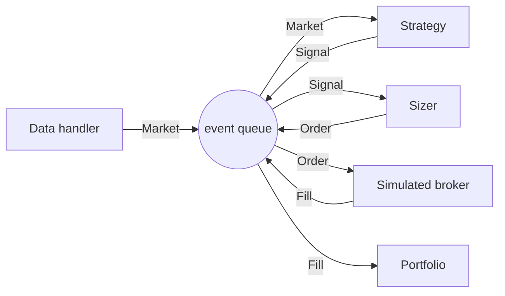

# Architecture and Event-Driven Design

Every backtest in Part IV was a multiplication: a matrix of positions times a matrix of returns, summed. That arithmetic built five strategies, priced their costs, and survived a validation gauntlet — and its closing lesson ended with a promissory note: [Validation and Overfitting](../part-04-strategy-development/08-validation-and-overfitting.md) tested everything by hand, at daily closes, with costs bolted on afterward, and promised that this part would industrialize the machinery. This lesson pays the first installment. An event-driven engine replaces the multiplication with a simulation — market data becomes events, events flow through a queue in timestamp order, and components that cannot see the future because the future has not been *delivered* to them turn signals into orders and orders into fills. The claim to internalize is architectural: a vectorized backtest is correct only if every line remembers to look away from the future, while an event-driven engine is correct because the future does not exist yet when each decision is made.

The vocabulary is one you already own. [Typing, Dataclasses, and Code Structure](../part-02-python/03-typing-dataclasses-structure.md) built frozen `Bar` and `Fill` dataclasses and argued that market objects are immutable facts; this lesson promotes those facts to *events* and gives them a clock. The data is new: backtesting fills orders at opens and checks stops against highs and lows, so the Close-only caches of Parts III and IV no longer suffice, and this lesson freezes a third and final cache — full OHLCV bars for the tsmom universe, plus one currency pair whose purpose [Portfolio Accounting](02-portfolio-accounting.md) will reveal.

## Two ways to run history

The strategy this part carries through every lesson is Part IV's `tsmom` — long what rose over the past year, short what fell, equal-weighted across SPY, TLT, and GLD. Vectorized, it is five lines and a familiar number:

```python
import numpy as np
import pandas as pd

px = pd.read_parquet("data/prices.parquet")
rets = np.log(px[["SPY", "TLT", "GLD"]]).diff()
tsmom = (np.sign(rets.rolling(252).sum()).shift(1) * rets).mean(axis=1).dropna()

print(f"tsmom: Sharpe {np.sqrt(252) * tsmom.mean() / tsmom.std():.2f}, "
      f"ann vol {np.sqrt(252) * tsmom.std():.1%}, n {len(tsmom)}")
# => tsmom: Sharpe 0.30, ann vol 12.2%, n 6158
```

Twenty-five years, three assets, milliseconds — that speed is why research iterates vectorized, and nothing in this part retires the habit. But read what the multiplication actually simulated. It held fractional, infinitely divisible, costless exposure; it rebalanced every day at the very close it had just used to compute the signal; it had no cash balance, so it could never run out of money or earn interest on a short's proceeds; no order ever existed, so nothing could be partially filled, rejected, or left working overnight; and if a regulator — or your own future self — asked *which trades* produced the 0.30, there would be nothing to show. The vectorized number is an upper bound on a claim, not a record of a strategy. Whenever the question shifts from "does this signal carry information?" to "what would I have held, paid, and suffered?", the multiplication has no answer, and the rest of this lesson builds the machine that does. The two run modes are not rivals but stages: vectorized to search, event-driven to certify — the same division of labor [Portfolio Construction and Transaction Costs](../part-04-strategy-development/07-portfolio-construction-and-transaction-costs.md) drew between research costs and production costs.

## Bars for the rest of this part

Fills happen at opens; stops trigger at highs and lows; participation limits are fractions of volume. This part therefore freezes its own cache — the same ritual as [Part III's](../part-03-statistics/01-probability-and-random-variables.md), widened from closes to full bars:

```python
# one-time download — requires a network connection
import yfinance as yf

bars = yf.download(["SPY", "TLT", "GLD", "EURUSD=X"], start="2000-01-01",
                   end="2025-07-01", auto_adjust=True)
bars = bars.rename(columns={"EURUSD=X": "EURUSD"}, level=1)
bars.to_parquet("data/part5.parquet")
```

Everything downstream reads the file, never the vendor:

```python
import pandas as pd

bars = pd.read_parquet("data/part5.parquet")
close = bars["Close"]

print(bars.shape)
print(", ".join(f"{t} {close[t].first_valid_index():%Y-%m-%d}"
                for t in ["SPY", "TLT", "GLD", "EURUSD"]))
spy = bars.xs("SPY", axis=1, level=1).dropna()
print("SPY rows after per-symbol dropna:", len(spy))
adv = (spy["Close"] * spy["Volume"]).tail(252).median()
print(f"SPY median dollar volume, last year: ${adv/1e9:.1f}bn")

old = pd.read_parquet("data/prices.parquet")["SPY"]
both = pd.concat([close["SPY"], old], axis=1, keys=["new", "old"]).dropna()
drift = (both["new"] / both["old"] - 1).abs().max()
print(f"max |part5 / prices.parquet - 1| for SPY close: {drift*1e4:.2f} bp")
# => (6611, 20)
#    SPY 2000-01-03, TLT 2002-07-30, GLD 2004-11-18, EURUSD 2003-12-01
#    SPY rows after per-symbol dropna: 6411
#    SPY median dollar volume, last year: $28.9bn
#    max |part5 / prices.parquet - 1| for SPY close: 0.01 bp
```

Three details in that printout are load-bearing. First, the shape: 6,611 rows against Part III's 6,411, because EURUSD trades a different calendar and the union index carries rows where SPY has no bar — every engine component in this part reads per-symbol, `dropna`-ed frames, never the raw union. Second, `auto_adjust=True` rewrites the open, high, and low with the same dividend adjustment as the close; for SPY, TLT, and GLD — none of which has ever split — that is a feature, since every bar stays internally consistent and Volume is untouched. Third, the drift line: two years after Part III downloaded its cache, the vendor's re-adjusted SPY closes agree with our frozen file to within a hundredth of a basis point. That is a courtesy, not a guarantee — dividend adjustment rewrites all of history every quarter — and the doctrine stands regardless: the file, not the vendor, is the source of truth, and every number pinned in this part is reproducible from `data/part5.parquet` forever. The $28.9bn median dollar volume is an entry in a later lesson's ledger — [Order Management and Fill Simulation](03-order-management-and-fill-simulation.md) will need it to price market impact.

## Four kinds of events

An event-driven engine is a small society with a strict etiquette: components never call each other. Each one subscribes to a single kind of event, does its work, and publishes a different kind back to a shared queue:



The four nouns carry precise meanings. A **Market** event says a bar became visible — not that a price "is" anything, but that at a stated moment a fact became knowable. A **Signal** is an opinion: a strategy looked at visible facts and wants exposure. An **Order** is an intention with a quantity attached, and a **Fill** is the only event that reports something that actually *happened* — shares moved, money changed hands. The discipline of publishing only to the queue is what makes the architecture worth its ceremony. The strategy cannot peek at the broker's state, the sizer cannot ask the data handler for tomorrow, and — the seam this course has been promising since Part II — the `SimulatedBroker` box can be unplugged and replaced by a live brokerage API without any other component changing a line, which is precisely how [Part VI](../part-06-live-infrastructure/index.md) will take this same diagram to production.

## Events as frozen facts

Part II argued that market objects should be immutable, validated at construction, and slotted; events are where that discipline earns its rent, because an event that can be edited after publication is a rumor, not a fact:

```python
import dataclasses
from dataclasses import dataclass
from datetime import date
from enum import StrEnum, auto

class Side(StrEnum):                      # as in Part II — the closed vocabulary
    BUY = auto()
    SELL = auto()

@dataclass(frozen=True, slots=True)
class Market:                             # a bar became visible
    ts: date
    symbol: str
    close: float                          # the full Bar returns in lesson three

@dataclass(frozen=True, slots=True)
class Signal:                             # a strategy wants exposure
    ts: date
    symbol: str
    strength: float                       # direction and conviction in [-1, +1]

@dataclass(frozen=True, slots=True)
class Order:                              # a sizer wants shares
    ts: date
    symbol: str
    side: Side
    qty: int

@dataclass(frozen=True, slots=True)
class Fill:                               # a broker reports what happened
    ts: date
    symbol: str
    side: Side
    qty: int
    px: float
    commission: float

f = Fill(date(2024, 1, 4), "SPY", Side.BUY, 100, 468.16, 0.94)
print(f.side, f.qty, "@", f.px)
try:
    f.px = 400.0
except dataclasses.FrozenInstanceError:
    print("fills are history; history does not change")
# => buy 100 @ 468.16
#    fills are history; history does not change
```

This is the event contract, and its asymmetries are deliberate. Every event carries `ts` — the moment it became true — because the queue will order the world by that field alone. Only `Signal` carries a `strength` in $[-1, +1]$: strategies state direction and conviction, never share counts, which keeps the sizing decision where [Part IV's sizing lesson](../part-04-strategy-development/06-position-sizing-and-risk-budgeting.md) put it — in its own component, with its own budget. Only `Order` and `Fill` carry a `Side` and a quantity, and only `Fill` carries money fields, `px` and `commission`: opinions are free, executions are not, and the type system now says so. The `Market` event here carries a bare close — the full OHLCV `Bar` from Part II rejoins in lesson three, when highs and lows start deciding whether stop orders trigger. And the frozen-ness is not ceremony: the portfolio will replay these objects to reconcile its books in [the next lesson](02-portfolio-accounting.md), and a replay is only evidence if nobody could have edited the record.

## The queue is the clock

The engine has no `for` loop over dates. Time advances only when the queue hands over the next event, so the queue's ordering rule *is* the simulation's model of causality. Event $e_i$ is processed before $e_j$ if and only if

$$
(t_i, s_i) \;<\; (t_j, s_j)
$$

lexicographically, where $t$ is the event's timestamp and $s$ is a monotone arrival sequence number — earlier moments first, and within the same moment, first published first processed:

```python
import heapq
from dataclasses import dataclass, field
from datetime import date
from itertools import count

@dataclass
class EventQueue:
    _heap: list = field(default_factory=list)
    _seq: count = field(default_factory=count)

    def push(self, ts: date, event: object) -> None:
        heapq.heappush(self._heap, (ts, next(self._seq), event))

    def pop(self) -> object:
        return heapq.heappop(self._heap)[2]

    def __bool__(self) -> bool:
        return bool(self._heap)

q = EventQueue()
q.push(date(2024, 1, 4), "signal computed on the 4th")
q.push(date(2024, 1, 3), "bar for the 3rd, arriving late")
q.push(date(2024, 1, 4), "order placed after that signal")
while q:
    print(q.pop())
# => bar for the 3rd, arriving late
#    signal computed on the 4th
#    order placed after that signal
```

Nine lines of `heapq`, and two of them repay study. The bar for the 3rd was pushed *after* both January-4th events and still popped first — the heap orders by timestamp, not by arrival, so a data handler may load history in any order it likes and the simulation is unmoved. And the two same-day events came back in publication order, because the tuple comparison falls through to the sequence number before it would ever compare the events themselves — which both makes ties deterministic and spares the event dataclasses from defining an ordering, correctly, since there is no meaningful sense in which an order is "less than" a fill. Determinism is the quiet payoff: identical inputs produce an identical processing sequence, bit for bit, every run. The reconciliation discipline of the [next lesson](02-portfolio-accounting.md) — books that must balance to the penny after every event — is only a usable test because reruns cannot shuffle.

## One bar through the loop

The loop itself is a dispatcher: pop an event, look at its type, hand it to the component that subscribes to that type, push whatever the component publishes. Two hand-built bars are enough to watch every state change a bar causes:

```python
import heapq
from collections import namedtuple
from datetime import date
from itertools import count

# the contract of the previous section, collapsed for a one-symbol trace
Market = namedtuple("Market", "ts close")
Signal = namedtuple("Signal", "ts strength")
Order = namedtuple("Order", "ts qty")
Fill = namedtuple("Fill", "ts qty px")

heap, seq = [], count()

def push(ev):
    heapq.heappush(heap, (ev.ts, next(seq), ev))

def on_market(ev):                        # a toy rule — Part IV owns real ones
    return Signal(ev.ts, +1.0 if ev.close >= 470.0 else -1.0)

def on_signal(ev):                        # a toy sizer — flat 100 shares
    return Order(ev.ts, int(100 * ev.strength))

def on_order(ev):                         # a fantasy price — lesson three's job
    return Fill(ev.ts, ev.qty, 470.50)

for bar in [Market(date(2024, 1, 3), 468.79), Market(date(2024, 1, 4), 471.30)]:
    push(bar)
while heap:
    ts, _, ev = heapq.heappop(heap)
    match ev:
        case Market(close=c):
            print(f"{ts}  MARKET  close {c:.2f}")
            push(on_market(ev))
        case Signal(strength=s):
            print(f"{ts}  SIGNAL  strength {s:+.0f}")
            push(on_signal(ev))
        case Order(qty=q):
            print(f"{ts}  ORDER   qty {q:+d}")
            push(on_order(ev))
        case Fill(qty=q, px=p):
            print(f"{ts}  FILL    {q:+d} @ {p:.2f}")
# => 2024-01-03  MARKET  close 468.79
#    2024-01-03  SIGNAL  strength -1
#    2024-01-03  ORDER   qty -100
#    2024-01-03  FILL    -100 @ 470.50
#    2024-01-04  MARKET  close 471.30
#    2024-01-04  SIGNAL  strength +1
#    2024-01-04  ORDER   qty +100
#    2024-01-04  FILL    +100 @ 470.50
```

Eight events from two bars, and the trace is the audit the vectorized backtest could never produce: this close caused this opinion, which caused this intention, which caused this execution, each stamped. Notice that January 3rd's entire cascade drained before January 4th's bar was touched — nothing in the code arranged that; the queue's $(t, s)$ ordering did, and it would have held just as well had the bars been pushed in reverse. The handlers are deliberately pure — one event in, one event out, no component reaching into another's state — and each carries its confession in a comment: the threshold rule is a toy, the flat hundred shares is a toy, and the 470.50 fill price is a fantasy invented by a broker with no market to consult. The contract dataclasses collapsed to `namedtuple`s here to keep the trace on one page — same immutability, less ceremony — and termination is simply the queue running dry once the data handler has nothing more to say. Every later engine in this part, including the full run in [Performance Metrics and Reporting](04-performance-metrics-and-reporting.md), is this loop with the confessions replaced by components that have stopped apologizing.

## Look-ahead, ruled out by construction

Part IV repeated one incantation in every strategy: `.shift(1)`, yesterday's signal trading today's return. Delete it and the signal trades a return that was inside its own lookback window when the "decision" was made. The deletion is eight characters, and here is what it buys:

```python
import numpy as np
import pandas as pd

px = pd.read_parquet("data/prices.parquet")
rets = np.log(px[["SPY", "TLT", "GLD"]]).diff()

for lb in [252, 20]:
    sig = np.sign(rets.rolling(lb).sum())
    honest = (sig.shift(1) * rets).mean(axis=1).dropna()
    leaky = (sig * rets).mean(axis=1).dropna()
    print(f"{lb:3d}-day lookback: honest Sharpe "
          f"{np.sqrt(252) * honest.mean() / honest.std():.2f}, "
          f"with the leak {np.sqrt(252) * leaky.mean() / leaky.std():.2f}")
# => 252-day lookback: honest Sharpe 0.30, with the leak 1.07
#     20-day lookback: honest Sharpe 0.13, with the leak 3.44
```

At a 20-day lookback the corrupted number is 3.44 — absurd enough that anyone would go hunting for the bug. At 252 days the same eight-character omission prints 1.07: a number good enough to raise money, produced from a strategy whose honest Sharpe is 0.30, and *nothing about it looks wrong*. That is why vigilance fails — leaks are caught when they produce unbelievable numbers, and the slower the signal, the more believable the corruption. Now try to run the same bug through the event architecture: it cannot be written. The strategy handler computes its signal from `Market` events already delivered — bars up to and including $t$ — and publishes a `Signal` stamped $t$; the sizer's `Order` follows at $t$; and the broker can only fill against a bar that arrives *after* the order exists. The return earned from $t$ to $t+1$ is booked by a fill whose price the strategy had not seen when it decided. The leak is not forbidden by a code-review checklist; it is inexpressible in the timestamps. Note the distinction from [Part IV lesson seven's](../part-04-strategy-development/07-portfolio-construction-and-transaction-costs.md) execution-lag test, which compared two *honest* timelines — signal-close versus next-close, Sharpe 0.30 versus 0.37 — a question about which reality to assume; this section's bug assumes a reality that never existed.

## The skeleton run

The last step is to run the loop against real history — all 6,411 SPY bars from the new cache, with the sign strategy real and everything else a declared placeholder:

```python
import heapq
from itertools import count
import numpy as np
import pandas as pd

bars = pd.read_parquet("data/part5.parquet")
spy = bars.xs("SPY", axis=1, level=1).dropna()
sig = np.sign(np.log(spy["Close"]).diff().rolling(252).sum())
nxt_open = spy["Open"].shift(-1)
nxt_ts = spy.index.to_series().shift(-1)

heap, seq = [], count()
counts = dict.fromkeys(["MARKET", "SIGNAL", "ORDER", "FILL"], 0)
pos, last, first_fill = 0, 0.0, None

def push(ts, kind, target=0, px=0.0):
    heapq.heappush(heap, (ts, next(seq), kind, target, px))

for ts in spy.index:                      # the data handler, in one line
    push(ts, "MARKET")
while heap:
    ts, _, kind, target, px = heapq.heappop(heap)
    counts[kind] += 1
    if kind == "MARKET":
        s = sig.at[ts]
        if not np.isnan(s) and s != last: # strategy: trade the sign change
            push(ts, "SIGNAL", target=int(100 * s))
            last = s
    elif kind == "SIGNAL":                # sizer: a flat 100 shares, for now
        push(ts, "ORDER", target)
    elif kind == "ORDER":                 # broker: next open, free of charge
        if not pd.isna(nxt_open.at[ts]):  # the last order of history never fills
            push(nxt_ts.at[ts], "FILL", target, round(nxt_open.at[ts], 2))
    elif kind == "FILL":                  # portfolio: a real ledger is lesson two
        if first_fill is None:
            first_fill = ts, px
        pos = target

print(" -> ".join(f"{k} {v}" for k, v in counts.items()))
print(f"first fill {first_fill[0]:%Y-%m-%d} at {first_fill[1]}, "
      f"final position {pos:+d} shares")
# => MARKET 6411 -> SIGNAL 90 -> ORDER 90 -> FILL 90
#    first fill 2001-01-03 at 81.25, final position +100 shares
```

Read the funnel first: 6,411 bars became 90 signals, because the strategy publishes only on a sign *change* — the queue is not a metronome forcing daily action, and a component with nothing to say says nothing. The first fill lands on 2001-01-03 at 81.25, a full year after the data begins, because a 252-day signal simply does not exist before then; the vectorized version got the same effect from a `dropna()`, but here no one had to remember it — the warm-up produced no `Signal` events, so nothing downstream could act. The final position is +100 shares, SPY's trailing year having ended the sample positive. Two placeholders deserve their confessions read aloud. The broker fills every order, in full, at the next day's open, for free — lesson three replaces it with a state machine, three fill models, partial fills, and a rejection path, though the guard clause already encodes one honest rule: an order on history's last bar never fills, because the engine does not invent prices. The portfolio is a single integer that believes every fill and remembers nothing — [Portfolio Accounting](02-portfolio-accounting.md) replaces it with lots, a cash ledger, and invariants checked after every event. What will not change, from here to the full tearsheet run of lesson four, is the shape of this loop.

!!! warning "Look-ahead bias is an architecture problem, not a vigilance problem"
    In a vectorized backtest, correctness lives in a suffix — `.shift(1)` — that every signal, in every notebook, must remember forever, and the punishment for one omission is a Sharpe of 1.07 that looks like a career. In an event-driven engine, correctness lives in the timestamps: decisions are made on delivered events, executions follow decisions into later bars, and the corrupted computation cannot be expressed at all. When you must choose what to trust, prefer machinery that makes the error unwritable over authors who promise not to write it — especially when the author is you.

!!! abstract "Key takeaways"
    - Vectorized and event-driven backtests answer different questions: the five-line `tsmom` (Sharpe 0.30, ann vol 12.2%, n 6158) is an upper bound on a claim — no cash, no orders, no audit trail — while the engine simulates what you would have held and paid.
    - This part's frozen cache, `data/part5.parquet`, holds OHLCV bars for SPY/TLT/GLD plus EURUSD: shape (6611, 20) on the union calendar, 6,411 SPY rows after per-symbol `dropna`, and a $28.9bn SPY median dollar volume that lesson three will spend pricing impact; the vendor currently agrees with Part III's two-year-old cache to 0.01 bp, which is a courtesy, not the doctrine.
    - The event contract is four frozen dataclasses — Market, Signal, Order, Fill — whose asymmetries are the design: only signals carry strength, only orders and fills carry quantities and sides, only fills carry money.
    - The queue processes events in lexicographic $(t, s)$ order: timestamps beat arrival order, and a monotone sequence number breaks same-moment ties deterministically, so identical inputs replay identically.
    - Two bars through the dispatch loop produced eight stamped events — close to opinion to intention to execution — with each day's cascade draining before the next day begins, by ordering rather than by arrangement.
    - Deleting `.shift(1)` inflates tsmom from 0.30 to 1.07 at a 252-day lookback and from 0.13 to 3.44 at 20 days: the slower the signal, the more believable the corruption — and in the event architecture the same bug is inexpressible, because fills can only follow orders into later bars.
    - The skeleton run turned 6,411 bars into 90 signals, 90 orders, and 90 fills, first fill 2001-01-03 at 81.25 after a structurally silent warm-up year — with the broker and portfolio as declared placeholders that lessons three and two replace.

## Where this goes next

The skeleton's weakest confession is the portfolio: a bare integer that believes every fill and remembers nothing — not what was paid, not which shares came first, not whether any cash remains. [Portfolio Accounting](02-portfolio-accounting.md) replaces it with the engine's memory: positions built from FIFO lots, a cash ledger that prices every fill and commission, mark-to-market equity, the corporate actions and currency conversions real books cannot dodge, and — the habit separating engines you trust from engines you hope — reconciliation invariants checked after every single event, to the penny.
