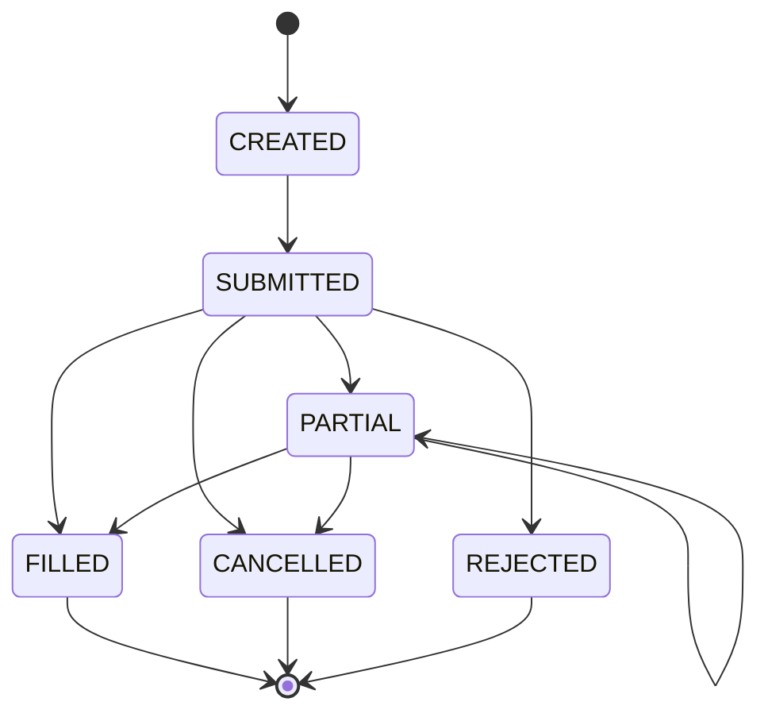

# Order Management and Fill Simulation

The simulated broker is where a backtest decides what reality it believes in. [Portfolio Accounting](02-portfolio-accounting.md) booked every fill it was handed with penny-exact discipline — but the *price on the fill* was somebody else's claim, and this lesson is that somebody. Its job splits into two halves that must not be confused. Order *management* is bookkeeping under law: an order is a stateful object that moves through a lifecycle, and only some transitions are legal. Fill *simulation* is epistemology under humility: given only a daily bar — four prices and a volume, with everything that happened inside it invisible — what execution price can you defend? The first half has a right answer and a state machine. The second half has no right answer at all, only assumptions of increasing honesty, and the lesson ends by measuring how much each assumption moves the strategy this part carries.

The costs are not new. The half-spreads and commission this lesson wires into the broker are, character for character, the constants [Portfolio Construction and Transaction Costs](../part-04-strategy-development/07-portfolio-construction-and-transaction-costs.md) estimated from [market microstructure](../part-01-foundations/03-market-microstructure.md) — what is new is *where they live*: not a haircut applied to a finished backtest, but machinery inside the simulation, applied fill by fill, at fill prices the strategy never chose.

## The order lifecycle

An order is not a request that either succeeds or fails; it is a small state machine that can rest, fill in pieces, be cancelled, or be refused — and once terminal, it never moves again:



The diagram becomes code as an enum, a transition table, and a guard that refuses everything the table does not bless:

```python
from enum import StrEnum, auto

class OrderState(StrEnum):
    CREATED = auto()
    SUBMITTED = auto()
    PARTIAL = auto()
    FILLED = auto()
    CANCELLED = auto()
    REJECTED = auto()

LEGAL = {
    OrderState.CREATED: {OrderState.SUBMITTED},
    OrderState.SUBMITTED: {OrderState.PARTIAL, OrderState.FILLED,
                           OrderState.CANCELLED, OrderState.REJECTED},
    OrderState.PARTIAL: {OrderState.PARTIAL, OrderState.FILLED,
                         OrderState.CANCELLED},
    OrderState.FILLED: set(),
    OrderState.CANCELLED: set(),
    OrderState.REJECTED: set(),
}

def advance(state: OrderState, to: OrderState) -> OrderState:
    if to not in LEGAL[state]:
        raise ValueError(f"illegal transition {state} -> {to}")
    return to

s = OrderState.CREATED
for to in [OrderState.SUBMITTED, OrderState.PARTIAL, OrderState.FILLED]:
    s = advance(s, to)
    print("->", s)
try:
    advance(s, OrderState.CANCELLED)
except ValueError as e:
    print(e)
# => -> submitted
#    -> partial
#    -> filled
#    illegal transition filled -> cancelled
```

Three features of the table do the real work. `PARTIAL` points at itself — an order can fill in many pieces, and each piece is its own event, which is why [lesson two's](02-portfolio-accounting.md) ledger was built to book multiple fills against one intention. The three terminal states have empty transition sets, so a cancel arriving after completion — the raised `illegal transition filled -> cancelled` — is a loud error instead of silent corruption. And `REJECTED` is reachable only from `SUBMITTED`: rejection is the *broker's* verdict on a fresh order, not something that happens to a working one. In a backtest this guard mostly catches your own engine's bugs. In live trading it earns its keep daily, because a real broker's updates arrive asynchronously, out of order, and occasionally duplicated — and the state machine is the component that notices when the story being told cannot be true, a seam [Part VI](../part-06-live-infrastructure/index.md) will stress hard.

## Order types against a bar

A daily bar answers only one question about an intraday price: *was it touched?* If the bar's range covered a level, that level traded. Market, limit, and stop orders are three different uses of that single fact — tested here against a genuinely wild bar, the yen-carry unwind of August 5th, 2024:

```python
import pandas as pd

bars = pd.read_parquet("data/part5.parquet")
b = bars.xs("SPY", axis=1, level=1).dropna().loc["2024-08-05"]
o, h, l = round(b["Open"], 2), round(b["High"], 2), round(b["Low"], 2)
print(f"SPY 2024-08-05: O {o} H {h} L {l} C {round(b['Close'], 2)}")

def against_bar(kind, side, px=None):
    if kind == "market":
        return f"fills near {o}"
    if kind == "limit":                   # price px or better must have traded
        touched = l <= px if side == "buy" else h >= px
        return f"fills at {min(o, px) if side == 'buy' else max(o, px)}" \
            if touched else "does not fill"
    if kind == "stop":                    # becomes a market order once touched
        touched = h >= px if side == "buy" else l <= px
        return f"triggers, fills near {max(o, px) if side == 'buy' else min(o, px)}" \
            if touched else "does not trigger"

for kind, side, px in [("market", "buy", None), ("limit", "buy", 505.0),
                       ("limit", "buy", 495.0), ("stop", "sell", 505.0),
                       ("stop", "buy", 515.0)]:
    tag = f"{kind} {side}" + (f" @ {px:.0f}" if px else "")
    print(f"{tag:18s} -> {against_bar(kind, side, px)}")
# => SPY 2024-08-05: O 499.81 H 511.47 L 498.47 C 505.42
#    market buy         -> fills near 499.81
#    limit buy @ 505    -> fills at 499.81
#    limit buy @ 495    -> does not fill
#    stop sell @ 505    -> triggers, fills near 499.81
#    stop buy @ 515     -> does not trigger
```

Two rows teach most of the microstructure. The limit buy at 505 fills at 499.81, *better* than its limit — the market gapped open below the level, and a limit order's contract is "this price or better", so the open is what you get. The sell stop at 505 is the same geometry with the opposite emotional payload: the market opened already through the stop, so it triggered immediately and filled near 499.81 — five dollars worse than the level the trader thought protected them. That is the **gap rule**, and it is not an edge case; it is what stops *are*: a guarantee of triggering, never of price. A stop-limit order composes the two tests — trigger like a stop, then rest like a limit — buying protection from the gap at the price of possibly not executing at all. The honest caveat belongs in every engine's documentation: a bar reports *that* levels traded, never *in what order*. When one bar touches both a stop and a limit, intrabar sequence decides the outcome and the bar cannot testify — a defensible engine picks the conservative reading (assume the ordering that hurts you) and says so, and if the strategy's edge depends on winning those ambiguities, the strategy needs intraday data, not a more optimistic convention.

## Fill model I: the next bar's open

The simplest defensible fill model is the one the skeleton and every engine run in this part uses: decide at the close of bar $t$, execute at the open of bar $t+1$ — the first price that verifiably existed *after* the decision. What the model charges you is the night in between:

```python
import numpy as np
import pandas as pd

bars = pd.read_parquet("data/part5.parquet")
spy = bars.xs("SPY", axis=1, level=1).dropna()

gap = (spy["Open"].shift(-1) / spy["Close"] - 1).dropna()
bp = gap.abs() * 1e4
print(f"overnight gap C(t) -> O(t+1), SPY, {len(bp):,d} nights:")
print(f"mean |gap| {bp.mean():.1f} bp, median {bp.median():.1f} bp, "
      f"95th pct {bp.quantile(0.95):.0f} bp, worst {bp.max():.0f} bp")
worst = bp.idxmax()
print(f"worst: close {worst:%Y-%m-%d} -> next open {gap[worst]:+.1%}")
# => overnight gap C(t) -> O(t+1), SPY, 6,410 nights:
#    mean |gap| 44.6 bp, median 29.0 bp, 95th pct 134 bp, worst 1045 bp
#    worst: close 2020-03-13 -> next open -10.4%
```

The distribution is the model's price tag. On a median night the open lands 29 bp from the prior close; the mean of 44.6 bp is dragged up by a fat tail; one night in twenty exceeds 134 bp; and the record is the COVID weekend — decide at Friday's close on 2020-03-13, and Monday's open greets you 10.4% lower. Next-bar-open accepts this overnight drift as the cost of honesty, and it is worth naming exactly what dishonesty it replaces: Part IV's vectorized convention implicitly filled *at the very close the signal was computed from* — a price you could not have traded, because by the time the close printed, the close was over. The gap distribution above is therefore also a preview of a reconciliation: when [lesson four](04-performance-metrics-and-reporting.md) runs `tsmom` through the engine at next-open fills and compares it with the vectorized number, the difference between the two is made of these gaps, harvested a few hundred times at signal flips. For a slow strategy the gaps sometimes even help — momentum's flips tend to fire after sharp moves that partially revert by morning — which is why honest timing does not always mean a worse number, only a *true* one.

## Fill model II: mid plus spread

The open is a real price, but nobody trades *at* it for free: a marketable order crosses half the bid-ask spread, and the broker charges commission. Model II adds both, with the constants inherited verbatim from Part IV:

```python
import pandas as pd

bars = pd.read_parquet("data/part5.parquet")
close = bars["Close"]

HS = {"SPY": 0.5, "IVV": 1.0, "TLT": 1.0, "GLD": 1.0, "SEC": 2.0}  # half-spread, bp
COMM = 0.2                                                          # bp per trade

def fill_mid_spread(sym, qty, mid):
    side = 1 if qty > 0 else -1
    px = round(mid * (1 + side * HS[sym] * 1e-4), 4)  # cross the half-spread
    fee = round(abs(qty) * px * COMM * 1e-4, 2)
    return px, fee

for sym, qty in [("SPY", +2000), ("TLT", -5000), ("GLD", +3000)]:
    mid = round(float(close[sym].iloc[-1]), 2)
    px, fee = fill_mid_spread(sym, qty, mid)
    cost = round(abs(qty) * abs(px - mid) + fee, 2)
    print(f"{sym} {qty:+6d} @ mid {mid:7.2f} -> fill {px:9.4f}, "
          f"commission {fee:5.2f}, total cost {cost:7.2f}")
# => SPY  +2000 @ mid  611.08 -> fill  611.1106, commission 24.44, total cost   85.64
#    TLT  -5000 @ mid   84.09 -> fill   84.0816, commission  8.41, total cost   50.41
#    GLD  +3000 @ mid  304.83 -> fill  304.8605, commission 18.29, total cost  109.79
```

The mechanics are direction-aware: the SPY buy fills above mid at 611.1106, the TLT sell fills *below* mid at 84.0816 — the model never grants price improvement, because crossing the spread is the fee for immediacy in both directions. The dictionary is the point of the section. `HS` and `COMM` are the exact objects from [Part IV lesson seven](../part-04-strategy-development/07-portfolio-construction-and-transaction-costs.md) — half a basis point for SPY, one for TLT and GLD, 0.2 bp of commission — but their role has changed from *analysis* to *simulation*: Part IV multiplied turnover by these numbers after the backtest finished; the broker charges them inside each fill, so the ledger's cash is wrong by exactly nothing at every moment in between. The magnitudes deserve one glance: the $1.22M SPY buy paid $85.64 all-in, about 0.7 bp. For liquid ETFs at these sizes the spread is almost beneath notice — which is precisely the trap. These same constants, applied to a strategy that trades daily instead of a dozen-odd times a year, were what executed `pairs` in Part IV; the last section of this lesson re-runs that verdict from inside the engine.

## Fill model III: spread plus impact

Models I and II share an assumption so natural it hides: that your order did not move the price. Above a certain size it does, and the standard first-order correction is the square-root law,

$$
\text{cost}_{\text{one-way}} \;=\; \frac{s}{2} \;+\; \sigma_d \sqrt{\frac{q}{\mathrm{ADV}}},
$$

half the spread plus daily volatility scaled by the square root of the order's share of average daily volume. The cache knows SPY's real depth — the $28.9bn ledger entry [lesson one](01-architecture-and-event-driven-design.md) made is now spent:

```python
import numpy as np
import pandas as pd

bars = pd.read_parquet("data/part5.parquet")
spy = bars.xs("SPY", axis=1, level=1).dropna()
adv = float((spy["Close"] * spy["Volume"]).tail(252).median())
sigd = float(np.log(spy["Close"]).diff().tail(252).std())

print(f"SPY today: ADV ${adv/1e9:.1f}bn, daily vol {sigd:.1%}")
for q in [1e6, 1e8, 1e9]:
    impact = sigd * np.sqrt(q / adv) * 1e4
    print(f"order ${q/1e6:>5,.0f}M: impact {impact:5.1f} bp, "
          f"all-in one-way {0.5 + 0.2 + impact:5.1f} bp")
# => SPY today: ADV $28.9bn, daily vol 1.3%
#    order $    1M: impact   0.8 bp, all-in one-way   1.5 bp
#    order $  100M: impact   7.5 bp, all-in one-way  8.2 bp
#    order $1,000M: impact  23.8 bp, all-in one-way  24.5 bp
```

Read the scaling, because intuition reliably gets it wrong in both directions. A $1M order in SPY is invisible — 0.8 bp of impact against $28.9bn of daily volume. A hundred times more money does not cost a hundred times more: $100M pays 7.5 bp, roughly ten times the impact, because the square root compresses. But by $1bn — three and a half percent of a day's volume — impact is 23.8 bp and has swallowed the spread thirty times over: for institutional size, *impact is the cost, and the spread is a rounding error on it*. The comparison with Part IV's cost lesson is the depth lesson: sector ETFs there carried $1.5bn ADVs, about twenty times shallower, and $\sqrt{20} \approx 4.4$ — the same dollars hurt four to five times more the moment you leave the deepest instruments. The square root also whispers the entire field of execution: since cost grows sublinearly in size, splitting an order across time cuts impact, which is why real desks schedule executions across hours or days — and why a backtest engine needs the concept this model still lacks: an order that cannot finish today. That is the next section.

## Partial fills

A participation cap — never take more than a fixed fraction of a bar's volume — is the simplest honest model of finite liquidity, and it forces the engine to handle an order that outlives the bar that received it. GLD's launch week, when the world's now-$290bn gold fund was days old and thin, makes it concrete:

```python
import pandas as pd

bars = pd.read_parquet("data/part5.parquet")
gld = bars.xs("GLD", axis=1, level=1).dropna()
CAP = 0.10                                # take at most 10% of a bar's volume

order_qty = 2_000_000                     # two million shares of week-one GLD
resting, paid = order_qty, 0.0
for ts, bar in gld.head(5).iterrows():
    if resting == 0:
        break
    take = min(resting, int(bar["Volume"] * CAP))
    resting -= take
    paid += take * round(bar["Open"], 2)  # each slice pays that day's open
    print(f"{ts:%Y-%m-%d}: volume {int(bar['Volume']):>10,d}, "
          f"filled {take:>9,d} @ {round(bar['Open'], 2)}, resting {resting:>9,d}")

avg = paid / order_qty
print(f"average fill {avg:.4f} vs day-one open {round(gld['Open'].iloc[0], 2)} "
      f"({(avg / round(gld['Open'].iloc[0], 2) - 1) * 1e4:+.0f} bp)")
# => 2004-11-18: volume  5,992,000, filled   599,200 @ 44.43, resting 1,400,800
#    2004-11-19: volume 11,655,300, filled 1,165,530 @ 44.49, resting   235,270
#    2004-11-22: volume 11,996,000, filled   235,270 @ 44.75, resting         0
#    average fill 44.5026 vs day-one open 44.43 (+16 bp)
```

The two-million-share order — about $89M — took three trading days to complete, and the trace is the `PARTIAL` self-loop from the state machine made flesh: each day emits its own fill event at its own price, the residual rests, and only when the last 235,270 shares print does the order reach `FILLED`. The ledger absorbs this without ceremony — lesson two's book was built for many fills per intention — but the *strategy* now faces a question vectorized backtesting cannot even pose: for three days the book held neither the old position nor the new one, and whatever the signal said on day two happened to a portfolio in transit. The price of patience is measured on the last line: the average fill of 44.5026 sits 16 bp above the day-one open the naive model would have granted, because GLD drifted up while the order worked. Sixteen basis points is the realized, path-dependent cousin of model III's square-root estimate — impact models are forecasts of exactly this number — and on a $89M order it is about $140,000 of slippage that model I would have silently awarded to the backtest as free money.

## The simulated broker

The pieces assemble into one component: rejection checks first, then the participation cap, then a spread-adjusted next-open price, then the verdict — the same interface the skeleton's free-of-charge placeholder pretended to have:

```python
import pandas as pd

bars = pd.read_parquet("data/part5.parquet")
data = {s: bars.xs(s, axis=1, level=1).dropna() for s in ["SPY", "TLT", "GLD"]}
HS = {"SPY": 0.5, "TLT": 1.0, "GLD": 1.0}  # half-spread bp, as in Part IV
COMM, CAP = 0.2, 0.10

def execute(sym, qty, ts):
    if sym not in data:                   # rejection: not our universe
        return f"{sym} {qty:+d}: REJECTED (unknown symbol)"
    if qty == 0:                          # rejection: meaningless order
        return f"{sym} {qty:+d}: REJECTED (zero quantity)"
    later = data[sym].index[data[sym].index > ts]
    if len(later) == 0:                   # rejection: nothing to fill against
        return f"{sym} {qty:+d}: REJECTED (no bar after {ts:%Y-%m-%d})"
    nb = data[sym].loc[later[0]]
    fillable = min(abs(qty), int(nb["Volume"] * CAP))
    side = 1 if qty > 0 else -1
    px = round(nb["Open"] * (1 + side * HS[sym] * 1e-4), 4)
    fee = round(fillable * px * COMM * 1e-4, 2)
    state = "FILLED" if fillable == abs(qty) else "PARTIAL"
    return (f"{sym} {qty:+,d}: {state} {side * fillable:+,d} @ {px} "
            f"comm {fee:.2f} on {later[0]:%Y-%m-%d}")

ts = pd.Timestamp("2004-11-18")           # GLD's first day in the cache
for sym, qty in [("SPY", +500), ("QQQ", +500), ("TLT", 0),
                 ("GLD", -2_000_000), ("SPY", -800)]:
    print(execute(sym, qty, ts))
# => SPY +500: FILLED +500 @ 79.7224 comm 0.80 on 2004-11-19
#    QQQ +500: REJECTED (unknown symbol)
#    TLT +0: REJECTED (zero quantity)
#    GLD -2,000,000: PARTIAL -1,165,530 @ 44.4856 comm 1036.99 on 2004-11-19
#    SPY -800: FILLED -800 @ 79.7144 comm 1.28 on 2004-11-19
```

Twenty-five lines, and every earlier section is inside them. The rejection ladder runs before any price is computed — an unknown symbol, a zero quantity, and an order with no future bar all die in `REJECTED` without touching the books, which is the risk-control half of brokering that lesson two's ledger deliberately declined to do when it financed a 3.75× leveraged buy without comment. The GLD line replays the participation story in one row: two million shares ordered, 1,165,530 filled at the capped maximum, verdict `PARTIAL`, commission 1,036.99 charged on what *filled*, not what was asked. And the two SPY rows hide the spread in the fourth decimal — the buy at 79.7224, the sell at 79.7144, a half-bp on either side of the same open. One deliberate simplification remains, worth stating because the capstone run inherits it: this broker prices market orders only. Limit and stop logic from the order-types section slots into `execute` as a trigger test before the fill price — the reason it stays out here is that `tsmom` never uses them, and an engine should carry no code its strategy cannot exercise and its tests cannot reach.

## The fill model is a free parameter

Three models, one strategy, one question: how much does the answer depend on the assumption? The dial is turned on daily-signal `tsmom` weights, with Part IV's signal-close timing as the reference:

```python
import numpy as np
import pandas as pd

bars = pd.read_parquet("data/part5.parquet")
SYMS = ["SPY", "TLT", "GLD"]
O = pd.DataFrame({s: bars.xs(s, axis=1, level=1).dropna()["Open"] for s in SYMS})
C = pd.DataFrame({s: bars.xs(s, axis=1, level=1).dropna()["Close"] for s in SYMS})
sig = np.sign(np.log(C).diff().rolling(252).sum())

HS = {"SPY": 0.5, "TLT": 1.0, "GLD": 1.0}
per_bp = pd.Series({s: HS[s] + 0.2 for s in SYMS})  # half-spread + commission
IMPACT = 7.5                              # bp one-way at $100M, from above

def sharpe(s):
    return np.sqrt(252) * s.mean() / s.std()

sc = (sig.shift(1) * np.log(C).diff()).mean(axis=1).dropna()
no = (sig.shift(2) * np.log(O).diff()).mean(axis=1).dropna()
drag1 = (sig.diff().abs() * per_bp * 1e-4).mean(axis=1).reindex(no.index).fillna(0)
drag2 = (sig.diff().abs() * (per_bp + IMPACT) * 1e-4).mean(axis=1).reindex(no.index).fillna(0)

for name, s in [("signal-close, free (Part IV's timing)", sc),
                ("next-open, free (fill model I)", no),
                ("next-open + spread & comm (model II)", no - drag1),
                ("next-open + impact at $100M (model III)", no - drag2)]:
    print(f"{name:40s} Sharpe {sharpe(s):.2f}")
# => signal-close, free (Part IV's timing)    Sharpe 0.30
#    next-open, free (fill model I)           Sharpe 0.34
#    next-open + spread & comm (model II)     Sharpe 0.34
#    next-open + impact at $100M (model III)  Sharpe 0.27
```

Four lines that repay slow reading. Moving from the vectorized fantasy timing to honest next-open fills *raised* the Sharpe from 0.30 to 0.34 — the overnight gaps of fill model I, harvested at momentum's flips, help this particular strategy, echoing Part IV's finding that a day of lag lifted `tsmom` from 0.30 to 0.37 at next-close. Adding the entire spread-and-commission apparatus of model II changes the printed number by *nothing at two decimals*: a book that flips three-hundred-odd times in twenty-five years — barely monthly — pays the toll so rarely that half a basis point per crossing vanishes. Only model III registers, and only under its aggressive premise — every trade a $100M order paying 7.5 bp of impact — dragging the book to 0.27. The correct reading is not "fills barely matter"; it is that *sensitivity scales with trading speed*. These same constants, in Part IV, took `pairs` from a 1.23 in-sample Sharpe to a net −0.07 FAIL, because pairs traded daily; `tsmom` shrugs because it barely trades. The timing assumption (±0.04) moved this book more than the entire cost model (−0.00 to −0.07), which inverts the usual beginner's ranking of what deserves scrutiny — and which is why the capstone tearsheet in [the next lesson](04-performance-metrics-and-reporting.md) prints its fill model in the header, beside the Sharpe it produced.

!!! warning "Every fill price is an assumption, and the only indefensible one is the unstated one"
    Signal-close, next-open, mid-plus-spread, spread-plus-impact — none of these is the truth, because a daily bar cannot contain the truth about your counterfactual order. Each is a defensible position on a spectrum of humility, and each prints a different Sharpe for the same signal on the same data. The malpractice is not choosing optimistically; it is publishing a backtest whose fill assumption is nowhere written down, so that nobody — including its author — can say which reality the number lives in. State the model, print it beside the result, and rerun the result under the model one notch more pessimistic. If the strategy survives only under the friendliest assumption, that is not a finding about execution; it is a finding about the strategy.

!!! abstract "Key takeaways"
    - An order is a state machine — CREATED, SUBMITTED, PARTIAL (self-looping), FILLED, CANCELLED, REJECTED — with terminal states sealed: `illegal transition filled -> cancelled` raises instead of corrupting, which is what protects the books when updates arrive out of order.
    - A daily bar testifies only that a level traded, never when: on 2024-08-05 (O 499.81, H 511.47, L 498.47) a limit buy at 505 fills *better* at the open, while a sell stop at 505 gaps through and fills near 499.81 — stops guarantee triggering, never price.
    - Fill model I (next bar's open) charges you the night: median SPY overnight gap 29.0 bp, mean 44.6 bp, 95th percentile 134 bp, worst −10.4% into 2020-03-16 — the honest replacement for filling at the close the signal was computed from.
    - Fill model II crosses Part IV's half-spreads plus 0.2 bp commission inside each fill — a $1.22M SPY buy costs $85.64 all-in, about 0.7 bp — moving costs from post-hoc haircut to in-simulation cash.
    - Fill model III adds square-root impact: on SPY's real $28.9bn ADV, $1M pays 0.8 bp, $100M pays 7.5 bp, $1bn pays 23.8 bp — sublinear in size, which is why [execution schedules](../advanced/04-optimal-execution-almgren-chriss.md) exist, and twenty times gentler than the sector ETFs of Part IV.
    - A 10% participation cap turns a 2M-share order in week-one GLD into three partial fills over three days at an average 16 bp above the day-one open — realized, path-dependent impact that model I would have booked as free.
    - The assembled broker rejects before it prices (unknown symbol, zero quantity, no next bar), caps what it fills, and charges commission on the filled quantity only — 1,036.99 on the 1,165,530-share GLD partial.
    - The dial test: signal-close 0.30, next-open 0.34, plus spread 0.34, plus $100M impact 0.27 — timing moved slow `tsmom` more than spread costs did, and the same constants that this book shrugs off are the ones that killed daily-trading `pairs` in Part IV.

## Where this goes next

The engine now has everything a simulation needs — events and a clock, books that reconcile, a broker with stated assumptions — and no way yet to say whether any of it was worth running. [Performance Metrics and Reporting](04-performance-metrics-and-reporting.md) builds the measurement layer: returns from equity, annualization without folklore, Sharpe joined by Sortino and Calmar, drawdowns with dates attached, turnover and exposure, and trade-level statistics — then assembles all of it into the engine's first full tearsheet, produced by running `tsmom` end to end through the queue, the ledger, and this lesson's broker, and reconciling the result against the vectorized number Part IV left as the benchmark.
