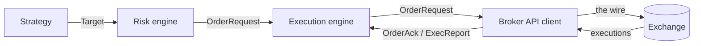

# System Architecture

[Part V closed](../part-05-backtesting-engine/05-trade-logs-and-visualization.md) with a handoff written as four promissory notes: the data handler becomes a scheduled pipeline against real feeds, the simulated broker becomes an API client with retries and failure modes, the reconciliation invariant becomes a nightly check against the broker's own statement, and the trade log becomes the audit trail the whole operation stands on. This part pays those notes, and this lesson draws the map it will pay them on. The surprise is how little new *strategy* code the crossing requires — the tsmom handler that survived Part V's gauntlet is finished, and this lesson runs it, byte-identical, in both worlds to prove it. What live trading demands instead is new *failure* code: processes crash mid-order, data arrives late or poisoned, brokers acknowledge in milliseconds and fill whenever the market feels like it, and every one of those events happens at 3am with no human watching. A backtest that dies is restarted from the top of history at zero cost. A live system that dies is holding positions.

The discipline that contains all of this is the one [Part V's first lesson](../part-05-backtesting-engine/01-architecture-and-event-driven-design.md) already imposed: components never call each other, they publish immutable events and subscribe to the kinds they care about. What changes is that the etiquette stops being a design preference and becomes physically enforced. In the backtest, the strategy *could* have peeked at the broker's internals — one process, one heap — and only manners prevented it. Live, the strategy and the broker may not even share a machine, the future genuinely has not arrived when decisions are made, and the queue between components is a real pipe with real latency. This lesson builds the professional pipeline stage by stage — Strategy → Risk Engine → Execution Engine → Broker API → Exchange — writes the message contracts at each boundary, decides which components share a process and why, classifies every byte of state by what its loss would cost, and ends by unplugging Part V's `SimulatedBroker` exactly the way that lesson promised: without any other component changing a line.

## Five stages, five failure domains

Part V's diagram had four boxes and a queue. The live pipeline keeps the shape and makes two changes that carry this whole part:



First, a **risk engine** now sits between opinion and intention. The backtest had no such stage because the simulator could not go insane — every number it saw came from a frozen file that had already been validated. Live, the strategy's inputs arrive from vendors and sockets, and the risk engine exists because *some day one of them will be wrong*. Second, the last two boxes are not ours. The broker API is a client to someone else's computer, with its own opinions about rate limits and maintenance windows, and the exchange is the world itself. Everything to the left of the wire is a failure domain we design; everything to the right is a failure domain we can only reconcile against. One target through the pipeline, with every hop stamped:

```python
import heapq
from collections import namedtuple
from datetime import datetime, timedelta, timezone
from itertools import count

Target = namedtuple("Target", "ts symbol qty")
Verdict = namedtuple("Verdict", "ts symbol qty ok")
Request = namedtuple("Request", "ts coid symbol qty")
Ack = namedtuple("Ack", "ts coid ok")
Report = namedtuple("Report", "ts coid qty px")

t0 = datetime(2025, 6, 30, 19, 45, tzinfo=timezone.utc)
ms = lambda n: t0 + timedelta(milliseconds=n)
stamp = lambda ts: f"{ts:%H:%M:%S}.{ts.microsecond // 1000:03d}"

heap, seq = [], count()
push = lambda ev: heapq.heappush(heap, (ev.ts, next(seq), ev))

push(Target(ms(0), "SPY", +1429))         # the book Part V actually held
while heap:
    _, _, ev = heapq.heappop(heap)
    match ev:
        case Target(ts, sym, qty):
            print(f"{stamp(ts)}  STRATEGY   wants {sym} {qty:+d}")
            push(Verdict(ms(2), sym, qty, True))
        case Verdict(ts, sym, qty, ok):
            print(f"{stamp(ts)}  RISK       {'pass' if ok else 'reject'}")
            push(Request(ms(4), "tsmom-live-v1:20250630:SPY:1", sym, qty))
        case Request(ts, coid, sym, qty):
            print(f"{stamp(ts)}  EXECUTION  submits {coid}")
            push(Ack(ms(21), coid, True))  # latencies invented, shape real
        case Ack(ts, coid, ok):
            print(f"{stamp(ts)}  BROKER     accepted {coid}")
            push(Report(ms(157), coid, +1429, 611.08))
        case Report(ts, coid, qty, px):
            print(f"{stamp(ts)}  EXCHANGE   filled {qty:+d} @ {px:.2f}")
# => 19:45:00.000  STRATEGY   wants SPY +1429
#    19:45:00.002  RISK       pass
#    19:45:00.004  EXECUTION  submits tsmom-live-v1:20250630:SPY:1
#    19:45:00.021  BROKER     accepted tsmom-live-v1:20250630:SPY:1
#    19:45:00.157  EXCHANGE   filled +1429 @ 611.08
```

The quantity is not decoration: +1,429 SPY is the long leg of the final book Part V's replay reconstructed, and 611.08 is the frozen cache's last SPY close, so this trace is the first live heartbeat of the exact portfolio the backtest left behind. The latencies are invented — the confession is in the comment — but their *asymmetry* is the honest part, and it is the most important thing this diagram adds. The broker acknowledged in 21 milliseconds and filled 136 milliseconds later, as two separate events. In the backtest, `submit` returned the fill; live, submission returns a receipt, and the truth arrives whenever the exchange decides. Every resilience problem in lesson five — timeouts, duplicate reports, orders acknowledged but never filled — lives in that gap.

## A message contract is a promise with a version

The arrows in the diagram need types. Part V's four events — Market, Signal, Order, Fill — survive unchanged inside the strategy's world; what is new is the envelope vocabulary for boundaries where our code talks to itself across a process line, [frozen and slotted as Part II demanded](../part-02-python/03-typing-dataclasses-structure.md), because a message that can be edited in flight is a rumor with a routing key:

```python
from dataclasses import dataclass
from datetime import date
from enum import StrEnum, auto

class Side(StrEnum):                      # Part II's closed vocabulary
    BUY = auto()
    SELL = auto()

@dataclass(frozen=True, slots=True)
class OrderRequest:                       # execution -> broker API
    ver: int
    ts: date
    coid: str                             # client order id — the dedupe key
    symbol: str
    side: Side
    qty: int

@dataclass(frozen=True, slots=True)
class OrderAck:                           # broker API -> execution
    ver: int
    ts: date
    coid: str
    ok: bool
    reason: str

@dataclass(frozen=True, slots=True)
class ExecReport:                         # the only message that moved money
    ver: int
    ts: date
    coid: str
    qty: int
    px: float

@dataclass(frozen=True, slots=True)
class Heartbeat:                          # every component -> the watchdog
    ver: int
    ts: date
    component: str
    seq: int

def gate(msg: object) -> str:             # runs at every boundary, both sides
    match msg:
        case OrderRequest(ver=1, qty=q, coid=c) if q > 0 and c.count(":") == 3:
            return f"pass    OrderRequest {c}"
        case OrderRequest(ver=1):
            return "reject  OrderRequest: malformed qty or coid"
        case OrderRequest(ver=v):
            return f"reject  OrderRequest: unknown version {v}"
        case OrderAck(ver=1) | ExecReport(ver=1) | Heartbeat(ver=1):
            return f"pass    {type(msg).__name__}"
        case _:
            return f"reject  {type(msg).__name__}: not in the contract"

d = date(2025, 6, 30)
for msg in [
    OrderRequest(1, d, "tsmom-live-v1:20250630:SPY:1", "SPY", Side.BUY, 1429),
    OrderRequest(1, d, "", "SPY", Side.BUY, 1429),
    OrderRequest(2, d, "tsmom-live-v1:20250630:SPY:2", "SPY", Side.BUY, 100),
    Heartbeat(1, d, "risk", 4180),
]:
    print(gate(msg))
# => pass    OrderRequest tsmom-live-v1:20250630:SPY:1
#    reject  OrderRequest: malformed qty or coid
#    reject  OrderRequest: unknown version 2
#    pass    Heartbeat
```

Three fields deserve their biographies read out. The `coid` — client order id — is minted by the execution engine in the format `run_id:date:symbol:sequence`, and it is the single most load-bearing string in this part: it makes retries safe in lesson five, threads one order's story through every log line in lesson four, and keys the audit trail in lesson six. The `ver` field looks bureaucratic until the first time you deploy a new strategy process while the old execution engine is still running — a contract without a version can never change, because changing it silently is how one component's upgrade becomes another component's parser crash. And `reason` on the ack exists because "no" from a broker is only actionable when it says why. The gate itself is `match`/`case` doing what [Part V's dispatcher](../part-05-backtesting-engine/01-architecture-and-event-driven-design.md) did, pointed outward: unknown versions and malformed envelopes are rejected loudly *at the boundary*, before their contents can be believed by anything that moves money.

## Processes fail alone; threads fail together

Whether the five stages share one process or five is the first architecture decision with teeth, and the fashionable answer — everything is a microservice — is not the argument. The argument is about what dies together:

```python
import multiprocessing as mp
import os
import threading
import time

def risk_bug():                           # stands in for the real killers:
    os._exit(13)                          # segfault, OOM-kill, kill -9

def strategy_work(out=None):
    n = 0
    for _ in range(5):
        time.sleep(0.05)                  # five slow, honest decisions
        n += 1
    if out is not None:
        out.put(n)

def shared_process():                     # both components, one process
    threading.Thread(target=strategy_work, daemon=True).start()
    time.sleep(0.12)                      # strategy mid-flight when...
    risk_bug()                            # ...risk hits the bug

if __name__ == "__main__":                # macOS re-imports this file
    shared = mp.Process(target=shared_process)
    shared.start()
    shared.join()
    print(f"one process  : exit {shared.exitcode}, strategy work lost")

    q = mp.Queue()
    strat = mp.Process(target=strategy_work, args=(q,))
    risk = mp.Process(target=risk_bug)
    strat.start()
    risk.start()
    strat.join()
    risk.join()
    print(f"two processes: risk exit {risk.exitcode}, strategy exit "
          f"{strat.exitcode}, {q.get()} decisions kept")
# => one process  : exit 13, strategy work lost
#    two processes: risk exit 13, strategy exit 0, 5 decisions kept
```

`os._exit(13)` is a stand-in for deaths no `try`/`except` can catch: a segfault inside a C extension, the kernel's out-of-memory killer, an operator's `kill -9`. In the shared arrangement the strategy thread was three decisions into its work and all of it died with the process — exit code 13, nothing kept. In the isolated arrangement the same bug killed the risk process alone and the strategy delivered all five decisions. That is the entire, unglamorous case for process boundaries: not scale, not fashion, but the guarantee that one component's worst day is not every component's last day. Three things matter when drawing the lines — crash isolation (the demo above), deploy independence (restart the strategy while the execution engine keeps working its orders), and backpressure (a slow consumer should fill a queue, not freeze a caller); what does not matter, for five processes that fit on one machine, is the rest of the microservice cosplay. That is the honest layout for this course's system: five processes on one box, talking through the queues lesson two builds — and the deeper patterns, for when one box stops being enough, are [Part IX's architecture lesson](../part-09-software-engineering/04-architecture-patterns-and-message-queues.md).

## Every byte of state is hot, durable, or reconstructable

Part V's engine kept everything — positions, cash, signal state — in Python objects, and that was correct: a backtest that dies is rerun from the first bar at the cost of a coffee. A live process that dies must come back *mid-history*, and what it can come back to is decided by where each piece of state lived. The classification this part uses everywhere has three bins — **hot** state you can afford to lose, **durable** state that moved money, and **reconstructable** state that is never stored authoritatively at all, only recomputed:

```python
from enum import StrEnum, auto

class Store(StrEnum):
    HOT = auto()                          # cheap to lose, deadly to trust
    DURABLE = auto()                      # if it moved money, it lives here
    RECON = auto()                        # never stored twice, recomputed

INVENTORY = [
    ("fills",       Store.DURABLE, "postgres",       "it IS the record"),
    ("open orders", Store.DURABLE, "postgres",       "reload, reconcile"),
    ("positions",   Store.RECON,   "postgres view",  "SUM(qty) over fills"),
    ("cash",        Store.RECON,   "postgres view",  "replay the fills"),
    ("marks",       Store.HOT,     "redis, 90s TTL", "refetch or go blind"),
    ("heartbeats",  Store.HOT,     "redis, 15s TTL", "re-announce"),
    ("signal state", Store.RECON,  "process memory", "recompute from bars"),
    ("bars",        Store.RECON,   "parquet cache",  "re-download, validate"),
    ("config",      Store.DURABLE, "env + git",      "redeploy the version"),
    ("logs",        Store.DURABLE, "append-only",    "rotated, never edited"),
]

for item, cls, home, path in INVENTORY:
    print(f"{item:<12} {cls:<8} {home:<15} {path}")
kinds = [cls for _, cls, _, _ in INVENTORY]
print(f"{len(INVENTORY)} items: {kinds.count(Store.HOT)} hot, "
      f"{kinds.count(Store.DURABLE)} durable, "
      f"{kinds.count(Store.RECON)} reconstructable")
# => fills        durable  postgres        it IS the record
#    open orders  durable  postgres        reload, reconcile
#    positions    recon    postgres view   SUM(qty) over fills
#    cash         recon    postgres view   replay the fills
#    marks        hot      redis, 90s TTL  refetch or go blind
#    heartbeats   hot      redis, 15s TTL  re-announce
#    signal state recon    process memory  recompute from bars
#    bars         recon    parquet cache   re-download, validate
#    config       durable  env + git       redeploy the version
#    logs         durable  append-only     rotated, never edited
#    10 items: 2 hot, 4 durable, 4 reconstructable
```

Two rows in that table are doctrine, not preference. **Positions are not durable state.** The live system never stores a position number it would have to trust later — positions are a *view*, `SUM(qty)` over the fills table, which is [Part V's replay invariant](../part-05-backtesting-engine/05-trade-logs-and-visualization.md) promoted from a nightly check to a schema decision: the derived number cannot drift from the fills because it has no existence apart from them. And **marks are hot with a TTL** — this is the component [Part V's accounting lesson](../part-05-backtesting-engine/02-portfolio-accounting.md) promised when it said the mark source becomes a component of its own in live trading. The 90-second expiry is the design: a mark that outlives its TTL does not become a stale number that poisons every downstream calculation, it becomes *no number*, and a system that cannot price its book knows that it cannot, which is infinitely safer than believing it can. Everything in the table gets its infrastructure in lesson two — Redis for the hot rows, PostgreSQL for the durable ones — and lesson five's crash recovery is nothing but this table executed in order.

## Blast radius is a design input

The risk engine earns its place in the pipeline the day something upstream goes insane, so the design question is not *whether* the strategy can emit an absurd order but *how far* the absurdity travels. Here is the classic: a feed delivers a mark in cents instead of dollars, and a sizer — which divides by the mark — obediently manufactures a monster:

```python
import math

MAX_QTY, MAX_NOTIONAL = 25_000, 2_000_000

def size(target_notional: float, mark: float) -> int:
    return round(target_notional / mark)  # trusts the mark — the bug's door

def risk_gate(qty: int, mark: float) -> tuple[bool, str]:
    if not math.isfinite(mark) or mark <= 0:
        return False, "mark is not a price"
    if abs(qty) > MAX_QTY:
        return False, f"|qty| {abs(qty):,} > {MAX_QTY:,}"
    if abs(qty) * mark > MAX_NOTIONAL:
        return False, f"notional ${abs(qty) * mark:,.0f} > ${MAX_NOTIONAL:,}"
    return True, "pass"

book = {"SPY": 1429}
for mark in [611.08, 0.61]:               # a real mark, then a poisoned one
    qty = size(900_000, mark) - book["SPY"]
    ok, why = risk_gate(qty, mark)
    print(f"mark {mark:>7.2f}  ->  order {qty:+,d}  ->  {why}")
    if ok:
        book["SPY"] += qty
print(f"book after both: {book}")
# => mark  611.08  ->  order +44  ->  pass
#    mark    0.61  ->  order +1,473,937  ->  |qty| 1,473,937 > 25,000
#    book after both: {'SPY': 1473}
```

With the true mark the rebalance is a sleepy +44 shares. With the poisoned mark — 0.61, the cents-for-dollars bug that has humiliated real trading desks — the identical code requests one and a half million shares, roughly $900 million at the real price. The gate rejects it by name and the book ends the day at 1,473 shares, exactly the sane trade and nothing else. Three things about this deserve to be said plainly. The strategy and sizer were *allowed* to go insane — no defensive `if` inside them was the fix, because the next bug will route around any vigilance the last bug inspired; the boundary is the fix. The gate *refused* rather than repaired — it did not guess a better quantity, because a component that silently rewrites orders is a second strategy nobody backtested. And the fault stayed in its domain: the request died between risk and execution, so no order, no ack, and no position ever existed downstream. This gate is a two-check sketch; [lesson five](05-resilience-and-risk-controls.md) arms the full gauntlet — concentration, rate limits, price collars, and the halt flag — and wires its rejections to the alerting lesson four builds.

## One strategy, two harnesses

Everything above is plumbing around a promise this course has repeated since Part IV: the code that was backtested is the code that trades. The moment live trading gets its own "production rewrite" of the strategy, [Part V's entire certificate](../part-05-backtesting-engine/04-performance-metrics-and-reporting.md) — every pinned number, every validated habit — silently stops applying to the thing actually running. Parity is enforced the boring way: the strategy is a closure that eats one close at a time and has no idea what is feeding it:

```python
import hashlib
import queue
import threading
from collections import deque
from math import log

import pandas as pd

def make_tsmom():                         # the module — identical in both
    win, last = deque(maxlen=252), [0.0, None]

    def on_close(ts, close):
        prev = last[1]
        last[1] = close
        if prev is None:
            return None
        win.append(log(close / prev))
        if len(win) < 252:                # the structurally silent warm-up
            return None
        s = 1.0 if sum(win) > 0 else -1.0
        if s == last[0]:                  # publish only on a sign change
            return None
        last[0] = s
        return ts, s

    return on_close

spy = (pd.read_parquet("data/part5.parquet")
         .xs("SPY", axis=1, level=1).dropna())

def digest(decisions):
    text = "|".join(f"{ts:%Y%m%d}{s:+.0f}" for ts, s in decisions)
    return hashlib.sha256(text.encode()).hexdigest()[:12]

# harness one: the backtest — a for loop over the frozen cache
strat = make_tsmom()
bt = [d for ts, c in spy["Close"].items() if (d := strat(ts, c))]

# harness two: live — a feed thread, a queue, a blocking consumer
strat = make_tsmom()
feed, live = queue.Queue(), []

def feeder():
    for ts, c in spy["Close"].items():
        feed.put((ts, c))
    feed.put(None)                        # the day the market ends

threading.Thread(target=feeder).start()
while (msg := feed.get()) is not None:
    if (d := strat(*msg)):
        live.append(d)

print(f"backtest: {len(bt)} decisions, digest {digest(bt)}")
print(f"live    : {len(live)} decisions, digest {digest(live)}")
print(f"identical: {digest(bt) == digest(live)}")
# => backtest: 90 decisions, digest 60458f22a9cd
#    live    : 90 decisions, digest 60458f22a9cd
#    identical: True
```

Ninety decisions — the same count [Part V's skeleton run](../part-05-backtesting-engine/01-architecture-and-event-driven-design.md) funneled from 6,411 bars, because it is the same strategy making them. The SHA-256 digests agree, which is the strong claim: not similar behavior but an identical decision stream, timestamp for timestamp, sign for sign, whether the closes arrived from a `for` loop over a parquet file or through a queue fed by another thread that the consumer must *block* on because the next bar genuinely does not exist yet. Notice what shape the strategy had to take to make this provable: it holds its own tiny state — a 252-deque and the last sign — and receives facts one at a time, so there is no DataFrame on which a stray `.shift(-1)` could even be written; the parity harness inherits Part V's look-ahead immunity by construction. When lesson two replaces the feeder thread with a real scheduler and lesson three freezes this exact interpreter into an image, nothing inside `make_tsmom` will hear about it.

## The seam, unplugged

Part V's first lesson made a promise it repeated verbatim: the `SimulatedBroker` box can be unplugged and replaced by a live brokerage API *without any other component changing a line*. Time to collect:

```python
import hashlib
from collections import namedtuple

import numpy as np
import pandas as pd

Req = namedtuple("Req", "coid symbol side qty")
Fill = namedtuple("Fill", "ts coid qty px")

class SimulatedBroker:                    # Part V's broker: sync and naive
    def __init__(self, nxt_open, nxt_ts):
        self.nxt_open, self.nxt_ts = nxt_open, nxt_ts
        self.out = []

    def submit(self, ts, req):
        px = self.nxt_open.at[ts]
        if not pd.isna(px):               # history's last order never fills
            sgn = +1 if req.side == "buy" else -1
            self.out.append(Fill(self.nxt_ts.at[ts], req.coid,
                                 sgn * req.qty, round(px, 2)))

    def poll(self):
        out, self.out = self.out, []
        return out

class PaperBroker(SimulatedBroker):       # same seam, asynchronous manners
    def __init__(self, nxt_open, nxt_ts):
        super().__init__(nxt_open, nxt_ts)
        self.acks, self.seen = [], set()

    def submit(self, ts, req):
        if req.coid in self.seen:         # dedupe — lesson five lives here
            return
        self.seen.add(req.coid)
        self.acks.append(req.coid)
        super().submit(ts, req)

bars = pd.read_parquet("data/part5.parquet")
spy = bars.xs("SPY", axis=1, level=1).dropna()
sig = np.sign(np.log(spy["Close"]).diff().rolling(252).sum())
nxt_open = spy["Open"].shift(-1)
nxt_ts = spy.index.to_series().shift(-1)

def digest(fills):
    text = "|".join(f"{f.ts:%Y%m%d}{f.qty:+d}@{f.px}" for f in fills)
    return hashlib.sha256(text.encode()).hexdigest()[:12]

for broker in [SimulatedBroker(nxt_open, nxt_ts),
               PaperBroker(nxt_open, nxt_ts)]:
    last, n = 0.0, 0
    for ts in spy.index:
        s = sig.at[ts]
        if not np.isnan(s) and s != last: # the skeleton run's strategy
            n += 1
            last = s
            broker.submit(ts, Req(f"tsmom-live-v1:{ts:%Y%m%d}:SPY:{n}",
                                  "SPY", "buy" if s > 0 else "sell", 100))
    fills = broker.poll()
    acks = len(getattr(broker, "acks", []))
    print(f"{type(broker).__name__:<15} {len(fills)} fills, "
          f"digest {digest(fills)}, {acks} acks")
print(f"first fill {fills[0].ts:%Y-%m-%d} {fills[0].qty:+d} @ {fills[0].px}")

pb = PaperBroker(nxt_open, nxt_ts)
req = Req("tsmom-live-v1:20010102:SPY:1", "SPY", "sell", 100)
for _ in range(3):                        # a nervous retry loop
    pb.submit(spy.index[251], req)
print(f"3 submits, one coid: {len(pb.poll())} fill, {len(pb.acks)} ack")
# => SimulatedBroker 90 fills, digest 231085e71e47, 0 acks
#    PaperBroker     90 fills, digest 231085e71e47, 90 acks
#    first fill 2001-01-03 -100 @ 81.25
#    3 submits, one coid: 1 fill, 1 ack
```

The strategy loop above the two runs is character-for-character identical — it holds a reference to "a broker" and calls `submit`, which is the entire meaning of a seam. Both brokers produce ninety fills with the same digest, first fill 2001-01-03, one hundred short at 81.25 — the very numbers the skeleton run pinned — so the swap is certified: nothing upstream changed a line, and nothing downstream could tell the difference by looking at the fills. What *did* change is everything this part exists to handle. The `PaperBroker` sent ninety acknowledgments its predecessor never sent — receipts, arriving as separate events, for orders whose fills come later — and it quietly refused two of the three submissions in the nervous retry loop, because it had seen that `coid` before. That dedupe line is [Part II's async lesson](../part-02-python/04-async-and-apis.md) collecting its own promissory note: retries are handled with idempotency keys, never with hope. One confession before the section closes: this broker is still a graduate of a sheltered school — it fills from a frozen file, never times out, never reports out of order, and never disagrees with our books. Its real education — timeouts after send, duplicate reports, and the nightly statement that outranks our database — is [lesson five](05-resilience-and-risk-controls.md), and the machinery it will be educated against is [Part V's order state machine](../part-05-backtesting-engine/03-order-management-and-fill-simulation.md), the seam that lesson promised this part would stress hard.

!!! warning "Failure domains are drawn at design time and discovered at 3am"
    Every boundary in this lesson — the risk gate between opinion and intention, the process line between strategy and execution, the TTL between a mark and its expiry — is a decision about what is allowed to die alone, made while you are rested and nothing is on fire. The alternative is to let the first real incident draw the boundaries for you, at 3am, with positions on, when the only tool left is `kill -9` and the only question is how much of the system goes down with the component that failed. A live trading system is not judged by how it behaves when everything works; it is judged by the size of the hole one broken piece can tear.

!!! abstract "Key takeaways"
    - The live pipeline is Strategy → Risk Engine → Execution Engine → Broker API → Exchange: Part V's diagram plus a risk stage between opinion and intention, with everything past the broker API belonging to someone else — and the one-target trace shows the defining asymmetry, an ack at 21ms and the fill at 157ms as separate events.
    - Boundary messages are versioned, frozen contracts — OrderRequest, OrderAck, ExecReport, Heartbeat — validated by a `match`/`case` gate that rejects malformed envelopes and unknown versions loudly; the `coid` (`run_id:date:symbol:seq`) is the idempotency key, correlation ID, and audit key this part reuses everywhere.
    - Process boundaries are about what dies together: one shared process lost all the strategy's work to a risk bug (exit 13), while isolation kept all 5 decisions with the strategy exiting 0 — crash isolation, deploy independence, and backpressure are the real arguments, not microservice fashion.
    - State is hot, durable, or reconstructable — 10 inventory items split 2/4/4 — with positions deliberately *not* durable (a `SUM(qty)` view over fills, Part V's replay invariant as schema) and marks hot with a 90s TTL so a stale price becomes an absent price.
    - The risk gate turned a cents-for-dollars mark (0.61 vs 611.08) from a +1,473,937-share order into a named rejection while passing the sane +44-share rebalance; it refuses rather than repairs, and the book ended at 1,473 shares.
    - One strategy ran under two harnesses — a `for` loop and a blocking queue — and produced 90 decisions with identical digest `60458f22a9cd`, the same 90 signals as Part V's skeleton: the code that was backtested is the code that trades, provably.
    - Unplugging `SimulatedBroker` for `PaperBroker` changed no upstream line and no fill — 90 fills, digest `231085e71e47`, first fill 2001-01-03 −100 @ 81.25 in both — while adding 90 asynchronous acks and coid-dedupe that turned 3 nervous submits into exactly 1 fill.

## Where this goes next

Read this lesson's confessions in one place: the live harness's "feed" was a thread reading a frozen file, the pipeline's clock was a lambda handing out invented milliseconds, the hot and durable stores were words in a printed table, and nothing anywhere would wake the system on a real Tuesday at 15:45 New York time — or notice a market holiday if it did. [Scheduling and Data Plumbing](02-scheduling-and-data-plumbing.md) makes those confessions expensive: cron and APScheduler supply the clock, the XNYS exchange calendar supplies the days the clock is allowed to matter, Redis becomes the actual home of marks and heartbeats, PostgreSQL becomes the actual home of orders and fills — loaded with the 1,103 fills Part V logged, and made to reproduce the book to the penny — and a data pipeline learns to land, validate, and only then believe the bars the whole edifice runs on.
