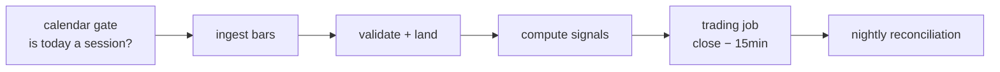

# Scheduling and Data Plumbing

[Lesson one](01-system-architecture.md) ended by reading its own confessions aloud: the live harness's feed was a thread walking a frozen parquet file, the pipeline's clock was a lambda handing out invented milliseconds, and the hot and durable stores were rows in a printed table. This lesson makes those confessions expensive. It is also where [Part II's async lesson](../part-02-python/04-async-and-apis.md) collects its promise: the machinery that schedules its downloaders and keeps them running unattended is built here. Nothing in this lesson is glamorous — a scheduler, a calendar, two databases, and a validation gate — and that is precisely the warning: live systems are rarely killed by their strategies. They are killed by a job that fired on a holiday, a mark that quietly went stale, a message that was published before anyone was listening, and a trading run that believed yesterday's data because nobody made it check.

The clock a trading system needs has three layers, and confusing them is the classic first outage. **Cron** answers *when* — 15:45, every day, forever, including Saturdays, Christmas, and the day the president dies. The **exchange calendar** answers *whether* — is today a session, and when does it actually close? And the **scheduler** answers the question cron never asks: *what happens when the moment was missed* — because the box was rebooting, the process was wedged, or the deploy ran long. The memory, likewise, has two temperatures, assigned by lesson one's state table: Redis for hot state whose loss costs a refetch, PostgreSQL for durable state that moved money. By the end of this lesson both are real services holding the real system's state — including all 1,103 fills [Part V logged](../part-05-backtesting-engine/05-trade-logs-and-visualization.md), reproduced to the penny in SQL — and the trading day has become a dependency graph in which no job runs until the job it believes in has proven itself.

## Cron says when, never whether

Cron's language — minute, hour, day-of-week — is fifty years old and still the right first tool: `45 15 * * mon-fri` fires a trading job at 15:45 on weekdays, and APScheduler speaks the same dialect from inside Python. The mistakes live in what the language *cannot* say. Watch a plain daily trigger walk through the second weekend of March 2026, with every fire time computed from a frozen starting instant — no scheduler sleeping, no wall clock consulted:

```python
from datetime import datetime
from zoneinfo import ZoneInfo

from apscheduler.triggers.cron import CronTrigger

NY, UTC = ZoneInfo("America/New_York"), ZoneInfo("UTC")

def fires(trig, start, n):                # replay the trigger, no sleeping
    prev, now, out = None, start, []
    for _ in range(n):
        prev = trig.get_next_fire_time(prev, now)
        out.append(prev)
        now = prev
    return out

daily = CronTrigger(hour=15, minute=45, timezone=NY)
for t in fires(daily, datetime(2026, 3, 5, 12, 0, tzinfo=NY), 5):
    print(f"{t:%a %m-%d %H:%M %Z} = {t.astimezone(UTC):%H:%M} UTC")

night = CronTrigger(hour=2, minute=30, timezone=NY)
print("a 02:30 job, spring forward:")
for t in fires(night, datetime(2026, 3, 7, 0, 0, tzinfo=NY), 3):
    print(f"  {t:%a %m-%d %H:%M %Z} = {t.astimezone(UTC):%H:%M} UTC")
print("a 02:30 job, fall back:")
for t in fires(night, datetime(2026, 10, 31, 0, 0, tzinfo=NY), 3):
    print(f"  {t:%a %m-%d %H:%M %Z} = {t.astimezone(UTC):%H:%M} UTC")
# => Thu 03-05 15:45 EST = 20:45 UTC
#    Fri 03-06 15:45 EST = 20:45 UTC
#    Sat 03-07 15:45 EST = 20:45 UTC
#    Sun 03-08 15:45 EDT = 19:45 UTC
#    Mon 03-09 15:45 EDT = 19:45 UTC
#    a 02:30 job, spring forward:
#      Sat 03-07 02:30 EST = 07:30 UTC
#      Sun 03-08 02:30 EST = 07:30 UTC
#      Mon 03-09 02:30 EDT = 06:30 UTC
#    a 02:30 job, fall back:
#      Sat 10-31 02:30 EDT = 06:30 UTC
#      Sun 11-01 02:30 EST = 07:30 UTC
#      Mon 11-02 02:30 EST = 07:30 UTC
```

Three traps in fifteen lines of output. First, the daily trigger fired on Saturday and Sunday — cron does not know what a market is, and `day_of_week="mon-fri"` only narrows the ignorance: it will still fire on Good Friday, a weekday and a market holiday. Second, read the UTC column across the weekend: 20:45, 20:45, 20:45, then 19:45. The job stayed at 15:45 *New York wall-clock time* because the trigger was defined in `America/New_York`; a job scheduled in UTC, or in the server's local timezone, drifts one hour against the exchange twice a year, which is why every timestamp in this lesson names its zone. Third, the 02:30 job: on March 8th the minute 02:30 *does not exist* (the clock jumps from 02:00 to 03:00), and APScheduler quietly resolves it to the instant 07:30 UTC; on November 1st the minute 02:30 *exists twice*, and the trigger picks the second occurrence rather than firing both times. Both resolutions are sane and neither is what a person reading "02:30 nightly" would confidently predict — so schedule market jobs at market times in the market's timezone, and keep maintenance jobs out of the 02:00–03:00 shadowlands entirely.

## The trading calendar is data, not arithmetic

The weekday-minus-holidays calendar cannot be computed; it has to be *known*. Exchange holidays follow rules with exceptions (Juneteenth traded until 2022), and some sessions vanish for reasons no formula predicts — hurricanes, funerals, September 11th. That knowledge ships as data, in the `exchange-calendars` package, and the first thing to do with it is check it against the only ground truth we own — the frozen cache every pinned number in Parts III through V stands on:

```python
import exchange_calendars as xcals
import pandas as pd

xnys = xcals.get_calendar("XNYS", start="1999-12-01", end="2026-12-31")

sessions = xnys.sessions_in_range("2000-01-03", "2025-06-30")
spy = (pd.read_parquet("data/part5.parquet")
         .xs("SPY", axis=1, level=1).dropna())
cal, cache = set(sessions.date), set(spy.index.date)
print(f"XNYS sessions: {len(sessions)}   cache SPY rows: {len(spy)}")
print(f"calendar minus cache: {sorted(cal - cache)}")
print(f"cache minus calendar: {sorted(cache - cal)}")

hols = pd.date_range("2025-01-01", "2025-06-30", freq="B").difference(
    xnys.sessions_in_range("2025-01-01", "2025-06-30"))
print("2025 H1 weekday holidays:", ", ".join(f"{d:%m-%d}" for d in hols))

closes = (xnys.schedule.loc["2000-01-03":"2025-06-30", "close"]
              .dt.tz_convert("America/New_York"))
early = closes[closes.dt.hour != 16]
print(f"early closes in the cache window: {len(early)}, "
      f"all at {early.dt.strftime('%H:%M').unique()[0]} New York")
# => XNYS sessions: 6411   cache SPY rows: 6411
#    calendar minus cache: []
#    cache minus calendar: []
#    2025 H1 weekday holidays: 01-01, 01-09, 01-20, 02-17, 04-18, 05-26, 06-19
#    early closes in the cache window: 55, all at 13:00 New York
```

The reconciliation is the quiet spectacle: 6,411 calendar sessions against 6,411 cache rows, symmetric difference empty in both directions, across twenty-five and a half years that include the four dark days after September 11th, two days of Hurricane Sandy, and several presidential funerals. An open-source calendar and a market-data vendor agree, date for date, about which days the NYSE traded — an independent validation of the cache that no earlier part could perform. The 2025 holiday list makes the point about arithmetic: six of the seven entries are rule-derivable, but `01-09` is the National Day of Mourning for President Carter — announced weeks in advance, encoded in no formula, present in the data because a maintainer typed it in. And the 55 early closes, every one at 13:00, are the sessions where a job scheduled for "15:45, fifteen minutes before the close" would fire two hours and forty-five minutes *after* the market went home — the next section's problem.

## Schedule sessions, not clock times

Put the two layers together and the scheduling rule falls out: the calendar decides the *moment* (this session's close, minus fifteen minutes), and the trigger merely delivers it. Here is Thanksgiving week 2025, followed by the question cron never asks — what happens when the box was down at the moment the calendar chose:

```python
import time
from datetime import datetime, timedelta, timezone

import exchange_calendars as xcals
import pandas as pd
from apscheduler.schedulers.background import BackgroundScheduler

xnys = xcals.get_calendar("XNYS", start="1999-12-01", end="2026-12-31")
for s in xnys.sessions_in_range("2025-11-24", "2025-11-28"):
    close = xnys.session_close(s).tz_convert("America/New_York")
    print(f"{s:%a %m-%d}  close {close:%H:%M}  "
          f"trading job at {close - pd.Timedelta('15min'):%H:%M}")

runs = {"coalesce": 0, "replay": 0}
sched = BackgroundScheduler()
outage = datetime.now(timezone.utc) - timedelta(seconds=35)
sched.add_job(lambda: runs.__setitem__("coalesce", runs["coalesce"] + 1),
              "interval", seconds=10, coalesce=True,
              misfire_grace_time=None, next_run_time=outage)
sched.add_job(lambda: runs.__setitem__("replay", runs["replay"] + 1),
              "interval", seconds=10, coalesce=False,
              misfire_grace_time=None, next_run_time=outage)
sched.start()                             # "reboot" after the 35s outage
time.sleep(1.0)
sched.shutdown()
print(f"after a 35s outage, 10s interval: coalesce=True ran "
      f"{runs['coalesce']}x, coalesce=False ran {runs['replay']}x")
# => Mon 11-24  close 16:00  trading job at 15:45
#    Tue 11-25  close 16:00  trading job at 15:45
#    Wed 11-26  close 16:00  trading job at 15:45
#    Fri 11-28  close 13:00  trading job at 12:45
#    after a 35s outage, 10s interval: coalesce=True ran 1x, coalesce=False ran 4x
```

Thursday is simply absent — not a session, so no moment, so no job, with nothing anywhere remembering to skip it — and Friday's job lands at 12:45 because the half-day's close is 13:00. The rule "fifteen minutes before the close" survived a holiday and an early close without containing an `if`, because the calendar is data and the rule consumed it. Then the outage: both interval jobs missed their firings while the "box" was down, and the two misfire policies did what their names promise — `coalesce=True` collapsed the backlog into one catch-up run, `coalesce=False` replayed all four due firings back to back. The choice is per job: ingestion wants coalescing (four runs fetch the same file four times), an audit-log appender may want every run accounted for. The policy that is *never* correct for a trading job is the third one, `misfire_grace_time` left at a small default, which silently *discards* the missed run — a trading job that missed its moment should run late or be loudly skipped by its own logic, never dropped by its scheduler's.

## Hot state is state you can afford to lose

Lesson one's table assigned marks and heartbeats to Redis with TTLs, and this is where the assignment becomes practice. Redis is an in-memory key-value store — reads and writes in microseconds, values gone if the box reboots — which sounds like a defect until you notice it is the exact risk profile hot state wants. This part's convention, once and for all its lessons: Redis database 15, every key under the `qt:` prefix, and every key born with an expiry:

```python
import time

import pandas as pd
import redis

r = redis.Redis(db=15, decode_responses=True)  # db 15: this course's sandbox
r.delete("qt:mark:SPY", "qt:mark:TLT", "qt:mark:GLD", "qt:hb:strategy")

close = pd.read_parquet("data/part5.parquet")["Close"]
marks = {s: round(float(close[s].dropna().iloc[-1]), 2)
         for s in ("SPY", "TLT", "GLD")}      # the cache's final session
for sym, px in marks.items():
    r.set(f"qt:mark:{sym}", px, ex=90)        # a mark is born dying
r.set("qt:hb:strategy", 1, ex=15)             # so is a heartbeat

print("marks:", {s: r.get(f"qt:mark:{s}") for s in marks})
print("ttl of qt:mark:SPY:", r.ttl("qt:mark:SPY"), "s")
r.set("qt:mark:SPY", marks["SPY"], ex=1)      # age one mark past its TTL
time.sleep(1.1)
print("SPY after its TTL :", r.get("qt:mark:SPY"))
print("TLT, still young  :", r.get("qt:mark:TLT"))
# => marks: {'SPY': '611.08', 'TLT': '84.09', 'GLD': '304.83'}
#    ttl of qt:mark:SPY: 90 s
#    SPY after its TTL : None
#    TLT, still young  : 84.09
```

This is the component [Part V's accounting lesson](../part-05-backtesting-engine/02-portfolio-accounting.md) promised when it said that in live trading the mark source stops being a lookup and becomes a component of its own — and the TTL is that component's whole personality. A mark that outlives its 90 seconds does not linger as a stale number silently poisoning every valuation downstream; it becomes `None`, and code that asks for it must confront the absence — `refetch or go blind`, exactly as lesson one's table put it. The rule between the temperatures is mechanical: if losing the value costs a *refetch*, it belongs in Redis with a TTL; if losing it costs *money or an audit*, it belongs in the next section's store; and if it can be recomputed from durable inputs — like [the tsmom deque](01-system-architecture.md) — it belongs nowhere at all, because recomputation is a guarantee of consistency, not a cost. What never belongs in Redis, at any TTL: fills, orders, or anything else you would have to explain to a regulator, because "the box rebooted" is not an accepted form of testimony.

## Pub/sub delivers to whoever is listening — and no one else

Lesson one's pipeline needs its arrows: strategy, risk, and execution run as separate processes now, and Redis pub/sub is the lightest possible message bus between them — `publish` to a channel, and every current subscriber receives the message. The load-bearing word is *current*:

```python
import json

import redis

r = redis.Redis(db=15, decode_responses=True)
fill = json.dumps({"type": "fill", "coid": "tsmom-live-v1:20250630:SPY:1",
                   "qty": 1429})

lost = r.publish("qt:events", fill)
print(f"published before anyone subscribed: {lost} receivers")

sub = r.pubsub(ignore_subscribe_messages=True)
sub.subscribe("qt:events")
while sub.get_message(timeout=1):         # drain the subscription handshake
    pass
n = r.publish("qt:events", fill)
msg = sub.get_message(timeout=1)
print(f"published after subscribing : {n} receiver")
print("received:", json.loads(msg["data"])["coid"])
# => published before anyone subscribed: 0 receivers
#    published after subscribing : 1 receiver
#    received: tsmom-live-v1:20250630:SPY:1
```

The first publish returned zero — and the message is not queued, not retried, not recoverable; it is *gone*. Pub/sub is delivery to the present tense: a subscriber that crashes, restarts, or briefly disconnects misses everything published in the gap, and Redis will never tell either side. That makes it the right tool for exactly one kind of traffic — signals whose next edition supersedes the last: mark updates, heartbeats, dashboard refreshes. And it makes pub/sub categorically wrong as the *system of record* for anything, which is why the fill above — reporting 1,429 SPY, the long leg of the real book — travels twice: once on `qt:events` for whoever is watching *now*, and once into PostgreSQL for whoever asks *ever after*. The broadcast is a courtesy; the insert is the fact. Systems that need guaranteed delivery and replay outgrow pub/sub into Redis Streams or a proper broker — [Part IX's message-queue territory](../part-09-software-engineering/04-architecture-patterns-and-message-queues.md); for five processes on one box, pub/sub plus the durable store covers the need with far less operational surface.

## If it moved money, it goes to Postgres

The durable store is PostgreSQL, and its setup is this part's equivalent of freezing a cache — performed once, then never thought about again:

```text
$ sudo -u postgres createuser --createdb $USER    # once, by an administrator
$ createdb quant                                  # once, by you
```

Peer authentication means no password appears in any code block in this part — deliberate, and deliberately incomplete: production credentials are [lesson six's](06-secrets-paper-live-compliance.md) opening problem. The schema below is lesson one's state table translated into DDL, and the load is [Part V's trade log](../part-05-backtesting-engine/05-trade-logs-and-visualization.md) — all 1,103 fills — pumped in over the `COPY` fast path and immediately made to answer for itself:

```python
import pandas as pd
import psycopg

trades = pd.read_parquet("data/part5trades.parquet")

DDL = """
DROP VIEW IF EXISTS positions;
DROP TABLE IF EXISTS fills, orders, job_runs, bars_live;
CREATE TABLE fills (
    id         BIGSERIAL PRIMARY KEY,
    run_id     TEXT NOT NULL,
    ts         DATE NOT NULL,
    symbol     TEXT NOT NULL,
    qty        INTEGER NOT NULL,        -- signed, as in the trade log
    px         NUMERIC(18, 10) NOT NULL,
    fee        NUMERIC(12, 2) NOT NULL, -- money is NUMERIC, never float
    cash_after NUMERIC(14, 2) NOT NULL
);
CREATE TABLE orders (
    coid   TEXT PRIMARY KEY,            -- one coid, one order, forever
    ts     DATE NOT NULL,
    symbol TEXT NOT NULL,
    qty    INTEGER NOT NULL,
    status TEXT NOT NULL
);
CREATE TABLE job_runs (
    id       BIGSERIAL PRIMARY KEY,
    job      TEXT NOT NULL,
    run_date DATE NOT NULL,
    status   TEXT NOT NULL,
    detail   TEXT NOT NULL
);
CREATE TABLE bars_live (
    ts     DATE NOT NULL,
    symbol TEXT NOT NULL,
    open   DOUBLE PRECISION,
    high   DOUBLE PRECISION,
    low    DOUBLE PRECISION,
    close  DOUBLE PRECISION,
    volume BIGINT,
    PRIMARY KEY (ts, symbol)
);
CREATE VIEW positions AS
    SELECT symbol, SUM(qty) AS qty FROM fills GROUP BY symbol;
"""

with psycopg.connect("dbname=quant") as conn:
    conn.execute(DDL)
    with conn.cursor() as cur, cur.copy(
            "COPY fills (run_id, ts, symbol, qty, px, fee, cash_after) "
            "FROM STDIN") as cp:
        for row in trades.itertuples(index=False):
            cp.write_row(row)
    n = conn.execute("SELECT count(*) FROM fills").fetchone()[0]
    pos = conn.execute(
        "SELECT symbol, qty FROM positions ORDER BY symbol").fetchall()
    cash = conn.execute(
        "SELECT cash_after FROM fills ORDER BY id DESC LIMIT 1").fetchone()[0]
    drift = conn.execute("""
        SELECT max(abs(cash_after - (1000000 - flow)))
        FROM (SELECT cash_after,
                     SUM(round(qty * px + fee, 2)) OVER (ORDER BY id) AS flow
              FROM fills) t""").fetchone()[0]
print(f"{n} fills loaded")
print("positions:", {s: int(q) for s, q in pos})
print(f"final cash ${cash:,}")
print(f"worst cash drift ${drift:.2f}")
# => 1103 fills loaded
#    positions: {'GLD': 2737, 'SPY': 1429, 'TLT': -10358}
#    final cash $1,685,966.32
#    worst cash drift $0.00
```

Read the schema as a set of kept promises. Money columns are `NUMERIC` — [Part II's SQL lesson](../part-02-python/05-sql-and-data-storage.md) drew the line between research floats and accounting exactness and said the distinction would return in the execution parts of the course; here it is, with `fee` and `cash_after` exact to the declared cent while `bars_live` keeps pragmatic doubles, because a bar is research data and a fee is testimony. `positions` is not a table — it is a `VIEW`, `SUM(qty) GROUP BY symbol`, so the long 2,737 GLD, long 1,429 SPY, short 10,358 TLT book *cannot* disagree with the fills, having no existence apart from them. And the drift query is [Part V's replay invariant](../part-05-backtesting-engine/05-trade-logs-and-visualization.md) compressed into one window function: cash re-derived from every fill against the log's own running column, worst disagreement across 1,103 fills and twenty-four years, $0.00. What a Python loop proved in Part V, SQL now proves on demand, in milliseconds, forever.

## Data lands, is validated, then is believed

The bars the whole edifice runs on arrive from a vendor, and the ingestion pipeline's design principle is the title of this section — between *arrival* and *belief* stands a validation gate and a landing zone, so the trading job never consumes a file the pipeline has merely received. The delivery below is simulated from the frozen cache's final session — the same four symbols a real vendor would send, including the EURUSD row [Part V's accounting](../part-05-backtesting-engine/02-portfolio-accounting.md) needs for its currency work:

```python
import pandas as pd
import psycopg

UNIVERSE = {"SPY", "TLT", "GLD", "EURUSD"}

bars = pd.read_parquet("data/part5.parquet")
day = bars.index[-1]                      # stand-in for today's delivery
d = bars.loc[day].unstack(level=0)        # rows: symbols, cols: OHLCV

checks = {
    "all symbols present": UNIVERSE <= set(d.index),
    "no NaN in any field": not bool(d.isna().any().any()),
    "high >= low": bool((d["High"] >= d["Low"]).all()),
    "high >= open, close": bool((d["High"] >=
                                 d[["Open", "Close"]].max(axis=1)).all()),
    "volume >= 0": bool((d["Volume"] >= 0).all()),
}
ok = all(checks.values())
for name, passed in checks.items():
    print(f"{'pass' if passed else 'FAIL'}  {name}")

with psycopg.connect("dbname=quant") as conn:
    conn.execute("DELETE FROM bars_live WHERE ts = %s", (day.date(),))
    with conn.cursor() as cur:
        for sym, row in d.iterrows():
            cur.execute(
                "INSERT INTO bars_live VALUES (%s, %s, %s, %s, %s, %s, %s)",
                (day.date(), sym, row["Open"], row["High"], row["Low"],
                 row["Close"], int(row["Volume"])))
    conn.execute(
        "INSERT INTO job_runs (job, run_date, status, detail) VALUES "
        "('ingest', %s, %s, %s)",
        (day.date(), "ok" if ok else "failed", f"{len(d)} symbols landed"))
    job = conn.execute("SELECT job, run_date, status, detail FROM job_runs "
                       "ORDER BY id DESC LIMIT 1").fetchone()
print("job_runs:", " ".join(str(x) for x in job))
# => pass  all symbols present
#    pass  no NaN in any field
#    pass  high >= low
#    pass  high >= open, close
#    pass  volume >= 0
#    job_runs: ingest 2025-06-30 ok 4 symbols landed
```

The checks are [Part II's data-quality reflexes](../part-02-python/02-pandas-and-polars.md) promoted to a gate with consequences: symbol coverage catches the vendor that silently dropped a ticker, the NaN sweep catches the half-written file, and the OHLC coherence checks catch the corrupted row that would otherwise become a fantasy high in someone's stop-loss logic. Two details carry the design. The `DELETE` before the `INSERT`s makes the landing *idempotent* — running the job twice, which section three's coalescing scheduler may legitimately do, leaves one copy of the day, not two. And the final `INSERT` into `job_runs` is the pipeline's testimony: a durable, queryable record that ingestion for 2025-06-30 ran, passed, and landed four symbols. That row looks bureaucratic for exactly one more section — it is about to become the hinge of the trading day.

## The trading day is a DAG, not a to-do list

Lay the jobs on the day's timeline and the arrows between them are dependencies, not decoration:



A to-do list runs every item at its appointed minute and hopes; a DAG refuses to run a node whose parent has not proven itself. The proof lives where the last section put it — in `job_runs` — and the trading job's first act is to demand it:

```python
import psycopg

RETRIES = 3

def ingest_ok(conn, run_date):
    row = conn.execute(
        "SELECT status FROM job_runs WHERE job = 'ingest' AND run_date = %s "
        "ORDER BY id DESC LIMIT 1", (run_date,)).fetchone()
    return row is not None and row[0] == "ok"

def trading_job(conn, run_date):
    for attempt in range(1, RETRIES + 1):
        if ingest_ok(conn, run_date):
            print(f"{run_date}  attempt {attempt}: ingest ok -> TRADE")
            conn.execute(
                "INSERT INTO job_runs (job, run_date, status, detail) VALUES "
                "('trade', %s, 'ok', 'orders submitted')", (run_date,))
            return
        print(f"{run_date}  attempt {attempt}: no landed data -> wait, retry")
    print(f"{run_date}  out of retries -> SKIP DAY, page a human")
    conn.execute(
        "INSERT INTO job_runs (job, run_date, status, detail) VALUES "
        "('trade', %s, 'skipped', 'ingest never landed')", (run_date,))

with psycopg.connect("dbname=quant") as conn:
    conn.execute("DELETE FROM job_runs")      # a fresh two-day rehearsal
    conn.execute(
        "INSERT INTO job_runs (job, run_date, status, detail) VALUES "
        "('ingest', '2025-06-30', 'ok', '4 symbols landed')")
    trading_job(conn, "2025-06-30")           # the ordinary day
    conn.execute(
        "INSERT INTO job_runs (job, run_date, status, detail) VALUES "
        "('ingest', '2025-07-01', 'failed', 'vendor 504')")
    trading_job(conn, "2025-07-01")           # the vendor is late
# => 2025-06-30  attempt 1: ingest ok -> TRADE
#    2025-07-01  attempt 1: no landed data -> wait, retry
#    2025-07-01  attempt 2: no landed data -> wait, retry
#    2025-07-01  attempt 3: no landed data -> wait, retry
#    2025-07-01  out of retries -> SKIP DAY, page a human
```

The ordinary day is one line: the dependency held, the job traded. The interesting day is the second, and what the gate did — and refused to do — is this lesson's doctrine in miniature. It did not trade on the last data it could find, which would have meant rebalancing today's book on yesterday's closes *silently*; staleness a human chose can be a policy, but staleness a job fell into is a bug that compounds. It did not crash, which would have told nobody anything. It retried a bounded number of times — the sleeps between attempts, elided here, come from section three's scheduler — and then it *skipped loudly*, writing its own failure to `job_runs` and paging a human, because a missed daily rebalance costs basis points while a rebalance on unvalidated data can cost the book. The page goes through [the alerting rules lesson four builds](04-monitoring-logging-alerting.md), the `job_runs` rows are what [lesson five's recovery](05-resilience-and-risk-controls.md) reads to learn how the day actually went, and the retry-then-refuse shape is [Part II's backoff discipline](../part-02-python/04-async-and-apis.md) completed with the piece that lesson deferred: what to do when the retries run out and money is on the line.

!!! warning "A job that cannot verify its inputs is a random-number generator with a cron entry"
    Every scheduled job in a trading system consumes something — a vendor file, a landed table, an upstream job's output — and the scheduler will start it on time regardless of whether that something exists, arrived complete, or passed validation. A job that checks only the clock is therefore sampling from the distribution of whatever happened upstream: correct data most days, yesterday's data some days, half a file eventually. The fix is never vigilance and always plumbing — a landing zone, a validation gate, a durable record that the gate passed, and a downstream job whose first line queries that record and whose failure mode is a loud, paged refusal.

!!! abstract "Key takeaways"
    - Cron answers *when*, never *whether*: a plain daily 15:45 trigger fired straight through Saturday and Sunday, and only a New York-zoned trigger held 15:45 wall-clock across the DST weekend while UTC slid from 20:45 to 19:45 — and 02:30 jobs meet a minute that doesn't exist in March and happens twice in November.
    - The trading calendar is data: XNYS's 6,411 sessions match the frozen cache's 6,411 SPY rows with an empty symmetric difference across 25 years, the 2025 holiday list includes the formula-proof Carter mourning day (01-09), and the window's 55 early closes — all 13:00 — are why close-relative scheduling beats fixed times.
    - Schedule off the session, not the clock: "close − 15min" produced 15:45 on ordinary days and 12:45 on the Thanksgiving half-day with no special cases, and after a simulated 35s outage `coalesce=True` ran the backlog once versus four replayed runs — while a small default misfire grace would have silently dropped it.
    - Hot state lives in Redis db 15 under `qt:` with a TTL: marks (SPY 611.08, TLT 84.09, GLD 304.83) are born dying, and an expired mark returns `None` — a visible absence, never a silent staleness — which is the mark-source component Part V promised.
    - Pub/sub delivers only to the present: publishing before subscribing reached 0 receivers and the message is unrecoverable, so broadcasts carry the ephemeral and PostgreSQL carries the record — the fill travels twice by design.
    - The `quant` schema keeps old promises: money is `NUMERIC` (Part II's distinction), positions are a `SUM(qty)` view that cannot drift from fills, and Part V's replay invariant became one window function — 1,103 fills, book GLD +2,737 / SPY +1,429 / TLT −10,358, final cash $1,685,966.32, worst drift $0.00.
    - Data lands, is validated, then is believed: five checks gate the landing, the landing is idempotent, the gate's verdict is a durable `job_runs` row — and the trading job queries that row, retries three times, then skips loudly and pages rather than trade on unproven data.

## Where this goes next

The system now wakes itself on real Tuesdays, skips real holidays, keeps its marks dying on schedule in Redis, and holds its money-moving history in PostgreSQL, reconciled to the penny. Every piece of that runs on a machine configured by hand: packages installed one `pip` at a time, two services set up by a human at a prompt, an environment assembled from memory and luck. Nothing about that box can be rebuilt, and a system that cannot be rebuilt cannot be trusted to survive its first hardware failure — or its first migration. [Docker and Cloud Deployment](03-docker-and-cloud-deployment.md) applies the course's oldest doctrine to the machine itself: the environment becomes a frozen, versioned artifact — an image — the five-process pipeline becomes a compose file with restart policies, and the question of where the box should live gets answered with arithmetic instead of vibes.
