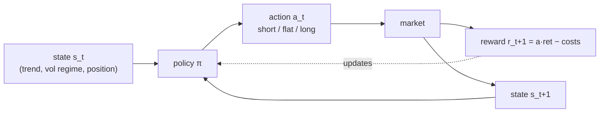

# Reinforcement Learning and Meta-Labeling

[Deep Learning](03-deep-learning.md) closed by conceding that predicting *direction* from daily bars is a nearly empty problem, and promised two changes of question. The first is an escalation with enormous surface appeal: stop predicting and start *acting*. Reinforcement learning dispenses with labels entirely — an agent observes the market's state, chooses a position, collects P&L as its reward, and learns the policy end to end. No triple barriers, no AUC, no gap between forecast and trade: the thing being optimized *is* the thing you want. AlphaGo learned to play Go this way; surely an agent can learn to trade.

The second change of question runs in the opposite direction, and it is the one that pays. Instead of asking a model to find direction — which four architectures and two ensembles have now failed to do — hand it a primary signal that already has direction, the tsmom rule this course has carried since [Part IV](../part-04-strategy-development/01-momentum-and-trend-following.md), and ask only: *when is this rule right, and how much should we bet when it is?* That is meta-labeling, and the division of labor matters: the primary rule contributes its small, robust, interpretable edge; the machine learning contributes conditioning — regime awareness the sign of a 252-day sum cannot have. This lesson demonstrates both answers with experiments, and for once one of them survives its own scoreboard.

## Trading is an MDP the way a coastline is a line

The Markov decision process formalization is quick to write: a state $s_t$ summarizing what is knowable, an action $a_t \in \{\text{short}, \text{flat}, \text{long}\}$, a reward $r_{t+1} = a_t \cdot \text{ret}_{t+1} - \text{costs}$, and a policy $\pi(s) \to a$ to be learned by acting. A [Markov chain](../appendix/part-08-stochastic-processes/05-markov-chains.md) with a steering wheel:



Every arrow hides an assumption, and the honest first step is to measure the one the diagram cannot show: how much signal the reward channel actually carries per decision. Discretize SPY into the coarsest defensible state space — trend sign at two horizons crossed with a volatility tercile, twelve states — and ask what each state knows about the next day:

```python
import numpy as np
import pandas as pd

spy = pd.read_parquet("data/part7.parquet").query("symbol == 'SPY'")
c = pd.read_parquet("data/part5.parquet").xs("SPY", axis=1, level=1).dropna()["Close"]
r = np.log(c).diff().reindex(spy.index)

tr = spy.index <= "2016"
q1, q2 = spy.f_vol_21[tr].quantile([1 / 3, 2 / 3])       # terciles from training years only
vol_t = np.digitize(spy.f_vol_21, [q1, q2])
state = ((spy.f_ret_21 > 0).astype(int) * 6 + (spy.f_ret_252 > 0).astype(int) * 3 + vol_t)
occ = pd.Series(state).value_counts()
print(f"state space: 2 x 2 x 3 = 12 states; occupancy median {occ.median():.0f} rows, "
      f"min {occ.min()} ('{occ.idxmin()}'), max {occ.max()}")

nxt = r.shift(-1)
by_state = nxt.groupby(state.values).agg(["mean", "std", "count"])
snr = (by_state["mean"].abs() / by_state["std"])
print(f"per-decision edge-to-noise |mean|/std of next-day return, by state: "
      f"median {snr.median():.3f}, best {snr.max():.3f}")
print(f"for scale: a coin with this edge needs ~{int(1 / snr.median() ** 2):,} flips "
      f"to distinguish from fair at 1 sigma")
# => state space: 2 x 2 x 3 = 12 states; occupancy median 414 rows, min 7 ('6'), max 1940
#    per-decision edge-to-noise |mean|/std of next-day return, by state: median 0.044, best 0.187
#    for scale: a coin with this edge needs ~518 flips to distinguish from fair at 1 sigma
```

Three numbers define the habitat. Occupancy first: even twelve states — laughably coarse next to the continuous states RL papers assume — leave one state visited seven times in a quarter century; the agent is expected to learn optimal behavior in a situation it has seen seven times. Edge-to-noise second: the median state's next-day return has a mean 4.4% the size of its standard deviation, so one decision's reward is 96% noise — against Go, where a won game is a won game, the reward channel here whispers through a hurricane. And the conversion at the bottom is the working arithmetic of this whole part: at that signal-to-noise, distinguishing a state's edge from zero at *one* sigma takes five hundred visits, which the median state accumulates in two years and the rare states never. The coastline metaphor earns its place in the section title: trading *is* an MDP, formally, the way a coastline is a line — the definition holds and the measurement diverges as you approach. The formalism is not wrong; it is expensive, and the currency it charges in is samples.

## Naive Q-learning, twenty seeds, one verdict

Q-learning is the cleanest tabular instantiation: maintain a value $Q(s, a)$ for every state–action pair, act ε-greedily, and update toward the observed reward plus the discounted value of the next state. Two design details in the block are the honest kind. The state is *augmented with the current position* — transaction costs make the reward depend on yesterday's action, so a learner without its own inventory in the state faces a non-Markovian problem and oscillates. And the learning rate is small (α = 0.01), for a reason this part keeps rediscovering: each update's noise is a percent-scale return, the gap between actions' true values is basis-point-scale, and a step size that does not average the noise below the gap leaves the argmax random forever — the SNR problem, resurfacing *inside* the optimizer. Twenty seeds, because a single RL run is an anecdote:

```python
import numpy as np
import pandas as pd

spy = pd.read_parquet("data/part7.parquet").query("symbol == 'SPY'")
c = pd.read_parquet("data/part5.parquet").xs("SPY", axis=1, level=1).dropna()["Close"]
r = np.log(c).diff().reindex(spy.index).values

tr_m = (spy.index <= "2016").astype(bool)
q1, q2 = spy.f_vol_21[tr_m].quantile([1 / 3, 2 / 3])
state = ((spy.f_ret_21 > 0).astype(int) * 6 + (spy.f_ret_252 > 0).astype(int) * 3
         + np.digitize(spy.f_vol_21, [q1, q2])).values
COST = 0.7e-4

def qlearn(states, rets, seed, n_mkt=12, epochs=60, alpha=0.01, gamma=0.95, eps=0.1):
    rng = np.random.default_rng(seed)
    Q = np.zeros((n_mkt * 3, 3))                     # costs make the position part of the state
    a_prev = 1
    for _ in range(epochs):
        for t in range(len(rets) - 1):
            s = states[t] * 3 + a_prev
            a = rng.integers(3) if rng.random() < eps else int(Q[s].argmax())
            rew = (a - 1) * rets[t + 1] - COST * abs(a - a_prev)
            Q[s, a] += alpha * (rew + gamma * Q[states[t + 1] * 3 + a].max() - Q[s, a])
            a_prev = a
    return Q

def sharpe(Q, states, rets):
    pos, a_prev = [], 1
    for t in range(len(rets) - 1):
        a_prev = int(Q[states[t] * 3 + a_prev].argmax())
        pos.append(a_prev - 1)
    pnl = np.array(pos) * rets[1:] - COST * np.abs(np.diff(pos, prepend=0))
    return np.sqrt(252) * pnl.mean() / pnl.std() if pnl.std() > 0 else 0.0

ins, oos = [], []
for seed in range(20):
    Q = qlearn(state[tr_m], r[tr_m], seed)
    ins.append(sharpe(Q, state[tr_m], r[tr_m]))
    oos.append(sharpe(Q, state[~tr_m], r[~tr_m]))
ins, oos = np.array(ins), np.array(oos)
print(f"20 seeds, trained 2001-2016, greedy policy evaluated on both windows:")
print(f"  in-sample Sharpe : median {np.median(ins):+.2f}, range [{ins.min():+.2f}, {ins.max():+.2f}]")
print(f"  2017+ Sharpe     : median {np.median(oos):+.2f}, range [{oos.min():+.2f}, {oos.max():+.2f}], "
      f"{(oos > 0).sum()}/20 positive")
print(f"  (tsmom on the same 2017+ window: +0.18; buy-and-hold: +0.71)")
# => 20 seeds, trained 2001-2016, greedy policy evaluated on both windows:
#      in-sample Sharpe : median +0.59, range [+0.24, +0.77]
#      2017+ Sharpe     : median +0.20, range [-0.50, +0.74], 12/20 positive
#      (tsmom on the same 2017+ window: +0.18; buy-and-hold: +0.71)
```

In sample, every seed found something: a median Sharpe of +0.59 on the years it trained on, policies that look — on their own history — like discoveries. Out of sample, the distribution is the verdict, and it must be read *as* a distribution. The median lands at +0.20, almost exactly the tsmom rule the agent had never heard of; the range spans −0.50 to +0.74; eight seeds in twenty lose money. Nothing about the algorithm changed between those runs — same data, same states, same hyperparameters — only the random seed steering exploration, which means the difference between the best and worst "agent" is a *lottery drawn inside the optimizer*, and the spread of that lottery (1.2 Sharpe units) is four times the size of every edge this course has certified. A single-run RL paper reporting the +0.74 seed would be reporting noise, sincerely. And the median's landing spot is its own small lesson: sixty epochs of temporal-difference learning over a quarter century recovered, roughly, the sign of a moving average — because at this signal-to-noise, in twelve states, that is approximately all there is to find, and the agent found it the expensive way with a fat confidence interval around it.

## The method is fine; the habitat is wrong

The clean way to separate "RL cannot trade" from "RL cannot trade *this*" is to change the market and nothing else. Same learner, same position-augmented states, same costs, same twenty seeds — but the market is now synthetic: an AR(1) process whose autocorrelation of 0.1 plants a real, stationary, modest edge, calibrated so the known-optimal policy (follow yesterday's sign) earns an annualized Sharpe around 1.2. If the learner fails here too, the method is broken; if it succeeds here, the earlier failure belongs to the habitat:

```python
import numpy as np

rng = np.random.default_rng(0)
PHI, N = 0.10, 10_000                                 # AR(1): a real, stationary, modest edge
eps_tr, eps_te = rng.standard_normal(N) * 0.01, rng.standard_normal(N) * 0.01
def ar1(eps):
    r = np.zeros(len(eps))
    for t in range(1, len(eps)):
        r[t] = PHI * r[t - 1] + eps[t]
    return r
r_tr, r_te = ar1(eps_tr), ar1(eps_te)

def to_state(r):                                      # sign x magnitude tercile of yesterday
    mag = np.digitize(np.abs(r), np.quantile(np.abs(r), [1 / 3, 2 / 3]))
    return ((r > 0).astype(int) * 3 + mag)

COST = 0.7e-4
def qlearn(states, rets, seed, n_mkt=6, epochs=60, alpha=0.01, gamma=0.95, eps=0.1):
    rng = np.random.default_rng(seed)
    Q = np.zeros((n_mkt * 3, 3))                      # the learner of the previous section
    a_prev = 1
    for _ in range(epochs):
        for t in range(len(rets) - 1):
            s = states[t] * 3 + a_prev
            a = rng.integers(3) if rng.random() < eps else int(Q[s].argmax())
            rew = (a - 1) * rets[t + 1] - COST * abs(a - a_prev)
            Q[s, a] += alpha * (rew + gamma * Q[states[t + 1] * 3 + a].max() - Q[s, a])
            a_prev = a
    return Q

def sharpe(pos, rets):
    pnl = np.array(pos) * rets[1:] - COST * np.abs(np.diff(pos, prepend=0))
    return np.sqrt(252) * pnl.mean() / pnl.std() if pnl.std() > 0 else 0.0

def greedy(Q, states):
    pos, a_prev = [], 1
    for t in range(len(states) - 1):
        a_prev = int(Q[states[t] * 3 + a_prev].argmax())
        pos.append(a_prev - 1)
    return pos

s_tr, s_te = to_state(r_tr), to_state(r_te)
oos = []
for seed in range(20):
    Q = qlearn(s_tr, r_tr, seed)
    oos.append(sharpe(greedy(Q, s_te), r_te))
oracle = sharpe(np.sign(r_te[:-1]), r_te)
print(f"AR(1) with phi = {PHI}: oracle policy (sign of yesterday) Sharpe {oracle:+.2f}")
print(f"Q-learner, 20 seeds: median {np.median(oos):+.2f}, "
      f"range [{min(oos):+.2f}, {max(oos):+.2f}], {sum(o > 0 for o in oos)}/20 positive")
# => AR(1) with phi = 0.1: oracle policy (sign of yesterday) Sharpe +1.24
#    Q-learner, 20 seeds: median +1.17, range [+0.91, +1.25], 20/20 positive
```

Twenty out of twenty. The same algorithm that produced a coin-flip lottery on SPY recovers a median +1.17 of the oracle's +1.24 — ninety-four percent of the achievable edge — and its worst seed out-of-sample beats its *best* seed's real-market median. Nothing was tuned between the experiments; only the world changed. Read off what the synthetic world supplied that markets refuse to: the edge is *stationary* (the AR coefficient never drifts, while a real market's regimes shift under the learner mid-education), the signal *recurs densely* (every single day carries the same exploitable structure, not a whisper per five hundred visits), and history is *unlimited* (ten thousand training days of an unchanging process, where markets ration one non-repeating path). This triptych — stationarity, density, volume — is the checklist for where RL-adjacent methods genuinely contribute, and it points away from signal generation toward *execution*: deciding how to work an order over minutes, where every parent order is a fresh episode, rewards (implementation shortfall) arrive densely and attributably, and thousands of episodes accumulate per month. [RL for Execution](../advanced/06-rl-for-execution.md) builds exactly that, against the [Almgren-Chriss](../advanced/04-optimal-execution-almgren-chriss.md) baseline that plays the role tsmom plays here.

## Meta-labeling: the rule decides direction, the model decides belief

Now the retreat that advances. The tsmom rule owns direction: long when the 252-day sum is positive, short when negative — simple, explainable, carrying the small edge Part IV certified at Sharpe 0.30. What it lacks is *discrimination*: it bets the same size on its best day and its worst. Meta-labeling adds a second model whose target is not the market but the *rule* — label each signal-day 1 if the primary's call was right about the next five days, 0 if wrong, and train on the frozen matrix's nineteen features to predict *that*. The predictions come from purged out-of-fold fits, so every probability is out-of-sample by construction:

```python
import numpy as np
import pandas as pd
import lightgbm as lgb
from sklearn.metrics import roc_auc_score

mat = pd.read_parquet("data/part7.parquet")
act = mat[mat.sig_tsmom != 0].sort_index()            # days the primary has an opinion
feat = [k for k in act.columns if k.startswith("f_")]
y_meta = (np.sign(act.ret_5d) == act.sig_tsmom).astype(int)
print(f"meta-label: was tsmom right about the next 5 days? "
      f"base rate {y_meta.mean():.3f} over {len(act):,} signal-days")

def purged_folds(t1, n_splits=5, embargo=21):         # the folds of lesson two
    idx, n = t1.index, len(t1)
    edges = np.linspace(0, n, n_splits + 1, dtype=int)
    for a, b in zip(edges[:-1], edges[1:]):
        t_max = t1.iloc[a:b].max()
        train = [i for i in range(n) if (i < a and t1.iloc[i] < idx[a])
                 or (i >= b + embargo and idx[i] > t_max)]
        yield np.array(train), np.arange(a, b)

p_oof = pd.Series(np.nan, index=act.index)
for tr, te in purged_folds(act.t1):
    m = lgb.LGBMClassifier(n_estimators=300, num_leaves=15, learning_rate=0.05,
                           seed=42, deterministic=True, force_row_wise=True,
                           num_threads=1, verbosity=-1)
    m.fit(act[feat].iloc[tr], y_meta.iloc[tr], sample_weight=act.w.iloc[tr])
    p_oof.iloc[te] = m.predict_proba(act[feat].iloc[te])[:, 1]

auc = roc_auc_score(y_meta, p_oof)
thresh = p_oof.median()
hi = p_oof > thresh
print(f"out-of-fold AUC on 'was the primary right': {auc:.3f}")
print(f"primary hit rate: all days {y_meta.mean():.3f}; "
      f"days the meta-model believes (p > {thresh:.3f}): {y_meta[hi].mean():.3f}; "
      f"days it doubts: {y_meta[~hi].mean():.3f}")
# => meta-label: was tsmom right about the next 5 days? base rate 0.535 over 16,592 signal-days
#    out-of-fold AUC on 'was the primary right': 0.530
#    primary hit rate: all days 0.535; days the meta-model believes (p > 0.549): 0.558; days it doubts: 0.512
```

An AUC of 0.530 — after two lessons of direction models clustering at 0.47–0.50, this is the first machine-learned number in the part that is meaningfully on the right side of the coin, and the reason is the question, not the model (the model is lesson two's LightGBM, unchanged). "Will SPY go up?" asks the features to know the future. "Is a trend-following rule likely to work right now?" asks them to know the *present* — and regime is exactly what a volatility level, a VIX reading, and a drawdown-from-high measure. The bottom line converts the AUC into trading terms: on the half of signal-days the model believes, the primary is right 55.8% of the time; on the half it doubts, 51.2% — a 4.6-point spread in hit rate, conjured not by predicting markets but by predicting *when a known edge is present*. This is the professional pattern hiding behind the term: primary strategies are chosen for robustness and interpretability, machine learning is deployed where its comparative advantage lies — high-dimensional conditioning — and neither is asked to do the other's job.

## Sizing and filtering, charged and drawn

A 4.6-point hit-rate spread is a claim; the cost model decides if it is income. Two ways to spend the belief probability: *filter* (trade the primary only when $p > 0.5$, full size) and *size* (scale the position by conviction, reaching full size only at $p \geq 0.75$). Both run on the three-asset book — SPY, TLT, GLD, equal-weighted sleeves, per-symbol half-spreads plus commission from [Part IV's cost table](../part-04-strategy-development/07-portfolio-construction-and-transaction-costs.md) — against the raw rule:

```python
import matplotlib.pyplot as plt
import numpy as np
import pandas as pd
import lightgbm as lgb

mat = pd.read_parquet("data/part7.parquet")
act = mat[mat.sig_tsmom != 0].sort_index()
feat = [k for k in act.columns if k.startswith("f_")]
y_meta = (np.sign(act.ret_5d) == act.sig_tsmom).astype(int)

def purged_folds(t1, n_splits=5, embargo=21):         # as in the previous section
    idx, n = t1.index, len(t1)
    edges = np.linspace(0, n, n_splits + 1, dtype=int)
    for a, b in zip(edges[:-1], edges[1:]):
        t_max = t1.iloc[a:b].max()
        train = [i for i in range(n) if (i < a and t1.iloc[i] < idx[a])
                 or (i >= b + embargo and idx[i] > t_max)]
        yield np.array(train), np.arange(a, b)

p_oof = pd.Series(np.nan, index=act.index)
for tr, te in purged_folds(act.t1):
    m = lgb.LGBMClassifier(n_estimators=300, num_leaves=15, learning_rate=0.05,
                           seed=42, deterministic=True, force_row_wise=True,
                           num_threads=1, verbosity=-1)
    m.fit(act[feat].iloc[tr], y_meta.iloc[tr], sample_weight=act.w.iloc[tr])
    p_oof.iloc[te] = m.predict_proba(act[feat].iloc[te])[:, 1]
act = act.assign(p_meta=p_oof.values)

bars = pd.read_parquet("data/part5.parquet")
HS = {"SPY": 0.5, "TLT": 1.0, "GLD": 1.0}             # Part IV lesson seven
books = {}
for label, scale in [("raw", None), ("filtered", "gate"), ("sized", "lean")]:
    sleeves, turns = [], []
    for sym in HS:
        px = bars.xs(sym, axis=1, level=1).dropna()["Close"]
        rs = np.log(px).diff()
        a = act[act.symbol == sym]
        base = a.sig_tsmom.reindex(rs.index).ffill()  # NaN before the sleeve's first signal
        p = a.p_meta.reindex(rs.index).ffill()
        if scale == "gate":
            pos = base * (p > 0.5)                    # trade only when the model believes
        elif scale == "lean":
            pos = base * (2 * (2 * p - 1)).clip(0, 1)  # full size only above p = 0.75
        else:
            pos = base
        cost = (HS[sym] + 0.2) * 1e-4
        sleeves.append(pos.shift(1) * rs - pos.diff().abs() * cost)
        turns.append(pos.diff().abs().sum() / (pos.notna().sum() / 252))
    book = pd.concat(sleeves, axis=1).mean(axis=1).dropna()
    eq = np.exp(book.cumsum())
    books[label] = book
    print(f"{label:8s}: Sharpe {np.sqrt(252) * book.mean() / book.std():+.2f}   "
          f"maxDD {(eq / eq.cummax() - 1).min():+.1%}   "
          f"sleeve turnover {np.mean(turns):.1f}x/yr")

fig, ax = plt.subplots(figsize=(9, 4.5))
for label, book in books.items():
    ax.plot(np.exp(book.cumsum()), label=label)
ax.set_yscale("log")
ax.set_ylabel("growth of $1, log scale")
ax.legend()
plt.show()
# => raw     : Sharpe +0.29   maxDD -29.3%   sleeve turnover 10.1x/yr
#    filtered: Sharpe +0.43   maxDD -23.2%   sleeve turnover 52.6x/yr
#    sized   : Sharpe +0.26   maxDD -12.2%   sleeve turnover 36.9x/yr
```

The raw line is the reconciliation this course requires before believing anything else: +0.29 on the matrix's window, the familiar 0.30 reappearing on schedule with costs and a slightly shorter sample accounting for the last hundredth. Against that anchor, read the two treatments as different purchases from the same budget. Filtering bought *performance*: Sharpe +0.43, a 48% improvement over the raw rule, with a fifth less drawdown — the model's doubt concentrated in exactly the stretches where trend-following bleeds. Sizing bought *safety*: the Sharpe barely moved (+0.26), but maximum drawdown fell from −29.3% to −12.2%, less than half, because scaling by conviction keeps the book small through the ambiguous regimes where full-size trend positions dig the deep holes. Neither is free, and the turnover column names the price: gating a signal on a daily probability quintuples trading (10.1× to 52.6× a year) — harmless at an ETF's 1.2 bp round trip, decisive at the spreads [Part IV's pairs trade](../part-04-strategy-development/02-mean-reversion-and-pairs-trading.md) died of. One honest caveat travels with the good news: the improvement is measured on out-of-fold predictions but a *single* history, and a 0.14 Sharpe lift on 24 years sits within the ±0.2 standard error [lesson three](03-deep-learning.md) taught you to attach — the direction of the evidence is right, its size is provisional. That is still the strongest sentence machine learning has earned in this part.

## Five weak signals vs the best one

Meta-labeling improved one signal from the *inside*; the other honest lever is combination from the *outside*. [Part IV's fifth lesson](../part-04-strategy-development/05-feature-and-signal-engineering.md) proved the theorem — combining lowly-correlated weak signals raises the information ratio — and this section finally tests it at book level: five one-line SPY strategies, none impressive alone, equal-weighted against whichever of them hindsight crowns:

```python
import numpy as np
import pandas as pd

c = pd.read_parquet("data/part5.parquet").xs("SPY", axis=1, level=1).dropna()["Close"]
vix = pd.read_parquet("data/part4.parquet")["VIX"]
r = np.log(c).diff()
COST = 0.7e-4

sigs = pd.DataFrame({
    "tsmom252": np.sign(r.rolling(252).sum()),
    "tsmom63": np.sign(r.rolling(63).sum()),
    "reversal21": -np.sign(r.rolling(21).sum()),
    "volmanaged": np.sign(r.rolling(252).sum()).where(
        r.rolling(21).std() < r.rolling(252).std(), 0.0),
    "vixcalm": (vix < vix.rolling(63).mean()).astype(float).reindex(c.index),
}).dropna()

rets = {}
for name in sigs:
    pos = sigs[name]
    rets[name] = (pos.shift(1) * r - pos.diff().abs() * COST).dropna()
strat = pd.DataFrame(rets).dropna()
corr = strat.corr()
pairs = corr.where(np.triu(np.ones(corr.shape, dtype=bool), 1)).stack()
print(f"pairwise correlation of the five books: mean {pairs.mean():+.2f}, "
      f"max {pairs.max():+.2f} {pairs.idxmax()}")

def line(s):
    eq = np.exp(s.cumsum())
    return f"Sharpe {np.sqrt(252) * s.mean() / s.std():+.2f}   maxDD {(eq / eq.cummax() - 1).min():+.1%}"

for name in strat:
    print(f"  {name:10s}: {line(strat[name])}")
combo = strat.mean(axis=1)
best = max(strat, key=lambda k: strat[k].mean() / strat[k].std())
print(f"equal-weight ensemble    : {line(combo)}")
print(f"best single, in hindsight: {line(strat[best])}  ({best})")
# => pairwise correlation of the five books: mean +0.02, max +0.60 ('tsmom252', 'volmanaged')
#      tsmom252  : Sharpe +0.30   maxDD -43.5%
#      tsmom63   : Sharpe +0.06   maxDD -49.0%
#      reversal21: Sharpe -0.08   maxDD -48.2%
#      volmanaged: Sharpe +0.58   maxDD -30.1%
#      vixcalm   : Sharpe +0.44   maxDD -44.5%
#    equal-weight ensemble    : Sharpe +0.46   maxDD -19.7%
#    best single, in hindsight: Sharpe +0.58   maxDD -30.1%  (volmanaged)
```

Start with the correlation line, because it is the engine: five books whose pairwise correlations average +0.02 are nearly independent bets, and [model averaging](../appendix/part-14-model-selection/05-model-averaging.md) over independent bets is the closest thing this field has to free money. The equal-weight ensemble earns +0.46 — better than four of its five members, including one that *lost* money — with a maximum drawdown of −19.7%, shallower than every single member, the best of whom drew down −30.1%. Now the objection the last line exists to host: vol-managed momentum beat the ensemble, +0.58 to +0.46, so why not just hold that? Because "that" was selected *after the race*, and [Part III's multiple-testing lesson](../part-03-statistics/04-hypothesis-testing-and-multiple-testing.md) priced this exact move: the maximum of five noisy Sharpes overstates its own future, and 2001's you — who is the one making the decision — had five ex-ante-plausible rules and no crystal ball. The ensemble is the *decision-theoretic* winner: it never required knowing the future ranking, it converts a set of fragile individual drawdowns into one tolerable one, and its Sharpe stands within noise of the lucky champion anyway. Diversification across signals, it turns out, obeys the same law as diversification across assets — and it composes with the previous section, since each sleeve of an ensemble can itself be meta-labeled.

!!! warning "An agent trained on one history has memorized a biography, not learned a market"
    The twenty-seed experiment is the shape of the problem: every seed found a profitable-looking policy in the training years, and out of sample the cohort delivered a lottery centered on the dumb baseline. Markets give a learner one path — non-repeating, regime-shifting, whisper-thin in reward — and an agent optimized on that path has learned *what happened*, not *what happens*. The same learner handed a stationary, dense, replayable world recovered 94% of the optimum on every seed, which acquits the algorithm and convicts the habitat — the formal version is an ergodicity failure rather than a sample-size one, in [Population vs Sample](../appendix/part-10-statistics-foundations/01-population-vs-sample.md). So point RL where its diet exists — execution, market-making, problems with episodes and dense rewards — and when someone shows you an agent trading daily bars, ask for the seed distribution, not the equity curve. The distance between one seed's curve and twenty seeds' spread is the distance between a biography and a market.

!!! abstract "Key takeaways"
    - Twelve coarse states leave a median next-day edge-to-noise of 0.044 (≈518 visits to reach one sigma) and one state visited 7 times in 25 years — the MDP formalism holds; the sample budget does not.
    - Q-learning on SPY, 20 seeds: in-sample median Sharpe +0.59, out-of-sample median +0.20 with a [−0.50, +0.74] spread — the seed lottery is four times wider than the edge, and the median rediscovers tsmom (+0.18) the expensive way.
    - The same learner on an AR(1) market with a real edge recovers a median +1.17 of the oracle's +1.24, 20/20 seeds positive — stationarity, reward density, and unlimited history are what markets refuse and execution problems supply.
    - Meta-labeling ("was the primary right?") earned out-of-fold AUC 0.530 — the part's first model meaningfully past the coin — splitting tsmom's 53.5% hit rate into 55.8% on believed days and 51.2% on doubted ones.
    - Charged at Part IV's costs, filtering lifted the three-asset tsmom book from Sharpe +0.29 (the familiar 0.30, reconciled) to +0.43; conviction-sizing held Sharpe at +0.26 while halving maxDD to −12.2%; the price was 5× turnover.
    - Five weak SPY signals with mean pairwise correlation +0.02 combined to Sharpe +0.46 with a −19.7% maxDD — beating four of five members and every member's drawdown; the hindsight champion (+0.58) is the multiple-testing sin wearing a crown.
    - Costs make the position part of the state, and step-size noise must sit below the action-value gap — two ways the low-SNR arithmetic reaches *inside* the algorithms.

## Where this goes next

This lesson ends the search for signals, and the part's honest ledger reads: direction prediction failed at every capacity; conditioning a known edge worked modestly (+0.29 → +0.43); combining weak edges worked structurally (−19.7% maxDD against −30% for the best member). Something from this part is now worth running — which changes the problem entirely, because a model that ships inherits every operational liability [Part VI](../part-06-live-infrastructure/index.md) spent six lessons hardening processes against, plus new ones no process monitor can see: features drift, calibration decays, and the regime that made the meta-model smart quietly ends. [Production ML](05-production-ml.md) treats the model as what it now is — a live component with a lifecycle — and builds the retraining cadence, drift detection, champion/challenger gates, and registry lineage that let it fail on schedule instead of by surprise.
