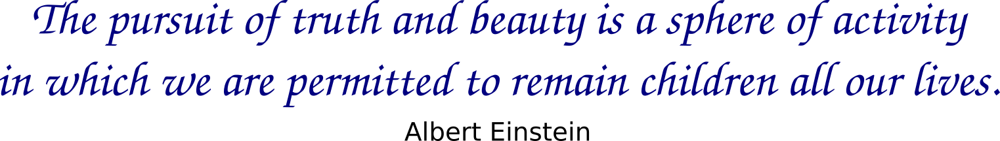

 

  

## What is data science?

The goal of data science is to extract knowledge and derive meaningful insights from mostly noisy data, structured or unstructured. Techniques from statistics and computer science are used to

  

## What is this website for?
